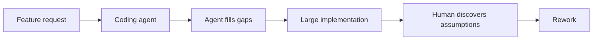
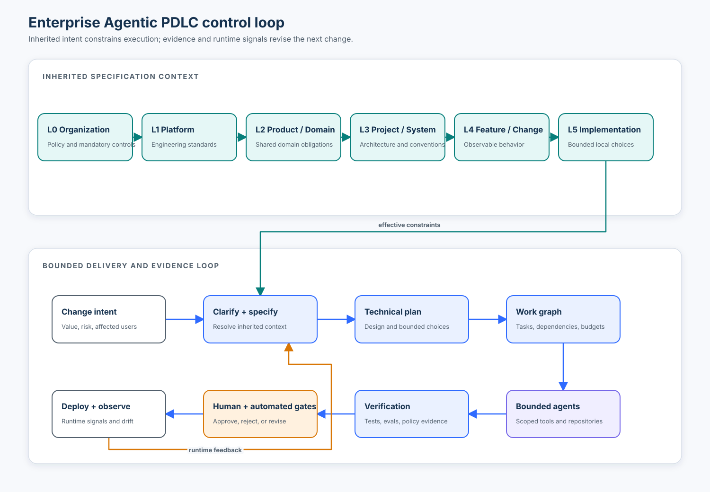

# Course 01 — Why Agentic Coding Changes the PDLC

Agentic coding changes more than implementation speed. When software agents can inspect repositories, make design choices, edit many files, run tools, and prepare pull requests, the organization must decide which choices the agent may make, which constraints it must inherit, which evidence it must produce, and where a person must approve. This course introduces spec-driven development (SDD) as that enterprise operating model.

The central claim is not “write longer requirements” or “use a particular SDD tool.” It is:

> Make consequential decisions explicit before expensive autonomous execution, then compare implementation and runtime evidence with those decisions.

## Learning outcomes

By the end of this course, you can:

1. distinguish code completion, conversational assistance, and agentic software delivery by their action and authority boundaries;
2. explain why faster code generation can move—not eliminate—the PDLC bottleneck;
3. model a specification as part of the agent's control plane rather than passive documentation;
4. compose organization, platform, domain, project, and feature requirements without silent lower-level overrides;
5. separate human-heavy intent and policy decisions from agent-heavy implementation work;
6. choose direct change, lightweight specification, full SDD, or specialist-reviewed SDD proportionately; and
7. evaluate an agent proposal for requirement coverage, traceability, evidence, autonomy overreach, permissions, and change budget.

## Scenario, success criteria, and boundaries

You are helping **Northstar Mutual**, an insurance company, add policy-document question answering to its Underwriter Assistant. A prompt such as “let underwriters ask questions about uploaded policies” does not tell an implementation agent about Northstar's model gateway, privacy rules, cloud standard, infrastructure policy, identity provider, telemetry, evidence requirements, or the domain obligation for human review.

This course succeeds when you can construct the effective context for that change, detect a feature-level attempt to override company privacy policy, compare a prompt-only proposal with a bounded proposal, and route three changes through proportionate workflows.

The lab is a deterministic simulation. It does not call an AI model, deploy infrastructure, process real policyholder data, or claim that a numeric routing threshold is universal. It deliberately exposes control logic for inspection. In a production system, identity, authorization, sandboxing, repository permissions, secrets, approval, retry budgets, idempotency, audit logs, and independent evaluation must be enforced outside prompts.

## Prerequisites

- Ability to read basic Python and structured data.
- Familiarity with pull requests and automated tests.
- No prior SDD framework or requirements-engineering experience.
- No credentials, cloud account, model API, or third-party package.

The next three courses deepen distinctions among artifacts, the specification hierarchy, and ownership across organization/project/feature boundaries. See the [full course roadmap](../../../COURSE_PLAN.md).

## 1. Why agentic coding changes the product development lifecycle

In this course, **PDLC** means the product development lifecycle: opportunity and intent, discovery, requirements, experience and technical design, planning, implementation, verification, release, operation, and learning. The familiar **SDLC** usually emphasizes the software engineering portion. Agentic coding affects both because an agent can participate in discovery artifacts, design, implementation, testing, review, and operational workflows—not just type code.

Traditional delivery relies on tacit organizational knowledge. An experienced developer who receives “add SSO to the administration portal” may know the approved identity provider, token library, audit schema, architecture conventions, threat model, privacy rules, test fixtures, deployment platform, and previous ADRs. Those facts are often distributed across memory, code, wikis, conversations, and review habits.

An agent only has the context and authority actually made available to it. When important knowledge is absent, it must stop, ask, retrieve, or guess. Guessing becomes more consequential as the agent's action surface expands from suggesting a line to changing a repository or coordinating work across several repositories.

### Three modes of assistance

| Mode | Typical action | State horizon | Primary human burden | Main control need |
| --- | --- | --- | --- | --- |
| Completion | Suggest tokens or a small edit | Current file/turn | Accept or reject a local suggestion | Local correctness and licensing review |
| Conversational assistant | Explain, draft, or propose code | Conversation and supplied context | Translate advice into the codebase | Context quality and factual verification |
| Coding agent | Inspect, plan, edit, run tools/tests, iterate, prepare a change | Repository or multi-step task | Set boundaries, review evidence and decisions | Authority, durable context, budgets, gates, traceability |

The boundary is behavioral, not a vendor label. A chat tool becomes agentic when it is allowed to take multi-step actions in an environment. An “agent” with no tools may still only produce advice.

### The bottleneck moves

A simplified human-led flow contains interpretation throughout:


An underspecified agentic flow can generate a large change before assumptions become visible:



Generating more code does not automatically improve delivery. DORA's 2025 report on generative AI in software development reported improvements in several process perceptions while also observing negative associations with delivery throughput and stability; the authors discuss larger change batches and insufficient testing as plausible explanations rather than treating AI adoption as a universal cause or cure. The study is organizational survey research, not a controlled experiment for SDD, so use it as a caution about system effects—not proof of one mechanism. [DORA report](https://dora.dev/research/ai/gen-ai-report/dora-impact-of-generative-ai-in-software-development.pdf)

A separate 2025 randomized study by METR found that 16 experienced open-source developers completing 246 tasks in repositories they knew took longer with the studied early-2025 AI tools, despite expecting to be faster. That narrow result does not generalize to every tool, team, or task; it does show why local productivity beliefs, benchmark scores, and end-to-end delivery outcomes must be measured separately. [METR study](https://metr.org/blog/2025-07-10-early-2025-ai-experienced-os-dev-study/)

The enterprise question is therefore not “Does AI make developers faster?” It is:

> Under which tasks, controls, context, review design, and evidence standards does agentic work improve the organization's desired outcomes?

## 2. The control-system mental model

A specification was always a communication and agreement artifact. For a coding agent it also becomes part of a **control system**:

- **Reference signal:** the intended behavior and constraints.
- **Controller:** workflow rules, policy checks, review gates, and the human decision maker.
- **Actuator:** the coding agent's tools and permissions.
- **Plant:** repositories, services, infrastructure, and delivery processes being changed.
- **Sensors:** tests, evaluations, static analysis, policy checks, review findings, and runtime telemetry.
- **Disturbances:** missing context, stale specs, conflicting instructions, dependency changes, prompt injection, tool failure, and production conditions.

The control loop is illustrated in the notebook asset:



This analogy has limits: organizations are socio-technical systems, requirements are contested, and “correctness” is rarely a single scalar. Its value is that it forces four questions:

1. What is the reference against which work is judged?
2. Which actuator may change what?
3. Which sensors supply credible evidence?
4. What happens when evidence and intent disagree?

If the only reference is a transient prompt and the only sensor is “the agent says it is done,” there is no robust control loop.

## 3. From prompt to durable specification

Consider this prompt:

```text
Implement authentication using OAuth.
```

It initiates a conversation but leaves the actor, provider, roles, failure behavior, session policy, data handling, integration boundaries, and acceptance evidence open. A more durable contract might include:

```text
AUTH-01
Administrators SHALL authenticate through the corporate identity provider.

Scenario: unauthenticated administrator
GIVEN an unauthenticated administrator
WHEN the administrator requests /admin
THEN the application redirects to corporate SSO.

Scenario: authenticated non-administrator
GIVEN an authenticated user without the Admin role
WHEN the user requests /admin
THEN access is denied and an authorization event is recorded.

Security constraint
Application passwords SHALL NOT be stored locally.
```

The difference is not Markdown, capitalization, or length. A specification creates an agreement that can be reviewed and falsified. It separates behavior from an implementation proposal and identifies evidence that could reveal nonconformance.

Later courses will distinguish prompts, requirements, designs, ADRs, tasks, tests, policies, and instructions precisely. For now, use this hierarchy:

| Question | Artifact focus | Typical authority |
| --- | --- | --- |
| Why change? | Business/product intent | Accountable product and business owners |
| What must be true? | Behavioral specification | Product, domain, risk, and engineering owners |
| Which constraints apply? | Organization/platform/domain/project policy | Control and platform owners |
| How should it work? | Architecture and technical design | Architects and engineers, assisted by agents |
| What work is required? | Work graph/tasks | Engineers and agents within the design |
| What realizes it? | Code/configuration | Agents and engineers within granted authority |
| What proves or challenges it? | Tests, evaluations, review, telemetry | Independent automation and accountable reviewers |

A task list is not a requirement set; a test suite is not proof of requirement completeness; an agent-instruction file is not an authorization system; and a design decision should not masquerade as user need.

## 4. The six-layer specification hierarchy

Do not copy every company rule into every feature specification. Compose an effective context from authoritative layers:

```text
L0  Organization       enterprise policy and mandatory controls
L1  Engineering        shared platform and engineering standards
L2  Product / domain   obligations shared by a product family or domain
L3  Project / system   architecture, interfaces, conventions, current decisions
L4  Feature / change   observable behavior and change-specific constraints
L5  Implementation     tasks, local technical choices, code, and evidence
```

Let each requirement be a tuple:

`r = (id, layer, control, expected value, owner, version)`

For a given control key, the effective value is resolved from the highest-authority applicable requirement. Lower layers may narrow behavior when permitted, but they may not silently weaken a mandatory higher-level control. Conceptually:

`EffectiveContext = resolve(O ⊕ P ⊕ D ⊕ S ⊕ F)`

Here `⊕` does **not** mean blind concatenation. `resolve` must preserve provenance, detect contradictions, apply precedence, and route exceptions to an accountable owner.

### Example layers at Northstar Mutual

| Layer | Examples | Likely owner |
| --- | --- | --- |
| L0 Organization | Production on AWS; PII only to approved model routes; Terraform; evaluation evidence | Security, privacy, risk, enterprise architecture |
| L1 Platform | OpenTelemetry; approved AI gateway; versioned prompts | AI platform and developer platform teams |
| L2 Domain | Policyholder communication is confidential; high-risk recommendations need human review | Insurance domain and risk owners |
| L3 Project | Python backend; Bedrock Knowledge Bases; corporate SSO | Underwriter Assistant team/architect |
| L4 Feature | Ask questions; cite passages; say when evidence is insufficient | Product owner and delivery team |
| L5 Implementation | Service boundaries, interfaces, tasks, tests, code | Engineering team and bounded agents |

### Inheritance and exceptions

If the feature requests `pii_model_route = public_model_api` while organization requirement `C-02` requires `approved_only`, the feature does not win because it is newer or closer to the code. The workflow stops and creates an explicit exception request. A waiver should identify scope, rationale, risk owner, compensating controls, expiry, evidence, and revocation conditions. Until approved, the effective value remains `approved_only`.

This is specification inheritance with governance, not object-oriented inheritance and not prompt priority folklore.

## 5. Autonomy should follow the decision hierarchy

An agent should not casually invent decisions while moving upward through the hierarchy. A useful default gradient is:

```text
Business intent       human-heavy
Requirements          human-heavy
Policy exceptions     human-owned
Architecture          shared deliberation
Technical design      shared, with bounded agent proposals
Tasks                 agent-heavy after approval
Implementation        agent-heavy within scope
Verification          agent + independent automation + human judgment
Release               policy and human gates proportional to risk
```

This is not a rule that humans write every requirement and agents only type code. Agents can draft, analyze, challenge, decompose, and evaluate artifacts at every level. **Proposal authority is not approval authority.** The agent may surface a missing retention policy; it should not silently choose “forever” and implement it.

At execution time, a complete boundary includes more than text:

- authenticated agent/run identity;
- allowed repositories, branches, paths, tools, and network destinations;
- read versus write permissions;
- secrets and data classification boundaries;
- change-size, time, cost, token, and retry budgets;
- explicit stop conditions for contradictions, missing authority, or failing evidence;
- idempotency and rollback expectations for side effects;
- required reviewers and approvals; and
- observable traces that record decisions and results without exposing private model reasoning.

Prompts can remind an agent about these controls. Enforcement belongs in the surrounding system.

## 6. Internal mechanics of an agentic change

A robust agentic PDLC resolves context before mutation:

1. **Classify the change.** Determine uncertainty, risk, blast radius, novelty, reversibility, affected repositories, data, and controls.
2. **Discover authoritative context.** Load applicable policies, platform standards, domain rules, project decisions, repository instructions, and current behavior.
3. **Compose and validate.** Preserve source IDs; flag conflicts, stale references, missing owners, and unauthorized exceptions.
4. **Clarify intent.** Ask questions whose answers could materially change scope, behavior, architecture, evidence, or risk.
5. **Design and decompose.** Select a technical approach, record consequential trade-offs, and build a dependency-aware work graph.
6. **Grant bounded execution.** Provide only the repositories, tools, permissions, data, time, and budgets required for the approved tasks.
7. **Execute and observe.** Capture file changes, tool calls, checks, failures, retries, and structured outcomes.
8. **Evaluate independently.** Compare implementation with requirements, policies, and design; do not accept self-attestation as the only evidence.
9. **Review and release.** Apply automated and human gates based on risk.
10. **Learn and converge.** Reconcile specifications with accepted implementation decisions and feed runtime signals back into the next change.

This flow is iterative. Discovery may reveal that the requested feature conflicts with policy. Implementation may expose a false design assumption. Runtime behavior may falsify an NFR. The owner of the incorrect artifact updates it; downstream artifacts are then regenerated or reconciled.

## 7. Architecture patterns for agentic delivery

| Pattern | Context supplied | Strength | Failure mode | Best fit |
| --- | --- | --- | --- | --- |
| Prompt-only | Current request | Lowest setup cost | Agent invents hidden decisions; weak audit trail | Disposable exploration with no consequential side effects |
| Repository instructions | Standing project conventions | Durable local guidance; broad agent portability | Becomes a giant, stale policy dump; text is mistaken for enforcement | Stable conventions that apply to most repository work |
| Feature SDD | Requirements, design, tasks, checks | Reviewable intent and decomposition | Ceremony applied uniformly; inherited controls omitted | Meaningful bounded changes in one system |
| Layered enterprise SDD | Organization → platform → domain → project → feature + execution policy | Reuse, provenance, exceptions, cross-repository consistency | Ownership and synchronization become platform problems | Regulated, multi-team, high-impact agentic development |

The mature pattern is not one enormous prompt. It is selective retrieval and resolution of authoritative artifacts, followed by scoped execution and evidence.

## 8. Technology landscape: mechanisms, not winners

This first course does not require a framework. The course will later implement and compare these options in depth.

| Mechanism | Primary contribution | Portability | Enterprise value | Important limitation |
| --- | --- | --- | --- | --- |
| GitHub Spec Kit | Extensible process harness with constitution and phased agentic SDD | Multiple coding-agent integrations | Quality gates, templates, extensions, convergence | Project constitution is not a company policy engine |
| OpenSpec | Current behavioral specs plus change artifacts; brownfield-oriented flow | Markdown and multiple tool integrations | Delta-based evolution and cross-repository stores | Stores are currently beta; governance model remains yours |
| Kiro Specs | Requirements/design/tasks workflows, including quick and bug paths | Centered on Kiro surfaces | Explicit artifacts and proportional workflow modes | Tool workflow does not determine organizational authority |
| `AGENTS.md` and peer instruction files | Standing agent guidance scoped by repository/path | Increasingly cross-tool | Makes conventions discoverable near code | Non-deterministic instruction following; no hard authorization |
| ADRs | Durable record of consequential architectural choices | Very high | Explains decisions and alternatives across time | Does not specify complete behavior or enforce policy |
| Policy-as-code + CI | Machine-enforced checks at defined gates | Depends on policy/runtime | Independent, repeatable enforcement and evidence | Encodes only what is formalized; can produce false confidence |
| Tests and evaluations | Evidence about selected behavior and quality properties | High | Detects nonconformance and regression | Passing evidence is bounded by cases, metrics, and oracle quality |

As of September 2026, GitHub Spec Kit documents a full command path of constitution, specify, clarify, plan, checklist, tasks, analyze, implement, and converge; clarify, checklist, and analyze are optional quality gates for meaningful ambiguity. Its documentation positions the toolkit as an extensible process harness and lists 38 integrations. Treat those counts and command names as versioned facts and recheck the official documentation when teaching. [Spec Kit agentic SDD reference](https://github.github.com/spec-kit/reference/agentic-sdd.html) · [Spec Kit overview](https://github.github.com/spec-kit/)

OpenSpec emphasizes current system truth in `specs/`, proposed deltas in `changes/`, iterative brownfield work, and shared stores for cross-repository planning; its own documentation labels stores beta. [OpenSpec repository and documentation index](https://github.com/Fission-AI/OpenSpec)

Kiro currently documents Feature Specs, Bugfix Specs, and Quick Spec. Its core feature artifacts are requirements (or bug analysis), design, and tasks; Quick Spec generates the same feature artifacts after front-loaded clarification without phase-by-phase approval. [Kiro Specs](https://kiro.dev/docs/specs/) · [Kiro Quick Spec](https://kiro.dev/docs/specs/quick-spec/)

OpenAI's official Codex documentation describes `AGENTS.md` as durable repository instructions with directory scope, while GitHub documents support for agent instructions and repository/path-specific customization across several Copilot surfaces. Both are context mechanisms, not guarantees that a stochastic model follows every instruction. [Codex `AGENTS.md` guide](https://learn.chatgpt.com/docs/agent-configuration/agents-md) · [GitHub customization reference](https://docs.github.com/en/copilot/reference/custom-instructions-support)

## 9. Proportionality: when not to use full SDD

Full SDD has coordination cost. Use it where ambiguity, impact, coupling, or assurance needs justify the cost.

| Change profile | Suggested path | Minimum durable evidence |
| --- | --- | --- |
| Obvious, local, reversible, low-risk correction | Direct change | Clear issue, focused diff, relevant test/check |
| Familiar change with bounded behavior | Lightweight/quick spec | Acceptance criteria, constraints, focused plan, tests |
| Ambiguous or cross-cutting feature | Full SDD | Clarified requirements, design, tasks, analysis, evaluation |
| Regulated, security-sensitive, architectural, cross-repository, or hard to reverse | Full SDD + specialist approval | Inherited controls, threat/risk review, ADRs, policy evidence, rollout/rollback, named approvals |

Do not route by lines of code alone. A one-line authorization change can be high risk; a large generated fixture may be mechanically safe. Useful routing dimensions include ambiguity, consequence, blast radius, reversibility, novelty, data sensitivity, regulatory scope, architectural impact, and number of ownership boundaries.

The lab includes a transparent scoring example so you can challenge its policy. The thresholds are not a standard and should not be copied into production without calibration.

## 10. State of practice and research frontier

### Established practice

Version-controlled requirements, ADRs, threat modeling, least privilege, code review, automated tests, policy gates, provenance, and secure-development practices predate modern coding agents. NIST's Secure Software Development Framework is outcome-based and designed to integrate secure practices into different SDLC implementations. Agentic delivery should extend these controls rather than invent an unrelated lifecycle. [NIST SP 800-218](https://csrc.nist.gov/pubs/sp/800/218/final)

### Current agentic practice

Repository instruction files, issue-to-PR agents, SDD harnesses, requirements-quality checks, cross-artifact analysis, and agent-generated work graphs are increasingly productized. The durable-artifact layer is becoming portable across agents, but tool support and semantics differ.

### Emerging practice

Cross-repository specification stores, organization-distributed instructions, custom SDD extensions, convergence workflows, continuous evaluation, and parallel-agent coordination are emerging. Their governance, conflict resolution, provenance, and failure recovery are less standardized than familiar source-control workflows.

### Research frontier and open problems

- How do we measure specification completeness without circularly using the same model as writer and judge?
- Which controls belong in natural language, typed schemas, tests, policies, sandboxes, or human decisions?
- How should context be selected and compressed without dropping rare but mandatory constraints?
- How do multiple agents coordinate changes without race conditions, duplicated work, or inconsistent assumptions?
- How do benchmarks predict maintainability, review effort, security, and runtime outcomes in a specific organization?
- How is specification drift detected when code, runtime behavior, policy, and organizational intent evolve at different speeds?

The safe conclusion is not that agents are unreliable and should never act, nor that stronger models eliminate process. It is that autonomy must be matched by observable control, representative evaluation, and organizational learning.

## 11. Worked Northstar Mutual scenario

The feature request is:

```text
Let underwriters ask questions about uploaded policy documents.
```

The effective context contains 14 controls:

```text
Organization: C-01 AWS, C-02 approved PII routes, C-03 Terraform, C-04 evaluation evidence
Platform:     P-01 OpenTelemetry, P-02 approved AI gateway, P-03 versioned prompts
Domain:       D-01 human review for high-risk recommendations
Project:      PR-01 Python, PR-02 Bedrock Knowledge Bases, PR-03 corporate SSO
Feature:      F-01 document questions, F-02 citations, F-03 insufficient-evidence behavior
```

### Prompt-only proposal

A plausible underspecified proposal uses a public model API, GCP, console-created infrastructure, TypeScript, local passwords, optional citations, and confident best guesses. It also edits a shared identity repository, requests production deployment permission, changes 47 files, and invents indefinite retention. Some choices may be technically coherent; they are unauthorized or inconsistent with Northstar's effective requirements.

### Bounded proposal

The controlled proposal resolves all inherited controls, links every task to requirement IDs, supplies evidence for the requirements, stays inside the `policy-assistant` repository, writes only to a feature branch, runs tests, remains below a 20-file change budget, and records one local implementation-structure decision at L5. Human approval is still required before the simulated gate passes.

### Injected conflict

Feature requirement `F-99` tries to route PII to a public model. The composer preserves organization requirement `C-02`, records the conflicting values and source IDs, and stops. It does not “merge” incompatible values or allow the newest artifact to win.

## 12. Lab implementation and observable metrics

Run the reusable implementation:

```bash
python3 lab.py
```

Or use the guided [notebook](agentic_pdlc.ipynb). The [lab](lab.py) implements:

- typed requirement layers and controls;
- precedence-aware context composition with conflict provenance;
- typed proposals, tasks, evidence links, repository scope, permissions, and file budgets;
- evaluation of coverage, traceability, constraint violations, autonomy overreach, and boundary violations;
- an explicit `PASS`, `REVIEW`, or `STOP` gate; and
- a proportionate workflow recommendation with a visible decision trace.

The key metrics are:

`Requirement coverage = matching effective controls / effective controls`

`Evidence coverage = effective requirement IDs with evidence / effective requirement IDs`

`Task traceability = tasks linked only to known requirement IDs / tasks`

These metrics expose selected properties. They do not measure correctness of the requirements, evidence quality, user value, maintainability, security as a whole, or actual delivery performance.

## 13. Experiments

### Experiment A — Prompt-only versus layered context

Evaluate both proposals against the same effective context and boundary. Observe not only the final gate but missing controls, contradictions, overreach, repository/permission violations, file budget, invalid task links, and evidence coverage.

Expected qualitative result: the prompt-only proposal stops; the bounded proposal passes after approval. The numeric values are generated by the local fixtures, not claims about real coding agents.

### Experiment B — Context ablation

Remove organization and platform layers, re-evaluate the prompt-only proposal, and observe how many violations disappear from the evaluator. This does not make the proposal safer; it makes the evaluator less informed. The experiment demonstrates why a clean report can mean missing controls rather than good work.

### Experiment C — Proportionate routing

Compare a copy edit, a familiar validation-rule change, and the regulated policy Q&A capability. The example policy routes them to direct change, lightweight spec, and full SDD with specialist review. Change one dimension at a time and explain the route change.

### Experiment D — Failure injection

Add `F-99`, which contradicts `C-02`. Verify the conflict includes both source IDs and that the higher-level value remains effective. The mitigation is an exception workflow—not deleting the company control from the agent context.

## 14. Failure modes and anti-patterns

| Failure | Observable symptom | Control or mitigation |
| --- | --- | --- |
| Prompt as policy | Important constraints exist only in one conversation | Versioned authoritative artifacts with owners and scope |
| Giant feature spec | Company rules duplicated across hundreds of changes | Layered inheritance and provenance |
| Instructions mistaken for enforcement | Agent can still access forbidden tools/data | External authorization, sandbox, network and branch controls |
| Same model writes and approves | Polished but shared blind spots | Independent checks, specialist review, adversarial cases |
| Agent climbs authority hierarchy | It invents policy, product, retention, or architecture choices | Decision ownership, clarification, explicit stop conditions |
| Uniform ceremony | Tiny changes wait; risky changes bypass meaningful review | Risk-based workflow routing |
| Agent-generated mega-PR | Review capacity and failure localization collapse | Small batches, file/task budgets, incremental evidence |
| Stale specification | Code and runtime behavior no longer match declared truth | Convergence, drift detection, runtime feedback |
| Silent conflict resolution | Local feature weakens mandatory enterprise policy | Precedence rules and explicit waiver workflow |
| Evaluation theatre | Many passing checks with weak or circular oracles | Representative datasets, mutation/failure injection, human judgment |

Prompt and context injection are also relevant: repository content, issues, documentation, test fixtures, and tool output may contain instructions. Treat untrusted content as data, scope tools narrowly, isolate sensitive context, validate proposed actions against policy, and never let retrieved text grant authority.

## 15. Production operating model

The classroom evaluator is a transparent primitive. A production capability needs distributed ownership and harder boundaries:

| Classroom primitive | Production upgrade |
| --- | --- |
| Python `Layer` enum | Versioned policy/spec registries with named owners and applicability rules |
| String control values | Typed schemas, policy language, semantic validation, and migration rules |
| In-memory precedence | Signed/versioned resolution with exceptions, expiry, and provenance |
| Proposed repository list | Authenticated workload identity and repository/branch/path authorization |
| Permission strings | Least-privilege tool credentials, network egress policy, secret brokering |
| File-count budget | Change, time, token, cost, retry, and parallelism budgets with stop conditions |
| Requirement IDs on tasks | Bidirectional graph linking intent, ADRs, tasks, code, tests, evidence, releases |
| Boolean evidence presence | Quality-scored, independently generated, reproducible evidence artifacts |
| Human approval flag | Named role, separation of duties, signed decision, expiry, revocation, audit |
| Console trace | Correlated, redacted, tamper-evident observability and retention controls |
| One repository | Cross-repository work graph, dependency locks, staged integration, rollback |

Operationally, define SLOs for the agentic delivery system: gate false-negative/false-positive rates, review lead time, escaped defects, rollback rate, policy exception age, specification drift age, cost per accepted change, and rework attributable to missing or conflicting context. Do not optimize agent throughput while ignoring queue growth at review, security, release, or operations.

## 16. Exercises

1. **Implementation:** add a `data_retention_days = 30` project requirement. Decide whether project ownership is sufficient or an organization/domain owner must define the upper bound.
2. **Diagnosis:** remove platform requirements before evaluating the controlled proposal. Explain why requirement coverage may still look internally consistent for the smaller context.
3. **Failure injection:** add a feature requirement that conflicts with `C-03`. Assert that the company requirement wins and both source IDs appear in the conflict.
4. **Boundary design:** reduce the allowed file count from 20 to 10. Decide whether the response should split the work, request a budget change, or abandon the design.
5. **Architecture judgment:** classify five changes from your environment into direct, lightweight, full SDD, or specialist-reviewed SDD. State the routing dimensions, not just the answer.
6. **Control placement:** for each rule—“use Ruff,” “never send PII to an unapproved model,” “return citations,” and “use a helper function”—choose the appropriate layer and enforcement mechanism.
7. **Evaluation:** design one check that is independent of the implementation agent and one runtime signal that could reveal spec drift after release.
8. **Operating model:** draw the owners and approval boundaries for one real multi-repository change in your organization.

## Review questions

1. Why can more generated code produce more rework?
2. What distinguishes proposal authority from approval authority?
3. Why is effective context resolution more than concatenating Markdown files?
4. Which requirements should a feature spec inherit rather than duplicate?
5. What does a clean evaluation report fail to show when context is incomplete?
6. Why should a repository instruction file not be treated as an authorization boundary?
7. When is direct change preferable to full SDD?
8. Which PDLC outcomes should be measured beyond code-generation speed?

## Summary

Agentic coding changes the PDLC because action becomes cheaper and faster while interpretation, authority, integration, and evidence remain organizational responsibilities. SDD is valuable when it makes those responsibilities explicit: a hierarchy of durable specifications constrains a bounded delivery loop; agents propose and execute within granted authority; independent evidence challenges the result; humans approve consequential decisions; and runtime learning updates the next specification.

The goal is neither unlimited agent freedom nor a new waterfall. It is controlled, iterative autonomy.

## References

- GitHub, [Spec Kit documentation](https://github.github.com/spec-kit/) and [Agentic SDD command reference](https://github.github.com/spec-kit/reference/agentic-sdd.html).
- Fission-AI, [OpenSpec repository and documentation index](https://github.com/Fission-AI/OpenSpec).
- Kiro, [Specs overview](https://kiro.dev/docs/specs/), [best practices](https://kiro.dev/docs/specs/best-practices/), and [Quick Spec](https://kiro.dev/docs/specs/quick-spec/).
- OpenAI, [Custom instructions with `AGENTS.md`](https://learn.chatgpt.com/docs/agent-configuration/agents-md).
- GitHub Docs, [custom-instruction support](https://docs.github.com/en/copilot/reference/custom-instructions-support).
- NIST, [Secure Software Development Framework (SP 800-218)](https://csrc.nist.gov/pubs/sp/800/218/final).
- DORA, [Impact of Generative AI in Software Development](https://dora.dev/research/ai/gen-ai-report/dora-impact-of-generative-ai-in-software-development.pdf), version 2025.2.
- METR, [Measuring the Impact of Early-2025 AI on Experienced Open-Source Developer Productivity](https://metr.org/blog/2025-07-10-early-2025-ai-experienced-os-dev-study/).
- Michael Nygard, [Documenting Architecture Decisions](https://cognitect.com/blog/2011/11/15/documenting-architecture-decisions).

