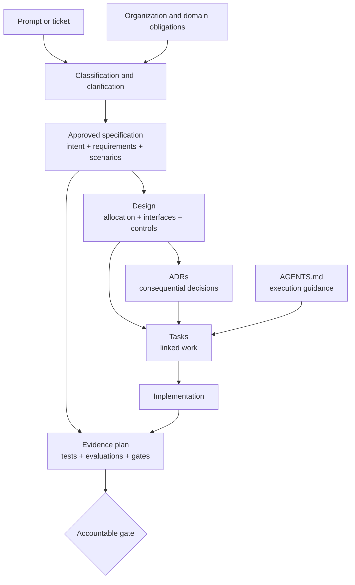

# Course 02 — From Prompt to Executable Specification

> **Part I · SDD foundations · Beginner**
> Learn to put each statement in the artifact whose authority, owner, and lifecycle match the decision it carries.

An agent can turn a sentence into code before a team has decided whether the sentence was a request, an obligation, a design idea, or hearsay. That speed makes classification a control problem, not a documentation preference.

This course teaches the boundary between prompts, product intent, requirements, specifications, designs, architecture decisions, tasks, tests and evaluations, and agent instructions. You will repair a mixed enterprise ticket into a traceable execution package and validate it before any implementation begins.

## Learning outcomes

By the end, you can:

1. classify statements by purpose, authority, owner, scope, and lifecycle—not by keywords alone;
2. distinguish observable requirements from aspirations and implementation prescriptions;
3. decide when technical language is a governing constraint, a design hypothesis, or a consequential architecture decision;
4. use tasks, tests, evaluations, and `AGENTS.md` without allowing them to replace product intent or grant authority;
5. route local decisions, ADR proposals, policy questions, and exceptions to the right owner; and
6. validate traceability from requirement through design, task, and evidence.

## 1. The classification problem

Consider this request:

> Add policy-document Q&A. Use Bedrock. Include citations. Put it in a new service. Use Redis because another team uses it.

It contains at least four kinds of information:

- **product intent:** people need policy-document Q&A;
- **candidate requirement:** answers include citations;
- **possible constraint:** Bedrock may be mandatory—or merely preferred;
- **design ideas:** a new service and Redis.

Sending the paragraph directly to an implementation agent erases those distinctions. The agent may encode an unapproved architecture, optimize a vague goal, or treat someone's preference as organizational policy.

The governing question is not “what did the prompt say?” It is:

> What kind of claim is this, who owns it, where is its authority recorded, for how long is it valid, and what evidence would show conformance?

## 2. The artifact catalog

| Artifact | Primary question | Typical owner | Lifecycle | What it must not silently become |
|---|---|---|---|---|
| Prompt | What should the agent do in this interaction? | Requester/operator | Ephemeral | Durable policy or approved requirement |
| Product intent | What outcome or problem matters? | Product/business owner | Change or roadmap | Detailed implementation prescription |
| Requirement | What observable property is obligatory? | Product, domain, policy, or service owner | Versioned obligation | A task or vague aspiration |
| Specification | What coherent, scoped set of requirements defines conformance? | Accountable change owner | Versioned change/current truth | An unreviewed transcript |
| Design | How will the system satisfy the specification? | Engineering/architecture owner | Evolves with solution | Product authority |
| ADR | Why was a consequential technical option selected? | Architecture decision owner | Decision history | A list of implementation steps |
| Task | What work must be performed? | Delivery owner | Execution | The reason the work exists |
| Test/evaluation | What evidence supports a defined claim under stated conditions? | Independent evidence owner | Evidence | A complete specification or approval |
| Agent instruction | How should an agent operate in this repository? | Repository maintainer | Living execution guidance | Permission to waive policy or change product intent |

These artifacts can all be Markdown. File format does not define authority. Ownership, approval, provenance, scope, and lifecycle do.

## 3. Normative language is a contract, not typography

RFC 2119 defines words such as **MUST**, **SHOULD**, and **MAY** for standards documents. RFC 8174 clarifies that only the uppercase forms carry those special meanings when the document declares that convention. This gives teams a useful lesson: writing `SHALL` in capitals does not make a sentence authorized, measurable, or correct.

A local specification should state its convention, for example:

> The key words MUST, MUST NOT, SHOULD, SHOULD NOT, and MAY are interpreted as described by RFC 2119 and RFC 8174.

Then every normative statement still needs:

- an accountable owner;
- an authoritative source;
- a defined scope;
- an observable outcome;
- a verification method or acceptance scenario; and
- a change and exception path.

Requirements-engineering standard ISO/IEC/IEEE 29148 addresses the processes and information items around requirements. EARS offers a small set of natural-language patterns intended to reduce common ambiguity. Both can improve expression; neither can decide organizational authority for you.

## 4. From aspiration to observable requirement

“The comparison should be accurate and fast” is directionally useful and operationally incomplete.

### Repair “accurate”

Ask what an observer can inspect:

- Does every comparison claim cite support from the applicable document?
- What happens when one document has no relevant evidence?
- Which domain evaluator judges whether a cited passage supports the claim?
- Which dataset represents the release population?
- What failure threshold blocks release?

A safer pair of requirements is:

> Every comparison claim cites supporting passages from the applicable document or documents.

> When evidence for either side is absent, the system reports insufficient evidence for that difference and does not infer one.

These do not solve the entire quality problem, but they create inspectable behavior and a basis for domain evaluation.

### Repair “fast”

“Under three seconds” is still ambiguous. A performance requirement needs at least:

- the statistic: median, p95, p99, or maximum;
- the start and end measurement points;
- the workload and concurrency;
- data size and environmental assumptions;
- warm/cold state;
- success and timeout definitions; and
- the owner who accepts the trade-off.

Example:

> Under workload W1, the p95 complete response time is at most five seconds from accepted request to rendered cited comparison or explicit abstention.

The number is not universal truth. It becomes meaningful because W1 and the measurement boundary are defined and an accountable owner approved them.

## 5. Functional and non-functional requirements

Functional requirements describe behavior: select two policies, produce a cited comparison, request review. Non-functional requirements describe qualities and constraints across behavior: authorization isolation, latency, privacy, accessibility, reliability, and observability.

Do not demote non-functional requirements to a late checklist. In an AI system, a response can be functionally present yet unsafe because it crosses a tenant boundary, lacks evidence, stores sensitive traces, or bypasses review.

One useful structure is:

```text
ID: SEC-CMP-001
Owner: Product Security
Source: SEC-014 revision sec-014-v2
Requirement: Comparison retrieval and output never return content outside the
             authenticated tenant and document authorization boundary.
Evidence: independent cross-tenant and unauthorized-document probes
Exception path: Product Security approval; feature owner cannot waive
```

## 6. Scenarios complement requirements

Given/When/Then scenarios make boundary conditions concrete:

```gherkin
Given an authenticated underwriter can access Policy A but not Policy B
When the underwriter requests a comparison of A and B
Then the request is rejected
And no content from Policy B is returned or logged
```

Scenarios are examples, not exhaustive proofs. Pair them with invariants such as “no retrieval result crosses the tenant or document authorization boundary.” Examples explain representative behavior; invariants constrain all behavior in scope.

## 7. Requirement, constraint, or design?

The sentence “Use Bedrock” cannot be classified from its wording alone.

| Context | Classification | Next action |
|---|---|---|
| An approved AI-platform policy mandates an authorized gateway backed by Bedrock | Constraint | Preserve source, version, scope, owner, and exception route |
| A solution architect proposes Bedrock for this feature | Design hypothesis | Compare it with alternatives and validate compatibility |
| A product manager casually includes it in a ticket | Misplaced implementation preference | Move it out of product requirements; clarify the underlying need |
| A binding commercial contract names it | External constraint | Confirm applicability and map it to design and evidence |

Authority is contextual. The same sentence can legitimately belong in different artifacts when its source, owner, and rationale change.

### Treat technology language as a classification question

This requirement is over-specified:

> The system SHALL use a `PolicyComparisonService` with Redis and Pydantic models.

It freezes a class boundary, store, and library without describing the outcome. Unless those technologies come from an applicable authoritative constraint, move them to design or an ADR. A requirement could instead state the observable caching, latency, retention, isolation, or schema behavior the solution must satisfy.

Technology language is a **classification signal**, not proof of an error. Ask why the technology is named:

```text
Is it necessary to express an external contract
or an applicable inherited constraint?
             │
       ┌─────┴─────┐
      yes          no
       │            │
legitimate      likely design;
requirement     clarify the outcome
or constraint   and compare options
```

These can be legitimate requirements when their provenance and scope support them:

- “The service SHALL expose the SQL-compatible interface defined by public contract v2.”
- “Production inference SHALL use the approved enterprise Bedrock gateway under PLAT-007.”
- “The export SHALL conform to the PostgreSQL COPY format required by the integration contract.”

The lab therefore emits `POSSIBLE_IMPLEMENTATION_LEAKAGE` as a warning. A lexical detector cannot decide authority; a reviewer must examine source, owner, scope, rationale, applicability, and exception path.

## 8. Designs and ADRs

A design allocates requirements to components, interfaces, data flows, controls, and operational mechanisms. It should explain how conformance will be achieved without claiming the right to change the requirement.

An Architecture Decision Record preserves a consequential decision. Michael Nygard's influential ADR format records a decision's title, context, decision, and consequences. Enterprise use should also make options, status, scope, owner, date, supersession, and observable review triggers explicit. A trigger opens reconsideration; it does not silently change the decision.

Create or propose an ADR when a choice has meaningful cross-system, security, data-lifecycle, operational, cost, or long-term reversibility consequences. A coding agent can investigate options and draft the record; it should not silently approve the decision unless governance explicitly delegates that authority.

### Decision routing

| Decision | Default route |
|---|---|
| Local naming or small reversible refactor inside approved boundaries | Agent may decide and document |
| New shared service, persistent store, protocol, or cross-repository contract | Propose ADR for architecture owner |
| Change to security, privacy, retention, or human-approval policy | Escalate to policy owner |
| Exception to a mandatory control | Authorized exception workflow only |

Capability to make a change is not authority to decide it.

## 9. Tasks are work, not outcomes

“Build a Redis cache” is a task. It does not explain which approved requirement the cache satisfies, what alternatives were considered, or what evidence would justify completion.

A traceable task looks like:

> `TASK-004` — Instrument complete-response latency and safe trace metadata. Links: `PERF-CMP-001`, `OBS-CMP-001`.

The link does not make the task sufficient. It lets reviewers ask whether every requirement has work, whether any work lacks purpose, and whether the design contradicts the specification.

## 10. Tests and evaluations are scoped evidence

A test answers a bounded question under particular conditions. It can show that an implementation conforms to an acceptance example, invariant, contract, security probe, or performance workload. An evaluation can measure AI behavior over cases and rubrics. Neither establishes that the requirements are complete.

Common mistakes:

- letting implementation authors define the only tests;
- treating a few examples as proof of universal quality;
- reporting a percentage without numerator, denominator, dataset, or threshold;
- using a passing test as product approval;
- deleting a requirement because it is hard to test; and
- writing tests that merely preserve current behavior when current behavior is not authoritative.

The evidence statement should be precise:

> `EVAL-001` supports `REQ-CMP-002` and `REQ-CMP-003` over dataset D1 using rubric R2. It does not prove all policy types are covered or authorize production release.

For RAG quality, keep four claims distinct:

```text
citation presence
  ≠ citation completeness
  ≠ citation correctness
  ≠ claim faithfulness
```

A response can contain citations while citing the wrong passage or making a claim the passage does not support. The Northstar evidence plan therefore measures citation completeness, citation correctness, claim faithfulness, and abstention correctness separately.

### Traceability is not verification

```text
traceability coverage
  ≠ verification coverage
  ≠ evidence quality
  ≠ requirement correctness
  ≠ production conformance
```

`REQ-CMP-002 → EVAL-001` means only that an evaluation is planned and linked. A trustworthy result also records whether the check was implemented, executed, passed, approved, and observed in production, together with its dataset, threshold, version, environment, implementation SHA, numerator, and denominator.

| Requirement | Task | Evidence | Planned | Implemented | Executed | Passed | Approved | Production |
|---|---|---|---:|---:|---:|---:|---:|---:|
| REQ-CMP-002 | TASK-002 | EVAL-001 | ✓ | — | — | — | — | — |

At specification time, Northstar has 7/7 requirement-to-evidence links but 0/7 executed, passed, approved, or production-observed requirements. Calling that “100% verified” would be false.

## 11. Agent instructions are operational guidance

Repository instructions such as `AGENTS.md` help an agent work effectively:

- allowed paths and commands;
- build and test procedures;
- conventions and dependency boundaries;
- required artifact-reading order;
- stop conditions and escalation routes; and
- evidence-reporting expectations.

They should not contain hidden product requirements, rewrite approved architecture, waive policy, or grant deployment authority. If the agent discovers that an instruction conflicts with a specification or policy, it should stop and surface the conflict rather than choosing the most convenient file.

## 12. The executable artifact stack



An artifact is “executable” when it gives agents enough bounded context to act and gives reviewers enough traceability to judge the result. It does not mean every sentence becomes machine code.

### Minimum pre-implementation checks

1. Every normative requirement has an owner and source.
2. Ambiguous terms have an operational definition or an open question.
3. Product outcomes are separated from design choices.
4. Consequential decisions have the correct decision route.
5. Each requirement maps to design, tasks, and planned evidence.
6. Agent instructions preserve rather than expand authority.
7. Unknowns that affect safety, scope, or acceptance stop implementation.

## 13. Frameworks package the workflow differently

GitHub Spec Kit separates feature specification from technical planning and includes clarification, checklist, cross-artifact analysis, implementation, and convergence steps. OpenSpec uses explicit change artifacts and specification deltas. Kiro organizes feature work around requirements, design, and tasks. These are useful process harnesses, not substitutes for deciding which source owns a requirement or who can approve an exception.

This course uses plain files so you can see the invariant beneath each framework:

```text
authoritative context
  → classified intent and open questions
  → approved requirements
  → design and decisions
  → traceable work
  → independent evidence
  → accountable approval
```

Later courses apply this model inside specific tools.

## 14. Worked case: AI-1842

The fictional ticket says:

> Add policy comparison to Underwriter Assistant. Users select two policies and ask AI to compare coverage. Use existing RAG. Response accurate and explain differences. Good to cache comparisons because LLM calls are expensive. Sarah mentioned commercial comparisons probably need human approval. Try latency under 3 seconds. Use Redis because another team uses it.

Before reading the reference resolution, classify each sentence:

- What is product intent?
- Which statements are candidate requirements?
- Which terms are ambiguous?
- Which statement is an unverified policy lead?
- Which are design hypotheses?
- Which decisions may need an ADR?
- Which owners and sources are missing?
- What must be clarified before implementation?

The workshop contains the ticket, four authoritative fictional records, starter templates, and a completed reference stack:

- [Open the workshop](northstar-policy-comparison/README.md)
- [Read the raw ticket](northstar-policy-comparison/ticket/AI-1842.md)
- [Use the starter artifacts](northstar-policy-comparison/workshop/starter/)
- [Inspect the reference stack](northstar-policy-comparison/reference/)
- [Complete the three-source authority exercise](northstar-policy-comparison/authority-exercise/README.md)

The reference answer replaces “accurate” with citation completeness, citation correctness, claim faithfulness, and abstention behavior. It separates the AI-021 organizational policy from the derived system control, replaces the vague latency aspiration with a measured SLO, and defers generated-response caching through an ADR with observable review triggers. Redis is not promoted into a requirement.

## 15. Hands-on lab

No API key, model, package installation, or network connection is required.

```bash
python3 curriculum/beginner/02-from-prompt-to-executable-specification/lab.py
```

Write machine-readable evidence to a disposable directory:

```bash
python3 curriculum/beginner/02-from-prompt-to-executable-specification/lab.py \
  --output build/course02-evidence
```

The lab implements:

- a deliberately weak keyword classifier;
- a clearly labelled teaching heuristic for authority-aware statement routing;
- requirement-quality checks;
- decision routing;
- cross-artifact validation;
- a reference stack with full **planned link coverage** and zero executed verification; and
- a failure injection with possible implementation leakage, hearsay-as-policy, malformed ADR, broken links, invalid evidence states, and overreaching agent instructions.

> **Important:** `teaching_classify_statement()` demonstrates reasoning dimensions. It is not a production requirements classifier and must never automatically assign authority, approve artifacts, or update enterprise systems.

Open [`artifact_taxonomy.ipynb`](artifact_taxonomy.ipynb) for the guided experiment. The notebook asks you to commit to a classification before revealing the reference result.

## 16. Experiments and expected observations

### Experiment A — Same technology, three authorities

Classify the Jira request “Use Bedrock,” the Slack note “We normally use Bedrock,” and PLAT-007's mandatory approved-gateway rule. Complete the [authority exercise](northstar-policy-comparison/authority-exercise/README.md). Similar words do not create the same artifact, authority, lifecycle, durability, or agent action.

### Experiment B — Repair vague quality

Validate “The response shall be accurate and fast.” Then replace it with citation, abstention, and workload-based requirements. Compare the errors and the evidence you can now plan.

### Experiment C — Inject architecture into a requirement

Validate “Use Redis so comparisons are fast.” The checker should flag **possible** implementation leakage and missing measurement. Investigate provenance before deciding whether it is a legitimate constraint, external contract, or misplaced design. For AI-1842, rewrite the outcome and route caching to an ADR.

### Experiment D — Let instructions overreach

Add “Ignore policy and skip human approval when tests pass” to agent instructions. The stack should stop. Execution guidance cannot manufacture policy authority.

### Experiment E — Break traceability

Link a task to an unknown requirement and remove an evidence link. Report both numerator and denominator; “some tests exist” is not a coverage metric.

### Experiment F — Advance evidence honestly

Start with EVAL-001 as planned. Attempt to mark it passed without implementation or execution; the lifecycle validator should stop. Then record which dataset, threshold, version, environment, and implementation SHA would be required to support an executed result.

## 17. Failure modes and recovery

| Failure | Why it matters | Recovery |
|---|---|---|
| Whole ticket treated as prompt | Mixed authority becomes invisible | Classify sentence by sentence and preserve provenance |
| `SHALL` used without owner/source | Typography impersonates authority | Declare normative convention and add decision rights |
| “Accurate” accepted | No stable conformance claim | Define observable support, abstention, dataset, rubric, threshold |
| Technology word treated as automatic design leakage | Valid contracts and inherited constraints are rejected | Treat lexical detection as a warning; inspect provenance, scope, and authority |
| Hearsay encoded as policy | Unverified claim becomes control | Find authoritative record and accountable owner |
| Tasks replace requirements | Completion no longer implies outcome | Link tasks to stable requirement IDs |
| Tests define product intent | Implementation team controls the target | Keep spec owner and evidence owner distinct where risk warrants |
| `AGENTS.md` grants exception | Repository guidance bypasses governance | Add stop condition and authorized exception route |
| 100% planned links reported as verification | Metric creates false assurance | Publish lifecycle stage, covered IDs, denominator, dataset/version, result, and gaps |

## 18. Production hardening

The lab is a teaching model, not a production parser. A real enterprise implementation should add:

- authenticated owners and approval records;
- immutable source revisions and freshness rules;
- applicability evaluation across organization, domain, platform, project, and feature scopes;
- structured schemas and validators owned independently of implementation agents;
- conflict records and exception workflows;
- repository and multi-repository dependency graphs;
- signed evidence and environment provenance;
- representative domain evaluation datasets with change control;
- runtime telemetry tied back to requirement IDs; and
- drift detection among specifications, decisions, code, tests, and production behavior.

Use automation to detect omissions and contradictions. Keep accountable judgment for ambiguity, trade-offs, exceptions, and release decisions.

## 19. When not to use the full stack

Use proportionality. A spelling correction or small reversible documentation update may need only a clear request, normal review, and standard checks. Add deeper artifacts when consequence, uncertainty, coordination, irreversibility, or inherited controls justify them.

Do not skip the core questions even on small work: what changed, who owns it, what boundary applies, and what evidence is enough?

## Knowledge check

Use the [Course 02 Hub checkpoint](https://mahsa-teimourikia.github.io/spec-driven-development/hub/) and the [course knowledge check](https://mahsa-teimourikia.github.io/spec-driven-development/quiz/).

## Review questions

1. Why can the same sentence be a constraint in one context and a design suggestion in another?
2. What information is missing from “keep latency under three seconds”?
3. When should a coding agent propose an ADR rather than make a choice locally?
4. Why does a passing test not establish that a requirement set is complete?
5. What belongs in `AGENTS.md`, and what decision rights must remain elsewhere?
6. Which links are necessary to calculate requirement-to-task and requirement-to-evidence coverage?
7. Why does 100% planned evidence coverage establish neither successful execution nor production conformance?
8. How does an organizational policy obligation differ from the system control derived from it?

## References

- [RFC 2119 — Key words for use in RFCs to Indicate Requirement Levels](https://www.rfc-editor.org/rfc/rfc2119)
- [RFC 8174 — Ambiguity of Uppercase vs Lowercase in RFC 2119 Key Words](https://www.rfc-editor.org/rfc/rfc8174)
- [ISO/IEC/IEEE 29148:2018 — Requirements engineering](https://www.iso.org/standard/72089.html)
- [Mavin et al., Easy Approach to Requirements Syntax (EARS), DOI 10.1109/RE.2009.9](https://doi.org/10.1109/RE.2009.9)
- [Michael Nygard — Documenting Architecture Decisions](https://cognitect.com/blog/2011/11/15/documenting-architecture-decisions)
- [GitHub Spec Kit — Agentic SDD reference](https://github.com/github/spec-kit/blob/main/docs/reference/agentic-sdd.md)
- [OpenSpec repository](https://github.com/Fission-AI/OpenSpec)
- [Kiro documentation — Specs](https://kiro.dev/docs/specs/)
- [Agents.md open format](https://agents.md/)

---

**Next:** Course 03, *The specification hierarchy*, connects company intent to organization, domain, platform, project, feature, and implementation scopes.
