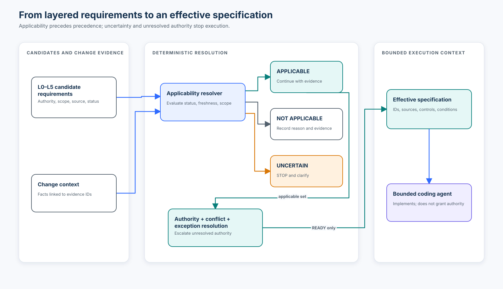

# Course 03 — The Specification Hierarchy

> Enterprise requirement inheritance, applicability, authority, provenance,
> freshness, conflicts, exceptions, and effective agent context.

Course 01 established why agentic development needs durable specifications.
Course 02 separated product intent, requirements, designs, decisions, tasks,
evidence, and agent instructions. Course 03 answers the next unavoidable question:

> Once requirements live in different places and have different owners, how do
> we determine the effective specification an agent must follow?

## Learning outcomes

After completing this course, you can:

1. model organization, platform, domain, project, feature, and implementation
   requirements without assuming lower layers automatically override higher ones;
2. evaluate applicability as `applicable`, `not applicable`, or `uncertain` and
   preserve the facts and evidence behind the decision;
3. distinguish authority from specificity, proximity, recency, and document format;
4. use source provenance, lifecycle status, effective dates, and freshness limits
   to prevent stale or draft artifacts from silently governing work;
5. detect genuine conflicts that an implementation agent must escalate;
6. validate scoped, conditional, expiring exception records without treating
   local fields as authenticated approval; and
7. compose a minimal effective context that retains stable requirement IDs,
   source locators, exception conditions, and unresolved stop states.

## Prerequisites

- [Course 01 — Why agentic coding changes the PDLC](../01-why-agentic-coding-changes-pdlc/README.md)
- [Course 02 — From prompt to executable specification](../02-from-prompt-to-executable-specification/README.md)
- Comfort reading JSON, Python dataclasses, tests, and simple policy artifacts

## Scenario, success criteria, and boundaries

Northstar Mutual receives ticket `AI-1937`:

> Allow an underwriter to export a policy comparison as a PDF and email it to a broker.

The feature lives inside privacy, security, AI-governance, messaging-platform,
records-management, project-architecture, and product requirements. One privacy
rule says generated PII interactions are deleted after 30 days. A records rule
says final broker underwriting communications are retained for seven years.

The course succeeds when the learner can produce an evidence-backed applicability
matrix, identify the retention conflict, reject an informal direct-email provider
override, assess a scoped exception, and generate a provenance-preserving effective
context. A parser running without credentials is not evidence of real organizational
approval, legal interpretation, deployed enforcement, or production conformance.

Non-goals:

- building a universal policy engine;
- claiming that layer number alone determines precedence;
- converting all organizational judgment into YAML or JSON;
- teaching OPA, Cedar, OSCAL, or any SDD framework in depth; or
- giving an implementation agent authority to resolve policy conflicts.

## 1. Why a feature specification is only one input

The feature says export and email. The effective obligation is closer to:

```text
PDF export
+ authorized broker delivery
+ Corporate Messaging Gateway
+ DLP inspection
+ Canadian restricted-data residency
+ AI-content disclosure
+ seven-year final-record retention
+ 30-day intermediate-interaction deletion
+ encryption, audit, and exception conditions
```

The requirements come from different owners and repositories. Concatenating them
does not answer which apply, which are current, which conflict, or which source has
authority. The effective specification must be *resolved*, not merely retrieved.



## 2. The six layers are scopes, not a winner ladder

```text
L0  Organization      privacy, security, compliance, AI governance
L1  Platform          cloud, identity, messaging, AI, observability
L2  Domain            underwriting, claims, records obligations
L3  Project/System    architecture, interfaces, conventions
L4  Feature/Change    behavior introduced by this change
L5  Implementation    tasks, code, bounded local choices
```

The hierarchy answers *where an obligation is owned and scoped*. It does not imply:

```text
L0 always wins L1
L1 always wins L2
...
```

An organization payment-card control does not apply to a change with no card data.
Two mandatory requirements from privacy and records management can both apply and
still conflict. An informal feature comment can be more specific than a platform
rule and still lack authority to override it.

## 3. Applicability comes before precedence

The safe resolution sequence is:

```text
all candidate requirements
          ↓
status, date, provenance, and scope evaluation
          ↓
applicable / not applicable / uncertain
          ↓
authority and compatibility resolution
          ↓
conflict escalation and scoped exception review
          ↓
effective specification or STOP
```

For `PCI-002`, the change context contains no payment-card data. The correct result
is `not_applicable`, with `DATA-FLOW-1937` as evidence. The policy remains active;
it simply does not govern this change.

### Conditional applicability

`PRIV-018` applies only when all of these facts match:

- environment is production;
- data classification is confidential or restricted; and
- jurisdiction is Canada.

The decision is not a keyword match. It is a claim about the change context and
must carry the evidence IDs that support its facts.

### Unknown is not not applicable

If the data classification is absent, this is unsafe:

```python
if classification in {"confidential", "restricted"}:
    apply_privacy_rule()
else:
    ignore_privacy_rule()
```

Missing data is not proof that the condition is false. The lab returns:

```text
PRIV-018 → UNCERTAIN → STOP_AND_CLARIFY
```

Uncertainty reduces autonomy. It does not grant the coding agent a choice.

## 4. Composition keeps provenance

Let the candidate sets be organization `O`, platform `P`, domain `D`, system `S`,
and feature `F` requirements. The naive model is:

```text
Context = O + P + D + S + F
```

A safer conceptual model is:

```text
Candidates = O ∪ P ∪ D ∪ S ∪ F

Applicable = evaluate(Candidates, ChangeContext)

EffectiveSpecification = resolve(Applicable, Authority, Exceptions)
```

The union must preserve source identity. Here `resolve` is not a mathematical
proof of organizational correctness; it is a deterministic workflow that exposes
what needs owner judgment.

## 5. Requirement metadata is operational context

A durable enterprise requirement needs more than a sentence:

```json
{
  "id": "PRIV-018",
  "statement": "Restricted Canadian customer data SHALL remain in approved Canadian regions.",
  "owner": "Privacy Office",
  "authority": "mandatory",
  "status": "active",
  "effective_from": "2026-07-01",
  "valid_until": "2027-06-30",
  "source": {
    "repository": "enterprise-policy",
    "path": "privacy/PRIV-018.json",
    "version": "4.2-training",
    "revision": "a84c4f9-training"
  },
  "scope": [
    {"field": "environment", "allowed_values": ["production"]},
    {"field": "data_classification", "allowed_values": ["restricted"]},
    {"field": "jurisdiction", "allowed_values": ["canada"]}
  ]
}
```

The values are fictional training data. The important structure is:

```text
requirement = statement + owner + authority + scope + lifecycle + provenance
```

### Provenance

The source locator lets reviewers distinguish an active policy from copied Jira
text, chat, a draft, a stale wiki page, or a historical ADR. The lab requires a
repository, path, version, and immutable revision. Production systems may also
need publisher identity, digest, signature, issue time, review history, and
authenticated retrieval.

### Lifecycle and freshness

Useful states include:

```text
DRAFT → PROPOSED → ACTIVE → SUPERSEDED → RETIRED
```

`ARCH-004` remains in the scenario as history but is `superseded`, so it is not
inherited. If a record claims to be active after its freshness boundary, the lab
returns `UNCERTAIN` instead of trusting a stale assertion.

Freshness and authority are independent dimensions:

| Source | Authority | Freshness/status | Action |
|---|---|---|---|
| PRIV-018 v4.2 | Mandatory | Active/current | Evaluate and inherit if applicable |
| ARCH-004 | Approved history | Superseded | Retain as history; do not inherit |
| Jira suggestion | Informal | Current | Context only; cannot override policy |
| Draft standard | Potential authority | Draft | Do not enforce as active policy |

## 6. Precedence is not proximity

`TICKET-MSG-001` says to use SendGrid directly. `MSG-004` requires the Corporate
Messaging Gateway. Both statements apply to outbound email, but their authority
differs.

```text
more specific      ≠ more authoritative
closer to code     ≠ authorized exception
newer comment      ≠ approved replacement
structured format  ≠ trusted policy
```

The lab selects `MSG-004` and records the rejected suggestion with reason code
`HIGHER_AUTHORITY_WINS_NOT_GREATER_SPECIFICITY`. It does not delete the ticket
text; it preserves the decision trail.

Authority resolution can be automated only where the organization has declared
the rule. Layer position is useful context, not a universal conflict algorithm.

## 7. Genuine conflicts must stay visible

`PRIV-030` and `RET-017` are both mandatory and applicable:

```text
PRIV-030: generated PII interactions → delete after 30 days
RET-017: final broker underwriting communication → retain 2,555 days
```

Neither owner delegated this decision to the implementation agent. Without a
valid resolution, the lab emits `CONFLICT-RETENTION-DAYS` and the gate is `STOP`.

A conflict record should contain:

- stable conflict ID;
- applicable requirement IDs and source versions;
- exact incompatible control or outcome;
- applicability evidence;
- accountable decision owners;
- current implementation state; and
- resolution or escalation status.

## 8. Exceptions are first-class, scoped artifacts

An exception does not erase a policy. It modifies how a named policy applies to
a bounded scope under explicit conditions.

`EXC-009` names:

- the requirement it modifies;
- the exact change scope;
- the replacement control value;
- rationale and compensating conditions;
- owner, approver, and approval-record locator;
- creation and expiry dates; and
- its own source version and revision.

The effective control retains both `PRIV-030` and `RET-017`, plus `EXC-009` and
all four compensating conditions. Hiding the exception inside the feature spec
would let a feature author appear to rewrite corporate policy.

### Expiry is an enforcement boundary

When `EXC-009` expires, it no longer resolves the conflict. The resolver reports
`EXCEPTION_EXPIRED`, exposes the original conflict, and returns `STOP`.

### Structural validity is not authenticated approval

The training code checks fields, scope, dates, and provenance. It does not prove
that the approver identity is authentic, that the approval record exists in a
trusted system, or that it is cryptographically bound to this exact exception.
Production approval validation belongs to trusted application code and durable
state—not to a model, prompt, or local boolean.

## 9. Give agents resolved context, not the corpus

Dumping thousands of policies into a coding-agent prompt is not resolution. It
creates token pressure, conflicting instructions, poor salience, and uncertain
freshness. A context supply chain should resemble:

```text
enterprise corpus
      ↓ candidate discovery
potentially relevant records
      ↓ applicability evaluation
applicable records + uncertainty
      ↓ authority/conflict/exception resolution
effective specification or STOP
      ↓ provenance-preserving compression
bounded agent context
```

Bad compression:

```text
Use the corporate gateway. Keep records seven years. Do not expose PII.
```

Better compression:

```text
[MSG-004 | mandatory | platform-standards:messaging/MSG-004.json@6.0#revision]
outbound_email_provider = corporate_messaging_gateway

[PRIV-030 + RET-017 | mandatory | EXC-009]
retention_days = 2555
condition = delete intermediate model interactions after 30 days
```

The agent needs enough source identity to explain and verify its decisions. The
full corpus can remain outside the prompt while still being reachable by ID.

## 10. Internal mechanics of the deterministic lab

[`lab.py`](lab.py) loads the same JSON artifacts learners inspect in the workshop.
Its sequence is:

1. validate unique IDs, owners, provenance, scope rules, and control fields;
2. evaluate status, effective dates, freshness, and scope facts;
3. preserve evidence IDs for every applicability decision;
4. validate exception scope, dates, metadata, and conditions;
5. apply valid scoped modifications without deleting the owning requirement;
6. group applicable requirements by control;
7. resolve declared authority differences and record rejected inputs;
8. escalate incompatible values at equal highest authority;
9. return `READY` only when no uncertainty, conflict, or error remains; and
10. emit minimal agent context containing IDs, source locators, controls, and
    exception conditions.

Run it locally:

```bash
python3 curriculum/beginner/03-the-specification-hierarchy/lab.py
```

Write machine-readable evidence to a disposable directory:

```bash
python3 curriculum/beginner/03-the-specification-hierarchy/lab.py \
  --output build/course03-evidence
```

## 11. Technology landscape

Course 03 implements the primitive with the Python standard library so that the
decision logic remains visible. Production technologies solve narrower parts of
the larger operating model:

| Option | Strength | Limitation | Best fit here |
|---|---|---|---|
| Markdown + Git | Reviewable narrative, history, ownership proximity | Weak structural guarantees | Human-readable policies and decisions |
| JSON/YAML + JSON Schema | Portable metadata and validation | Schema-valid is not authoritative or semantically correct | Requirement and exception records |
| OPA/Rego | General policy decisions over structured input; decouples decision from enforcement | Requires policy lifecycle, input contracts, tests, and enforcement integration | CI, API, infrastructure, and configuration decisions |
| Cedar | Purpose-built principal/action/resource/context authorization decisions with default-deny semantics | Not a general requirements-resolution or compliance language | Application authorization boundaries |
| NIST OSCAL | Standardized machine-readable control, implementation, and assessment information | Rich compliance model; adoption and organizational mapping still require work | Security/privacy control catalogs and assessment exchange |
| Custom resolver | Fits organization-specific scope, ownership, and conflict workflows | Creates maintenance, correctness, and portability obligations | Small transparent teaching model or narrowly governed domain |

[OPA documents](https://www.openpolicyagent.org/docs) a general-purpose policy
engine that evaluates structured input using Rego. [Cedar documents](https://docs.cedarpolicy.com/)
authorization policies over principal, action, resource, and context. [NIST OSCAL](https://pages.nist.gov/OSCAL/)
defines machine-readable XML, JSON, and YAML models for control and assessment
information. These tools complement one another; none automatically discovers
organizational intent or authenticates a copied exception record.

## 12. Established practice, emerging practice, and open problems

Established practice includes version-controlled requirements, declared owners,
ADRs, policy-as-code for bounded decisions, CI gates, exception registers, and
traceability. Structured control catalogs such as OSCAL provide standardized
exchange for security and privacy information.

Emerging enterprise practice connects control catalogs, product specifications,
policy decision points, repository context, and agent context manifests. The
hard part is not retrieval alone: it is evaluating applicability, authority,
freshness, conflicts, and loss during compression.

Open problems include semantic conflict detection, trustworthy cross-repository
provenance, policy freshness at scale, evaluating context-selection recall,
representing judgment-heavy obligations without false precision, and proving
that production behavior still conforms to the resolved specification.

## 13. Experiments and expected observations

Open [`specification_hierarchy.ipynb`](specification_hierarchy.ipynb) and predict
each result before executing it.

### Experiment A — Concatenation baseline

Copy all 13 statements into one context. Observe that the baseline includes the
irrelevant payment-card rule, superseded US-region note, direct SendGrid suggestion,
and unresolved retention conflict without explaining any disposition.

### Experiment B — Applicability with evidence

Run the reference context. Confirm 11 applicable, two not applicable, and zero
uncertain decisions. Inspect the evidence IDs instead of accepting the counts alone.

### Experiment C — Delete data classification

Remove `data_classification`. Privacy and related rules become uncertain. The
resolver stops; it does not reinterpret missing data as low sensitivity.

### Experiment D — Remove or expire the exception

Without valid `EXC-009`, two mandatory retention values conflict. The agent cannot
compose executable context.

### Experiment E — Test specificity against authority

Keep the feature-level direct SendGrid suggestion. Confirm that `MSG-004` wins by
declared authority, not because platform always beats feature.

### Experiment F — Inspect compression

Confirm that `PCI-002` and `ARCH-004` are absent from agent context, while stable
IDs, source locators, `EXC-009`, and every exception condition remain.

## 14. Evaluation

This course reports explicit populations:

| Measure | Numerator/meaning | Denominator | Reference result |
|---|---|---|---:|
| Applicability distribution | Applicable, N/A, uncertain decisions | 13 candidates | 11 / 2 / 0 |
| Provenance completeness | Records with owner and complete source locator | 13 candidates | 13 / 13 |
| Effective controls | Resolved control/value groups | Applicable controls after resolution | 8 |
| Unresolved conflicts | Highest-authority groups with incompatible values | Conflict candidates | 0 with EXC-009; 1 without |
| Valid exceptions | Structurally valid, in-scope, current records | Exception candidates | 1 / 1 |

These measures establish internal structural behavior of the fixture. They do not
prove policy completeness, legal correctness, authentic approval, implementation
conformance, release authority, or production behavior.

A production evaluation should add labelled cases for missing facts, wrong scope,
future/expired/superseded artifacts, invalid provenance, simultaneous exceptions,
authority conflicts, malicious retrieved instructions, and context-compression
loss. Track false exclusions as seriously as irrelevant inclusions.

## 15. Failure modes and recovery

| Failure | Risk | Recovery |
|---|---|---|
| Concatenate every policy | Irrelevant, stale, and conflicting instructions look equally active | Evaluate applicability and lifecycle first |
| Treat unknown as N/A | Missing facts silently widen autonomy | Return uncertain and require clarification |
| Assume lower layer wins | Feature text appears to rewrite corporate policy | Resolve declared authority separately from specificity |
| Assume higher layer always wins | Legitimate cross-domain conflict is hidden | Escalate incompatible highest-authority obligations |
| Trust structured data | Typed but forged or stale records gain authority | Authenticate source, publisher, revision, and lifecycle |
| Copy exception into feature spec | Feature owner appears to waive policy | Link a separately owned, scoped, expiring exception |
| Drop IDs during compression | Agent decisions cannot be traced or refreshed | Preserve IDs, locators, exception conditions, and stop states |
| Give agent conflict authority | Implementation optimizes away organizational risk | Block and route to named owners |
| Count retrieved records as coverage | Search recall is mistaken for correct applicability | Evaluate decisions against labelled cases and owners |

## 16. Production upgrade path

| Teaching lab | Production capability |
|---|---|
| Local JSON source refs | Authenticated artifact registry, immutable digests, publisher identity |
| Date comparisons | Trusted time, review schedules, revocation, freshness service |
| Exact string scope | Versioned schemas, controlled vocabularies, ontology/mapping governance |
| Numeric authority enum | Organization-owned decision table with review and exception routes |
| Structural approval locator | Authenticated, signed, scope-bound, expiring approval record |
| In-memory resolution | Durable workflow with optimistic locking and reproducible snapshots |
| Simple conflict grouping | Semantic conflict analysis plus accountable human adjudication |
| Text context output | Signed context manifest, token budget, loss/recall evaluation, retrieval by ID |
| Unit tests | Golden cases, mutation/failure injection, policy-owner review, CI gates |
| `READY` gate | Separate merge, deployment, and production-release decisions with evidence |

Observability should record change ID, requirement and source revisions,
applicability reasons, fact evidence IDs, exception IDs and expiry, conflict IDs,
resolver version, output digest, reviewers, and terminal state—without copying
sensitive content unnecessarily.

## 17. When not to use the full resolver

A small spelling correction with no behavior, policy, data, or deployment impact
may need only normal review and standard checks. A single-team reversible change
with one authoritative local contract may use a lighter applicability note.

Use the fuller hierarchy process when obligations are distributed, data or
communications cross boundaries, multiple owners have authority, artifacts can
be stale, exceptions exist, or an agent would otherwise fill consequential gaps.

## 18. Exercises

1. **Implementation:** add a new accessibility requirement with scope and source
   metadata; update the reference applicability matrix and expected control.
2. **Diagnosis:** remove jurisdiction evidence and identify every decision that
   becomes uncertain. Explain why other decisions remain stable.
3. **Conflict:** add a second mandatory messaging rule with an incompatible route.
   Confirm the resolver escalates instead of using layer order.
4. **Exception:** create an expired or wrong-change exception and show the exact
   stop codes. Do not “fix” it by changing the feature specification.
5. **Freshness:** mark `ARCH-004` active while leaving its freshness boundary in
   the past. Explain why stale-active becomes uncertain rather than applicable.
6. **Compression:** remove source locators or one exception condition from the
   context composer. Design a test that detects the loss.
7. **Architecture judgment:** choose Markdown, JSON Schema, OPA, Cedar, OSCAL, or
   a combination for a real organization and defend the ownership boundary.
8. **Proportionality:** identify a real change where this full workflow would be
   excessive and define the minimum defensible record.

## Review questions

1. Why must applicability be evaluated before precedence?
2. When is `not applicable` justified, and what evidence should accompany it?
3. Why does a more specific feature statement not automatically win?
4. What distinguishes an authority resolution from a genuine conflict?
5. Why must a superseded requirement remain discoverable but non-governing?
6. Which exception fields prevent a temporary waiver from becoming invisible policy?
7. What information must survive context compression?
8. What can the deterministic lab prove, and what remains unverified?

## Knowledge check

Use the [Course 03 Hub checkpoint](https://mahsa-teimourikia.github.io/spec-driven-development/hub/)
and the cumulative [course knowledge check](https://mahsa-teimourikia.github.io/spec-driven-development/quiz/).

## References

- [ISO/IEC/IEEE 29148:2018 — Requirements engineering](https://www.iso.org/standard/72089.html)
- [NIST OSCAL — Open Security Controls Assessment Language](https://pages.nist.gov/OSCAL/)
- [NIST OSCAL control layer and profiles](https://pages.nist.gov/OSCAL/learn/concepts/layer/control/)
- [Open Policy Agent documentation](https://www.openpolicyagent.org/docs)
- [OPA/Rego policy language](https://www.openpolicyagent.org/docs/policy-language)
- [Cedar Policy Language reference guide](https://docs.cedarpolicy.com/)
- [JSON Schema specification](https://json-schema.org/specification)
- [RFC 2119 — Key words for requirements](https://www.rfc-editor.org/rfc/rfc2119)
- [RFC 8174 — Uppercase normative terms](https://www.rfc-editor.org/rfc/rfc8174)

---

**Previous:** [Course 02 — From prompt to executable specification](../02-from-prompt-to-executable-specification/README.md)

**Next:** Course 04, *Company vs project vs feature requirements*, deepens
ownership, requirement location, enforcement, specialization, and RACI.
