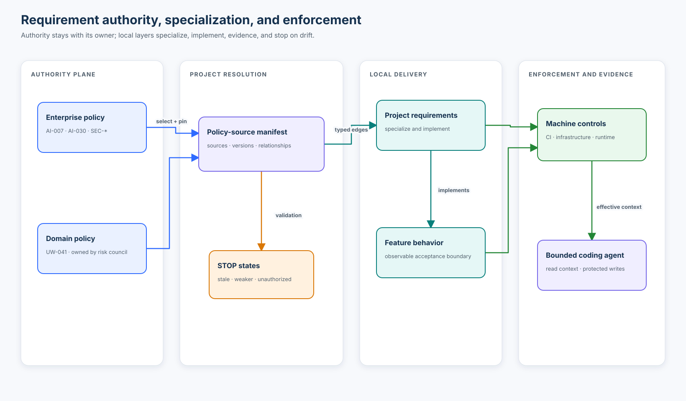

# Course 04 — Company vs project vs feature requirements

> Place each obligation at the level that owns the decision, connect it to downstream implementations without copying authority, and make policy change visible before an agent changes code.

## Why this course exists

An enterprise requirement rarely becomes executable in one step. A company may require human review for consequential AI. A domain may define who is qualified to review an underwriting decision. A project may choose a shared review service. A feature may define the exact release transition that must remain blocked.

Those statements are related, but they are not interchangeable. If every project copies central policy, copies drift. If every detail stays central, central teams become delivery bottlenecks. If a feature team treats proximity to code as authority, a local ticket can silently weaken an enterprise obligation. Agentic delivery amplifies all three failure modes because agents can reproduce, transform, and implement inconsistent text quickly.

This course teaches a federated alternative: **centralize the invariant, specialize it locally, preserve explicit relationships, and enforce it at the layer that can actually observe the decision**.

## Learning objectives

By the end, you can:

1. decide whether a requirement belongs at enterprise, domain, project, or feature level;
2. distinguish requirement owner, consumer, implementation owner, and enforcement owner;
3. model `INHERITS`, `SPECIALIZES`, `IMPLEMENTS`, `EVIDENCES`, `EXCEPTS`, and `SUPERSEDES` without inventing an automatic “closest file wins” rule;
4. prove that a specialization narrows or strengthens its parent rather than weakening it;
5. separate explanatory documentation from detective and preventive enforcement;
6. use a compact project policy manifest to select governed sources without copying a central catalog;
7. bind exceptions to requirement, version, scope, approver, and expiry;
8. propagate a central change through direct and transitive consumers; and
9. give a coding agent enough context to implement work while denying it authority to rewrite policy or approve exceptions.

## Prerequisites and boundary

Complete [Course 03: The specification hierarchy](../03-the-specification-hierarchy/README.md) first. Course 03 asks which requirements apply and how conflicts are resolved. Course 04 asks where those requirements should live, who may change them, how lower layers relate to them, and how changes propagate.

The lab validates local teaching fixtures. It does not authenticate a publisher, signature, approver, repository protection rule, or runtime decision. Those are production controls, not properties a JSON field can prove.

---

## 1. Placement follows decision rights

The right level is the narrowest level that legitimately owns the decision **without creating duplicated authority**.

| Level | Owns | Should not own | Example |
| --- | --- | --- | --- |
| Enterprise | Cross-business invariants, regulated controls, approved shared capabilities, global minimums | Product-specific workflow details | `AI-030`: consequential AI requires human approval |
| Domain | Rules whose authority comes from a business or technical domain | One project’s component choice | `UW-041`: a senior underwriter must approve renewal recommendations |
| Project | Architecture and operating choices shared by several features | A waiver of enterprise or domain policy | `ARCH-031`: this project specializes review through Review Service v2 |
| Feature | Observable behavior and acceptance boundaries for one user outcome | Organization-wide policy or platform ownership | `REQ-REN-004`: hold the recommendation until authorized review is recorded |

Ask five questions:

1. **Who can approve a change?** If a project product owner cannot approve it, it is not project-owned.
2. **Who is affected?** Broad blast radius usually implies broader ownership, but reach alone does not prove authority.
3. **What is stable?** Long-lived invariants belong above short-lived implementation choices.
4. **Where can it be observed?** The obligation may be owned centrally while its evidence is produced in CI, infrastructure, or runtime.
5. **What happens when it changes?** The owning layer must publish migration intent and identify affected consumers.

### A common category error

“The company requires human review, so put the requirement in every feature spec” confuses **consumption** with **ownership**. The feature should derive observable behavior from the central obligation and link back to it. It should not become a new policy publisher.

## 2. Four roles, not one owner field

A single `owner` field cannot explain an enterprise control system.

| Role | Decision right | AI-2048 example |
| --- | --- | --- |
| Requirement owner | Changes or retires the obligation | Enterprise AI Governance owns `AI-030` |
| Consumer | Must satisfy the obligation | Renewal Assistant and its feature teams |
| Implementation owner | Chooses and maintains the mechanism within constraints | Project architecture owner selects Review Service v2 |
| Enforcement owner | Operates the control that observes or blocks behavior | Review Platform operates the receipt gate |

A RACI can make collaboration visible, but it does not itself authorize a policy change. The source repository, approval workflow, and protected decision record establish authority.

## 3. Relationships carry meaning

Treat requirements as a graph, not a stack of prose files.

| Relationship | Meaning | Valid example | Invalid shortcut |
| --- | --- | --- | --- |
| `INHERITS` | Child is subject to the parent without restating it | Project selects the enterprise AI policy source | Copy the full policy into the repository |
| `SPECIALIZES` | Child narrows or strengthens a parent within delegated freedom | Approved gateways `{Azure, Bedrock}` → project selects `{Bedrock}` | Add an unapproved gateway |
| `IMPLEMENTS` | Child names observable behavior or a mechanism satisfying the parent | Review Service v2 implements the review obligation | Claim the mechanism now owns the policy |
| `EVIDENCES` | Artifact supports a conformance claim | Runtime denial log evidences the release guard | Treat a planned test as a passing result |
| `EXCEPTS` | Authorized, scoped, time-bound record modifies one obligation | `EXC-014` names policy version, feature, approver, and expiry | A ticket says “skip review for small cases” |
| `SUPERSEDES` | New authoritative record replaces an old version | `AI-030@4.0-training` supersedes `3.0-training` | Delete history and lose provenance |

### Relationship invariants

- Both endpoints use stable IDs.
- A specialization or exception records the parent revision it evaluated; the typed graph connects the stable IDs.
- A graph must be acyclic for inheritance and implementation resolution.
- A specialization preserves the parent’s authority domain and controlled subject.
- An exception changes only the named obligation and scope; every other obligation remains in force.
- A relationship is an assertion to validate, not proof that the relationship is legitimate.

## 4. Monotonic specialization

A normal project specialization can be stricter than its parent, but not weaker.

For an allowlist:

\[
Allowed_{child} \subseteq Allowed_{parent}
\]

For a minimum ordered threshold:

\[
Rank_{child} \ge Rank_{parent}
\]

For a required Boolean, `true` cannot become `false` downstream.

The Course 04 resolver makes the same principle executable with a deliberately small **fixed-versus-delegated control** model. A specialization cannot bind a fixed parent field—even to repeat the same value—because repetition would imply a decision right the child does not have. It may bind a delegated field only when the specialization owner matches the named decision owner. `ARCH-032-weakening.json` attempts to bind and weaken `AI-030` human review and is rejected with explicit reason codes. A production system needs domain-specific schemas, richer types for sets and thresholds, trusted publishers, and a defined conflict model.

| Record | Meaning | Example |
| --- | --- | --- |
| Binding | “This owner is making a delegated decision.” | Project Architecture selects `ReviewServiceV2` for `review_mechanism` |
| Conformance claim | “This design claims to support a fixed parent obligation.” | `ReviewReceipt.rationale` is claimed to support `review_rationale` |

The fixture's `supported_parent_controls: "design_claim_only"` values are deliberately
small teaching shorthand. They are unauthenticated design claims—not proof of
implementation, test execution, or runtime effectiveness. A production record
should link each parent control to named design elements, implementation
artifacts, and evidence IDs.

An authorized exception is different from specialization. It may permit a bounded weakening, but only through its own owner, approver, version, scope, conditions, and expiry. Calling a weakening a “specialization” hides a governance decision in an engineering artifact. The lab can verify that requester and approver records differ; it cannot authenticate either identity or establish actual independence.

## 5. Select sources; do not vendor policy

The core practical artifact is `project/policy-manifest.json`. It selects:

- authority domains from the catalog;
- project specializations;
- approved exception references; and
- fields that must survive context composition.

The surrounding governed package carries the rest: catalog records pin source
revisions and owners, the typed graph records relationships, each requirement
names enforcement and evidence, and `agent-boundary.json` declares writable,
read-only, prohibited, and stop-state boundaries.

It does **not** enumerate a copied snapshot of every enterprise rule. Discovery happens from selected, versioned sources. This keeps policy ownership central while allowing each project to declare which domains it consumes.

```json
{
  "project": "underwriter-assistant",
  "policy_sources": [
    "enterprise/ai-governance",
    "enterprise/security",
    "platform/ai",
    "domain/underwriting"
  ],
  "specialization_ids": ["ARCH-031"],
  "exception_ids": ["EXC-014"]
}
```

The pinned revisions in requirement, specialization, and exception records support reproducibility. They also create a responsibility: a project must detect when an authoritative source advances and re-evaluate its bindings.

## 6. Documentation is not enforcement

Three mechanisms are often collapsed into “the policy exists”:

1. **Documentation** explains an obligation or tells a contributor how to operate.
2. **Detective enforcement** observes a violation or failed claim, often in CI or monitoring.
3. **Preventive enforcement** blocks a prohibited state transition or request.

`AGENTS.md` is valuable documentation and can set an agent’s workflow boundaries. It cannot prove that production requests use an approved gateway, prevent a release without a review receipt, or approve an exception. The fixture therefore maps mandatory requirements to CI, infrastructure, or runtime controls and names the control owner.

GitHub illustrates the distinction. `CODEOWNERS` identifies responsible reviewers, but required review is enforced only when branch protection or a ruleset requires it. Rulesets can aggregate controls, and overlapping rulesets apply their combined restrictions. The file describes ownership; the repository control enforces the gate.

## 7. Federated governance without central bottlenecks

Federation separates **policy authority** from **local implementation autonomy**.

Central teams should:

- publish stable IDs, schemas, owners, versions, and change notices;
- define the delegated specialization envelope;
- operate or assign enterprise enforcement;
- approve exceptions independently; and
- provide machine-readable sources and compatibility guidance.

Project and feature teams should:

- select applicable sources;
- derive local controls and acceptance behavior;
- record relationships and parent versions;
- produce evidence at observable boundaries;
- reject silent weakening; and
- re-evaluate downstream artifacts after central change.

The anti-patterns are symmetrical: central policy should not prescribe every local component, and projects should not redefine the invariant.

## 8. Change propagation is part of the design

When `AI-030` moves from `3.0-training` to `4.0-training`, the graph reveals:

```text
AI-030@4.0-training
  ├─ ARCH-031 SPECIALIZES AI-030@ai030v3-training  ← direct review
  │    └─ ReviewServiceAdapter IMPLEMENTS ARCH-031 ← transitive review
  └─ REQ-REN-004 DERIVED_FROM AI-030               ← direct feature review
       └─ TEST-REVIEW-004 EVIDENCES REQ-REN-004    ← evidence review
```

The direct child is stale because it evaluated an older policy version. The transitive feature may still be locally consistent with `ARCH-031`, but it is affected by the unresolved upstream change. “Affected” does not mean “non-compliant,” and it does not prove code migration is needed. It means the prior evidence is insufficient for the new version.

```text
impact detected
      ↓
conformance re-evaluation required
      ↓
existing implementation satisfies the new obligation?
      ├─ yes → refresh traceability/evidence
      └─ no  → migration required
```

The deterministic analyzer stops at conformance re-evaluation. It reports
`migration_required = null` until an accountable owner evaluates the actual
design, implementation, and evidence.

A useful impact report therefore separates:

- direct versus transitive consumers;
- stale version bindings versus downstream review candidates;
- policy-owner migration intent;
- implementation-owner decisions;
- enforcement-owner control changes; and
- evidence that must be regenerated.

## 9. Bounded context for coding agents

An implementation agent needs the effective requirements, not unrestricted authority over their sources.

The generated context preserves:

- requirement ID, owner, control, and immutable source locator;
- typed relationships and parent versions;
- enforcement layer and owner;
- valid exception IDs; and
- an explicit `READY` or `STOP` gate.

`agent-boundary.json` permits writes to feature, implementation, test, and evaluation paths while treating policy, architecture, authentication, infrastructure, and exception sources as protected. It also names permitted and prohibited decision types. Filesystem restrictions alone are not a complete security boundary: even if an agent gains write access to `exceptions/**`, that does not authorize it to approve an exception.

```text
path or tool permits write?
            +
actor has authority for the represented decision?
            ↓
       both must pass
```

Policy authority, artifact ownership, repository review routing, and filesystem
permission remain distinct. `CODEOWNERS` may route a review without changing
who owns the underlying policy decision.

---

## 10. Tool and SDK landscape

These tools solve different parts of the problem; none makes ownership semantics disappear.

| Tool or standard | Useful role | Important boundary |
| --- | --- | --- |
| NIST OSCAL profiles | Import, merge, and tailor control catalogs with machine-readable traceability | A profile-processing pipeline still needs organizational authority and approved tailoring rules |
| Open Policy Agent (OPA) | Centrally manage bundles while distributing policy decisions and collecting status/decision logs | Rego and bundle delivery implement policy logic; they do not decide who legitimately owns a business requirement |
| Cedar | Keep authorization policy separate from application code and evaluate principal/action/resource/context requests | Designed for authorization decisions, not a complete requirements lifecycle |
| Backstage Software Catalog | Record component ownership and relationships in a discoverable catalog | Catalog metadata is not runtime authorization or proof of review |
| GitHub CODEOWNERS and rulesets | Route accountable review and enforce protected repository operations | `CODEOWNERS` alone does not require review; enforcement configuration matters |
| JSON + Python standard library | Create a small, readable, dependency-free teaching manifest and typed fixtures | The Course 04 schema is pedagogical, not an industry interchange standard |

### Current practice

Modern policy systems increasingly separate a logical control plane from distributed enforcement. OPA’s management model, for example, covers bundles, discovery, decision logs, and status, while agents can enforce locally. OSCAL profiles similarly preserve imported control lineage while supporting tailoring and resolution. The transferable lesson is not “adopt one tool”; it is to preserve source, ownership, version, transformation, and enforcement semantics end to end.

For AI-assisted engineering, this becomes more important: retrieval can find a policy, but only a governed relationship model explains whether a project may specialize it, who may approve an exception, and what must stop when the source changes.

## 11. Architecture



The visual separates the authority plane, project specialization plane, feature behavior, and enforcement/evidence plane. Change moves downstream through versioned relationships; agents read the effective context and cannot write protected sources.

## 12. Lab A — run the ownership resolver

From the repository root:

```bash
python3 curriculum/beginner/04-company-project-feature-requirements/lab.py
```

The baseline should report:

- gate: `ready`;
- ownership completeness: `5/5` applicable requirements;
- specialization traceability: `1/1` selected specialization;
- requirement-level enforcement mapping coverage: `5/5` applicable requirements;
- valid exception coverage: `1/1`; and
- an impact set of `4/4` labelled descendants for the `AI-030` update.

Use the [guided notebook](requirement_ownership.ipynb) to exercise four failure classes:

1. a project specialization that changes a fixed human-review control;
2. an agent instruction that contradicts governing policy;
3. writes to protected policy and exception sources; and
4. a self-approved or expired exception.

The automated tests additionally cover a stale parent revision, copied-policy drift, missing enforcement/evidence, and impact-recall gaps.

## 13. Lab B — complete the AI-2048 workshop

Open the [Northstar renewal governance scenario](northstar-renewal/README.md). Complete:

- requirement placement;
- ownership/RACI mapping;
- relationship graph;
- enforcement map;
- downstream impact analysis; and
- bounded agent context.

Do the work in `workshop/starter/` before comparing your decisions with `reference/`. The reference is a reasoned answer, not production evidence.

## 14. Evaluation

Report ratios with numerator and denominator. A percentage without the candidate set hides gaps.

| Metric | Numerator | Denominator | Baseline |
| --- | --- | --- | ---: |
| Ownership completeness | applicable requirements with a meaning owner | applicable requirements | 5/5 |
| Specialization traceability | selected specializations linked to their parent in the graph | selected specializations | 1/1 |
| Requirement-level enforcement mapping coverage | applicable requirements with an automated enforcement mapping and named evidence | applicable requirements | 5/5 |
| Valid-exception coverage | structurally valid selected exceptions | selected `EXCEPTS` edges | 1/1 |
| Unauthorized-write rejection | protected paths rejected | protected-path test cases | measure in tests |
| Impact recall | known affected descendants returned | known affected descendants | 4/4 for `AI-030` |

These metrics measure internal fixture behavior. They do not prove the declared owner is authentic, the policy is legally sufficient, or the runtime control is deployed. Control-level enforcement coverage is explicitly `not_measured`: one requirement-level gate may enforce only part of a multi-control requirement. Production measurement needs a denominator of individual machine-enforceable controls and a mapping from each control to its mechanism and evidence.

### Measure process, outcomes, and agent behavior separately

Do not collapse the operating model into one “governance score.” Each family
answers a different question:

| Family | Examples | Question answered |
| --- | --- | --- |
| Specification process | location accuracy, ownership completeness, traceability, impact recall, policy freshness | Is the governed work structurally connected? |
| Engineering outcome | lead time, rework, defects, rollback rate | Did delivery improve? |
| Governance outcome | violations, expired exceptions, missing approvals, control failures | Are the required controls operating? |
| Agent behavior | clarification requests, scope-expansion requests, unauthorized-path attempts, human corrections | Is bounded autonomy exposing uncertainty and authority limits? |

Interpret the denominator and the event context. More clarification requests
can mean an agent is correctly refusing to invent requirements. More scope
expansion requests can expose weak planning, or show that a hidden dependency
was caught before an unauthorized change. `agent_behavior_metrics()` therefore
reports counts by type and deliberately produces no composite score.

Goodhart's law applies: `100%` traceability proves that links exist, not that the
requirements are correct, tests are meaningful, or production conforms. Keep
structural coverage, semantic quality, conformance, and business outcomes
separate.

## 15. Release snapshots and runtime effectiveness

`reference/release-context.json` records the exact requirement revisions,
specialization, exception, evidence IDs, resolver version, and context digest
used for one release decision. This makes the decision reproducible; it does
not make that snapshot the current source of policy truth. A later policy
revision should trigger impact analysis, not silently rewrite release history.

The runtime fixture demonstrates the next distinction:

```text
control documented → control implemented → control observed → control effective
```

`runtime_control_effectiveness()` compares consequential recommendations with
review receipts, confirms that receipts came from authorized reviewers, and
checks for legacy-endpoint bypasses. The baseline returns
`effective_in_observed_window`; lowering receipt coverage or introducing a
bypass returns `control_gap_detected`.

Even a perfect window is bounded evidence. It does not authenticate the
telemetry producer, prove the quality of each review, or establish behavior
outside the observation interval. Production continuous conformance therefore
loops from specification through implementation, release, runtime evidence,
comparison, and remediation while preserving those limitations.

## 16. Failure patterns

| Failure | Why it fails | Better move |
| --- | --- | --- |
| Copy central policy into every repo | Local copies drift and appear authoritative | Select and pin the source; derive local behavior |
| “More specific wins” | Specificity does not grant decision rights | Compare declared authority and relationship type |
| Put every rule in `AGENTS.md` | Instructions are not a policy registry or runtime gate | Link requirements and enforce at observable layers |
| Allow project owners to approve their own exceptions | The control subject becomes its own independent check | Require a separate approver and protected record |
| Treat tests as ownership | A test can encode an unauthorized interpretation | Trace tests to approved requirements and owners |
| Ignore parent versions | Changes remain invisible until production drift appears | Bind every edge and run impact analysis on change |
| Assume centralization means one repository | Physical storage and decision authority are different | Use federated sources with explicit owners and schemas |
| Treat write access or CODEOWNERS as policy authority | File operations and review routing do not confer decision rights | Check both path permission and semantic authorization |

## 17. Production hardening

Before applying this pattern in a real enterprise:

- authenticate publishers and approvers;
- sign and verify policy bundles or immutable revisions;
- protect policy, exception, and manifest paths with independently owned rules;
- define schemas and compatibility rules per authority domain;
- publish deprecation and migration windows;
- make impact analysis event-driven and owner-routed;
- test fail-open/fail-closed behavior for unavailable policy services;
- collect decision logs without leaking sensitive inputs;
- reconcile runtime control versions with requirement versions; and
- audit exceptions for expiry, usage, and compensating controls.

## 18. Exercises

1. Add a valid project specialization of `AI-007` that binds the delegated `gateway_adapter` field under the Project Architecture owner.
2. Change its fixed `model_gateway` value; explain why the resolver must stop.
3. Make `EXC-014` self-approved, expired, or bound to the wrong policy version. Compare reason codes.
4. Remove runtime enforcement for `AI-030` and leave only `AGENTS.md`. Explain the coverage change.
5. Add a new evidence artifact below `REQ-REN-004`; verify that an `AI-030` update reaches it transitively.
6. Design a `SUPERSEDES` rule that preserves history and rejects two simultaneously active versions.
7. Change the runtime fixture to include 37 legacy-endpoint bypasses. Explain
   why passing integration tests no longer establish control effectiveness.
8. Record two clarification requests and one scope-expansion request. Explain
   why their counts require qualitative context rather than a target of zero.
9. Make Project Architecture bind `reviewer_role`, even though `AI-030`
   delegates that decision to Underwriting Risk. Then add a CODEOWNERS rule for
   the engineering platform team. Explain why neither artifact reassigns policy
   authority and why the resolver returns `SPECIALIZATION_OWNER_UNAUTHORIZED`.

## Knowledge checkpoint

**A feature owner wants low-value renewals to skip human review and adds `human_review = false` to the feature specification. What is the correct result?**

- A. Accept it because feature requirements are closest to the code.
- B. Accept it if the feature’s tests pass.
- C. Stop: the feature weakens inherited enterprise and domain obligations; route a scoped exception to the authorized independent approver.
- D. Copy `AI-030` into the feature repository and edit the copy.

<details>
<summary>Answer</summary>

**C.** Proximity and test coverage do not create authority. Normal specialization must be monotonic. A permitted weakening requires an explicit, version-bound, scoped, expiring exception approved by the proper authority, plus any compensating controls.

</details>

## Authoritative references

- [NIST OSCAL profile layer](https://pages.nist.gov/OSCAL/learn/concepts/layer/control/profile/) — importing, merging, modifying, and tailoring control catalogs.
- [NIST OSCAL profile resolution](https://pages.nist.gov/OSCAL/learn/concepts/processing/profile-resolution/) — resolving a profile into a catalog with traceable transformations.
- [Open Policy Agent: management APIs](https://www.openpolicyagent.org/docs/management-introduction) — bundles, decision logs, status, and discovery for distributed enforcement.
- [Open Policy Agent: discovery](https://www.openpolicyagent.org/docs/management-discovery) — centrally configuring policy agents and signed bundle considerations.
- [Cedar policy language guide](https://docs.cedarpolicy.com/) — authorization policy separated from application code.
- [Backstage catalog descriptor format](https://backstage.io/docs/features/software-catalog/descriptor-format/) — ownership and entity relationship metadata.
- [GitHub CODEOWNERS](https://docs.github.com/en/repositories/managing-your-repositorys-settings-and-features/customizing-your-repository/about-code-owners) — responsible reviewers and the need for branch protection to require their approval.
- [GitHub rulesets](https://docs.github.com/en/repositories/configuring-branches-and-merges-in-your-repository/managing-rulesets/about-rulesets) — layered repository enforcement and rule aggregation.

## What comes next

[Course 05: Requirements engineering for agents](../README.md) moves from ownership and placement to elicitation, ambiguity removal, quality criteria, and agent-ready requirement structures.
