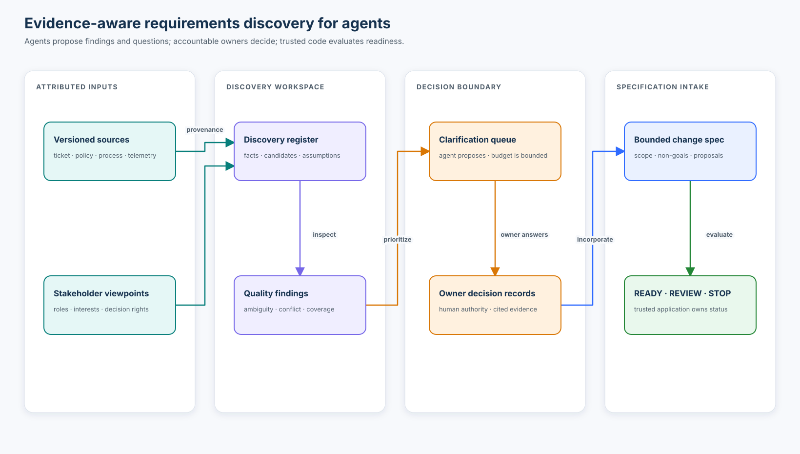

# Course 05 — Requirements engineering for coding agents

> Turn ambiguous business intent into precise, testable, implementation-independent requirements
> that humans and coding agents can execute without inventing authority.

Course 04 established where requirements belong and who owns them. Course 05 asks the next question:
**how do we discover and engineer a good requirement before an agent plans implementation?**

The running case is Northstar Mutual ticket `AI-2176`, a request for an AI assistant that identifies
missing underwriting information and prepares broker follow-up. The ticket also suggests auto-send,
“simple cases,” “accurate” messages, and reuse of an existing agent. Those phrases are inputs to
discovery—not permission to make product, policy, architecture, or release decisions.

[Open the guided notebook](requirements_engineering.ipynb) ·
[Run the deterministic lab](lab.py) ·
[Complete the AI-2176 workshop](northstar-broker-follow-up/README.md)



## Learning outcomes

By the end, you can:

- separate a business goal, user story, requirement, acceptance criterion, design, task, and evidence;
- build an ambiguity register that distinguishes unknowns, conflicts, design questions, and policy decisions;
- ask high-value clarification questions, assign owners, and block only affected capabilities;
- write singular, observable, source-backed requirements with stable IDs and explicit lifecycle state;
- define preconditions, postconditions, state transitions, negative requirements, invariants, and failure behavior;
- preserve implementation independence while making data contracts and enforcement boundaries concrete;
- distinguish schema, semantic, policy, approval, and execution validation;
- bind consequential approval to exact content and current context;
- evaluate requirement quality and draft correspondence with honest populations and denominators;
- detect orphan tasks, unimplemented requirements, stale agent context, and semantic requirement changes; and
- reduce autonomy when evidence or authority is incomplete.

## Prerequisites and boundary

Complete [Course 02](../02-from-prompt-to-executable-specification/README.md),
[Course 03](../03-the-specification-hierarchy/README.md), and
[Course 04](../04-company-project-feature-requirements/README.md) first. You should already be able to
classify artifacts, resolve an effective specification, and distinguish requirement ownership from
implementation ownership.

This course introduces EARS and scenarios only as useful expression forms. Course 06 teaches those
forms in depth. Course 07 deepens acceptance criteria and invariants; Course 08 treats non-functional
requirements; Course 10 expands lifecycle traceability. Here the focus is the engineering process
that makes those later artifacts truthful.

## Success criteria

You have succeeded when you can explain why the reference solution:

1. lets analysis and drafting proceed while automatic delivery stays blocked;
2. treats the model as a proposer rather than the source of underwriting truth;
3. rejects unsupported and omitted message items deterministically;
4. invalidates approval when exact content or current context changes;
5. reports precision and recall with populations and limitations; and
6. makes every approved requirement reachable from implementation tasks without forcing one task per
   requirement.

## Non-goals and safety boundary

The lab does not contact a model, underwriting system, identity service, or broker. It does not
authenticate the fictional decision records, set a production quality threshold, prove regulatory
compliance, or simulate a production delivery receipt. A `PROCEED` decision means only that the
declared preconditions for a simulated attempt passed.

The central boundary is:

```text
model or coding agent
  proposes requirements, MissingItems, drafts, questions, and tasks
                         │
                         ▼
trusted application code
  validates schema → semantics → policy → approval → execution preconditions
                         │
                         ▼
external effect only through a narrow, authorized, idempotent adapter
```

Typed output is not trusted output. A role name in a prompt is not identity. A human-sounding approval
sentence is not a valid receipt. A successful API call is not proof that a broker received exactly one
message.

## 1. Start with discovery, not SHALL

The ticket says:

> Inspect every submission, find missing information, prepare an accurate and professional message
> quickly, and automatically send simple cases.

Changing “should” to `SHALL` would preserve every ambiguity. Before drafting requirements, separate:

| Discovery item | Meaning | Example | Required action |
| --- | --- | --- | --- |
| Unknown | A fact has not been established | supported product and channel | obtain evidence from the fact owner |
| Ambiguity | Wording permits materially different interpretations | “simple case” | ask a decision-reducing question |
| Conflict | Authoritative sources prescribe incompatible outcomes | auto-send vs mandatory review | stop and route to authority/exception process |
| Design question | The outcome is known; implementation is not | reuse existing agent | compare options after requirements stabilize |
| Policy decision | The organization has not granted or denied authority | automatic external delivery | accountable owner decides; agent cannot infer |

The clarification register records an ID, type, evidence, owner, affected capability, status, and
decision. “Ask the user” is incomplete: the question needs the person or system with decision rights.

### High-value clarification

A good question removes a consequential branch from the decision tree. Compare:

```text
Low value: What tone should the message use?

Higher value: Which authoritative rules determine whether an item is required,
and what terminal state applies when those rules or submission evidence are stale?
```

Rank questions by consequence, uncertainty, reversibility, and how much downstream work they block.
Do not fabricate a numeric score unless the scale has been calibrated and owned.

## 2. Build a requirement from evidence

A durable requirement needs more than a sentence:

```text
stable ID + revision + lifecycle status
source and accountable owner
scope and affected capability
normative statement
preconditions + observable behavior + postconditions
evidence method
links to related invariants, questions, tasks, and tests
```

The reference package expresses `REQ-FU-001` as:

```text
When an authenticated underwriter requests analysis of a supported submission
revision, the system SHALL return one structured MissingItem for each absent or
invalid item required by the current underwriting rule set.
```

This is singular enough to evaluate, but not tied to a model vendor, queue, cache, or UI. Its data
contract is concrete because downstream components must agree on fields and meaning. Implementation
independence does not mean vagueness.

### Quality test

Review each requirement for:

- necessity and source support;
- one primary obligation;
- one clear subject and observable behavior;
- feasible preconditions and explicit boundaries;
- an accountable owner and stable scope;
- a named evaluation method;
- failure behavior and epistemic behavior; and
- freedom from premature solution choices.

Lexical checks can flag “fast,” “accurate,” “all,” or a long compound sentence. They cannot prove the
requirement is complete, correct, feasible, or authorized. That remains an evidence-backed review.

## 3. Use normative language carefully

This course declares:

- `SHALL` — required behavior;
- `SHALL NOT` — prohibited behavior;
- `SHOULD` — expected behavior with an explicit deviation rationale; and
- `MAY` — permitted optional behavior.

The typography works only inside a declared convention. It does not make the ticket authoritative.
Keep normative strength separate from delivery priority:

```text
priority = must / should / could       # sequencing and product importance
normative_strength = SHALL / SHOULD    # conformance meaning
```

A low-priority requirement may still be an absolute obligation whenever that capability ships.

## 4. Complementary expression forms

EARS can make triggers and states visible:

```text
WHEN a supported submission revision is accepted,
the system SHALL evaluate required items against that exact revision.
```

Given/When/Then scenarios provide examples:

```gherkin
Given loss history is required and absent from submission revision 7
When an authorized underwriter requests analysis
Then the result contains one MissingItem linked to the loss-history rule
And the result cites the observed empty field
```

Neither form guarantees truth. A precisely worded requirement can still encode the wrong policy, and
a scenario proves one example rather than a universal property. Use an invariant for the latter:

```text
Every MissingItem traces to a current authoritative rule and observed evidence.
```

## 5. Model state and boundaries

Preconditions say when behavior is valid. Postconditions say what must be true afterward. A state
model exposes forbidden transitions:

```text
submission_received
        │ authorized + current rules
        ▼
analysis_ready ── validated plan ──▶ draft_ready
        │                                  │
        └─ insufficient evidence ─▶ review_required
                                           │ exact-content approval
                                           ▼
                                      send_eligible
                                           │ policy + idempotency gate
                                           ▼
                                    delivery_attempted
```

In the reference release, `send_eligible` is unreachable because `OQ-017` remains open. Invalid
transitions include drafting from an unvalidated plan, reusing approval after an edit, and retrying an
unknown delivery outcome without reconciliation.

Treat these states differently:

- **missing** — required evidence is absent;
- **invalid** — evidence exists but violates its contract;
- **unverified** — the system cannot establish validity;
- **conflicting** — credible sources disagree; and
- **stale** — identity is known but a newer version governs.

Collapsing them into “missing” invites unsupported messages and unsafe retries.

## 6. Separate domain decision from generation

The model does not decide what underwriting requires. The pipeline is:

```text
current rule set + current submission revision
          │
          ▼
deterministic/authorized domain evaluation
          │
          ▼
validated MissingItem[] plan
          │
          ▼
model drafts wording from the plan
          │
          ▼
schema → semantic correspondence → policy → approval validation
```

The correspondence validator measures two different failures:

- **precision:** among items mentioned in the message, how many belong to the plan?
- **recall:** among items in the plan, how many appear in the message?

An unsupported addition can burden a broker. An omission can prolong the underwriting cycle. The lab
reports numerator and denominator for each; it does not invent an acceptable production threshold.

## 7. Define epistemic and failure behavior

An agent needs explicit choices when it does not know:

| Outcome | Use when | Example |
| --- | --- | --- |
| `proceed` | evidence and authority satisfy the bounded action | produce a review-only draft |
| `abstain` | output cannot satisfy a quality or schema contract | malformed structured output |
| `clarify` | a resolvable fact or owner decision is missing | rule applicability is unknown |
| `escalate` | consequence or policy requires accountable review | authorization denied or send policy unresolved |

“Low confidence” is not enough unless confidence is calibrated for a named population and consequence.
Use reason codes and evidence IDs rather than private chain-of-thought.

The failure matrix distinguishes transport, schema, safety, evidence, and quality failures. Only a
declared transient transport failure is retryable, and then only with a bounded attempt count and the
same logical operation ID. Policy denial is terminal. An unknown delivery outcome must be reconciled
before retrying.

## 8. Engineer non-functional requirements

“Fast,” “secure,” and “available” are aspirations until they name:

```text
population + workload + measurement boundary + statistic + unit + threshold + owner
```

For example, a latency requirement needs the accepted request and completed response measurement
points, workload profile, environment, percentile, and owner-approved target. The synthetic
operating baseline is context—not permission to choose a target.

Security, privacy, observability, and audit requirements are system behavior too:

- authorize before retrieving submission or broker data;
- minimize model input and exclude message content/PII from telemetry;
- record submission revision, requirement ID, analysis version, outcome, and reason code;
- record actor, exact approved draft digest, authorization result, delivery result, and time for a
  consequential send attempt; and
- define retention and deletion by referencing the enterprise-owned policy instead of copying a
  possibly stale value.

Accessibility and internationalization requirements should describe user outcomes and applicable
standards, not prescribe a particular screen layout.

## 9. Approval and time-of-check/time-of-use

Between analysis and delivery, the submission, rule set, broker relationship, message, or policy can
change. A trustworthy send gate re-checks current state and binds approval to:

```text
submission ID + exact submission revision
requirements revision
broker identity
exact draft digest
reviewer identity + decision + rationale
issuance + expiry + single-use state
```

Editing the draft invalidates approval. A consumed receipt cannot be replayed. The application—not
the model—checks these properties immediately before the external effect. Production consumption must
be atomic; the in-memory course fixture deliberately does not claim that guarantee.

## 10. Progressive autonomy

Autonomy is a controlled capability, not a property of the model:

| Level | Permitted behavior | AI-2176 status |
| --- | --- | --- |
| 0 | recommend or remain disabled | automatic send |
| 1 | produce a draft for review | analysis and drafting |
| 2 | execute a reversible action with deterministic preconditions | not authorized |
| 3 | execute a consequential external action under monitored policy | not authorized |

If evidence is weak, lower autonomy before adding prompt language. Instructions such as “be careful”
cannot enforce identity, policy, approval, idempotency, or exact-content binding.

## 11. Change management and traceability

Every agent execution unit should pin a specification revision and requirement revisions. When an
upstream revision changes, CI can report `SPEC_CONTEXT_STALE`, then semantic impact analysis decides
whether to replan. Constantly refreshing context destroys reproducibility; ignoring changes forever
creates drift.

A semantic diff identifies changed obligations rather than only changed text:

```text
HITL-FU-003
ADDED POSTCONDITION: review_rationale = required
```

Requirement-to-task links are many-to-many. Flag a task with no requirement or decision rationale as
`ORPHAN_TASK`; flag an approved requirement with no implementation work as
`UNIMPLEMENTED_REQUIREMENT`. Both are review findings, not automatic proof of wrongdoing.

Acceptance criteria and tests remain evidence plans until they are implemented, executed, and passed.
Traceability does not convert planned checks into observed conformance.

## 12. Evaluation

The notebook evaluates a keyword ambiguity baseline against evidence-aware rules on eight labelled
synthetic cases. Each metric includes its population, numerator, denominator, direction, and
limitations. The exercise demonstrates why wording-only lint misses unsupported, ownerless, or
non-observable requirements.

Keep these measurement layers separate:

| Layer | Example |
| --- | --- |
| Per-case invariant | no unsupported MissingItem |
| Aggregate component quality | correspondence precision/recall by slice |
| Operational SLO | analysis latency for a declared workload |
| Safety outcome | actual unauthorized or duplicate messages |
| Business KPI | underwriter handling time or broker re-contact rate |

A high aggregate score does not waive a zero-tolerance safety invariant. A lower handling time does
not prove messages were correct or authorized.

## 13. Technology landscape

| Approach | Strength | Limitation | Best fit |
| --- | --- | --- | --- |
| Markdown + stable metadata | reviewable, portable, repository-native | semantic rules need separate validation | small-to-medium code-owned specs |
| JSON/YAML + schema | typed structure and automation | schema validity does not prove meaning or authority | contracts and machine gates |
| Requirements platforms / ReqIF | rich ownership, baselines, relationships, exchange | process and integration overhead | regulated, multi-system programs |
| Model-based requirements | explicit states and formal relationships | specialist skills and modelling cost | safety-critical or highly coupled systems |
| Spec Kit clarification/checklists | agent-friendly process harness | does not supply enterprise authority by itself | repository delivery workflow |

Choose based on governance, lifecycle, integration, portability, and evidence needs. Do not force
nuanced reasoning into YAML merely because machines can parse it. Pair structured metadata with a
human-readable normative statement and concrete scenarios.

## 14. What is established, emerging, and unresolved

- **Established:** requirements engineering, stable identity, source/owner metadata, review, version
  control, state models, verification planning, and traceability.
- **Established for high-consequence software:** authorization at the application boundary,
  fail-closed behavior, bounded retries, idempotency, audit, and exact approval scope.
- **Emerging:** agent-assisted elicitation, requirement linting, semantic diff, task derivation, and
  continuous synchronization across specifications and code.
- **Open:** how to measure semantic completeness, calibrate autonomous clarification, prevent
  persuasive but unsupported requirements, and maintain low-noise traceability at enterprise scale.

The safe enterprise pattern is not to let a model resolve those questions by assertion. Use models to
increase discovery coverage and drafting speed; use owners, trusted state, and executable controls to
decide and enforce.

## Run the lab

```bash
python3 curriculum/beginner/05-requirements-engineering-for-agents/lab.py
python3 -m unittest tests.test_course_05 -v
python3 scripts/validate_course.py
```

The default run uses only the Python standard library. The notebook imports the same `lab.py` tested
by CI and executes without credentials.

## Exercises

1. **Implementation:** add `document_invalid` to the MissingItem contract and write a negative test
   proving it cannot be collapsed into `document_missing`.
2. **Diagnosis:** mutate the approved draft body after receipt creation. Explain every reason code and
   why a new approval—not a retry—is required.
3. **Requirements review:** rewrite “professional” without prescribing message copy or a user
   interface. Name the evaluator, rubric population, and unresolved threshold decision.
4. **Architecture judgment:** decide which validations belong before generation, after generation,
   immediately before delivery, and after provider response.
5. **Change management:** add rationale to the approval contract, create a semantic diff, and decide
   which tasks and tests need replanning.
6. **Governance:** propose the evidence required before moving send from autonomy level 0 to level 2.

## Review questions

1. Why can an open question block send without blocking analysis and drafting?
2. Why is a schema-valid MissingItem still untrusted?
3. What is the difference between a clarification and an escalation?
4. Why do precision and recall answer different broker-burden questions?
5. What does `SPEC_CONTEXT_STALE` prove, and what does it not prove?
6. Why can one task legitimately implement four requirements?

## References

- [ISO/IEC/IEEE 29148:2018 — Requirements engineering](https://www.iso.org/obp/ui#iso:std:iso-iec-ieee:29148:ed-2:v1:en)
- [Mavin et al., “Easy Approach to Requirements Syntax (EARS)”](https://doi.org/10.1109/RE.2009.9)
- [RFC 2119 — Requirement levels](https://www.rfc-editor.org/info/rfc2119/)
- [JSON Schema Draft 2020-12](https://json-schema.org/draft/2020-12)
- [GitHub Spec Kit — Agentic SDD workflow](https://github.github.com/spec-kit/reference/agentic-sdd.html)
- [GitHub Spec Kit — specification persistence models](https://github.com/github/spec-kit/blob/main/docs/concepts/spec-persistence.md)
- [NIST AI RMF: Generative AI Profile](https://doi.org/10.6028/NIST.AI.600-1)
- [INCOSE Guide for Writing Requirements](https://portal.incose.org/Web/iCore/Store/StoreLayouts/Item_Detail.aspx?Category=EBOOKS&iProductCode=GUIDEWRITEREQ)

Learning with One+i · responsible AI, real-world impact. [oneplusi.io](https://oneplusi.io)
