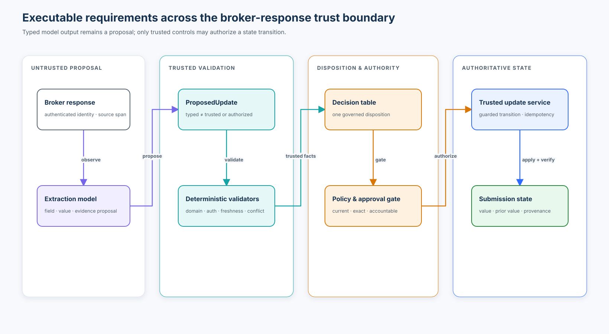

# Course 06 — Writing executable requirements

> Use user stories, EARS, SHALL requirements, scenarios, decision tables, contracts, and state
> models as complementary views of one governed behavior—not as competing sources of truth.

Course 05 showed how to discover a requirement without letting an agent invent missing product or
policy decisions. Course 06 asks the next question: **how do we express an approved requirement so
humans, coding agents, tests, and control gates interpret the same behavior?**

The running case is Northstar Mutual ticket `AI-2219`. A broker replies with missing underwriting
information, and a model extracts a possible field update. The unsafe implementation accepts the
model's status and writes directly to the submission. The governed implementation treats extraction
as observation, recomputes meaning in trusted code, applies a decision table, enforces state and
approval guards, and preserves provenance.

[Open the guided notebook](requirements_writing.ipynb) ·
[Run the deterministic lab](lab.py) ·
[Complete the AI-2219 workshop](northstar-broker-response/README.md)



## Learning outcomes

By the end, you can:

- distinguish intent-bearing user stories from normative, testable requirements;
- select the right EARS pattern for ubiquitous, event-driven, state-driven, unwanted, optional,
  and compound behavior;
- use `SHALL`, `SHALL NOT`, `SHOULD`, and `MAY` under an explicit interpretation convention;
- add preconditions, postconditions, frame conditions, failure behavior, and invariants;
- turn interacting conditions into a complete and deterministic decision table;
- detect incomplete and overlapping table rows across a declared fact space;
- write Given/When/Then scenarios as governed examples rather than hidden policy;
- define a typed proposal contract without confusing schema validity with truth or authorization;
- model proposal states, explicit guard semantics, reachability, terminal outcomes, required
  waypoints, and invalid transitions;
- declare artifact authority and stop when normative representations contradict each other;
- evaluate capability readiness without fabricated completeness percentages;
- separate extraction quality from deterministic decision and state-transition quality;
- detect semantic requirement changes and trace direct and transitive impact; and
- give parallel coding agents bounded work without giving them authority to change requirements.

## Prerequisites and course boundary

Complete [Course 02](../02-from-prompt-to-executable-specification/README.md),
[Course 03](../03-the-specification-hierarchy/README.md),
[Course 04](../04-company-project-feature-requirements/README.md), and
[Course 05](../05-requirements-engineering-for-agents/README.md) first. You should already be able to
classify artifacts, resolve applicable requirements, place requirements with accountable owners,
and route open questions.

Course 07 will examine acceptance criteria and invariants more deeply. Course 10 will extend
traceability across the full lifecycle. Here, the emphasis is choosing and connecting expression
forms so an agent can implement a bounded behavior without interpreting policy.

## Success criteria

You have succeeded when you can explain why the reference solution:

1. does not treat a user story, scenario, schema, test, or model confidence as sufficient authority;
2. returns exactly one disposition for every supported combination of relevant facts;
3. prevents a verified value conflict from reaching the mutation boundary automatically or directly;
4. binds approval to the exact proposal, selected resolution, submission revision, and requirement context;
5. reports readiness per capability and names each blocker;
6. measures model extraction separately from application-owned decisions; and
7. stops on semantic contradiction instead of silently choosing the easiest representation.

## Non-goals and safety boundary

The lab is deterministic, credential-free, and standard-library only. It does not contact a model,
broker, identity provider, document parser, policy engine, or underwriting platform. Its labelled
cases are synthetic. Its update service changes an in-memory dictionary, not a production record.

A clean run demonstrates that the declared artifacts agree for the tested fixture. It does **not**
prove that stakeholder decisions are authentic, the requirement is lawful, a model extracts values
accurately, all production races are controlled, or a real transaction is durable.

The core boundary is:

```text
broker response ──▶ model observation ──▶ typed proposal
                                               │
                                               ▼
                                deterministic trusted validation
                                  schema · domain · authorization
                                  freshness · conflict · policy
                                               │
                                               ▼
                                  guarded approval and transition
                                               │
                                               ▼
                                  narrow authoritative mutation
```

The model may propose a field, value, evidence span, and provisional interpretation. It may not
decide that a conflict is safe, authorize a write, mint approval, or redefine the schema.

## 1. A user story is intent, not an executable specification

The ticket begins with a useful story:

```text
As an underwriter,
I want broker replies to update missing submission information,
so that I can continue review without re-entering data.
```

It identifies an actor, capability, and benefit. It does not establish:

- which responses and submission revisions are in scope;
- how a phrase maps to a canonical field;
- whether a value is structurally and semantically valid;
- what happens when a broker contradicts a verified value;
- which fields may be accepted automatically;
- who may approve a proposal and what that approval covers;
- whether a duplicate, stale, or out-of-order response may apply; or
- what evidence proves that unrelated fields stayed unchanged.

The story belongs in product discovery. It becomes implementable only through a connected behavioral
model. Do not inflate the story until it becomes a paragraph-sized pseudo-specification. Keep the
intent and the normative obligations distinct and linked.

## 2. Declare what normative words mean

This course uses the following local convention, consistent with the interpretation guidance in
[RFC 2119](https://www.rfc-editor.org/rfc/rfc2119) and
[RFC 8174](https://www.rfc-editor.org/rfc/rfc8174):

| Keyword | Meaning in this course |
| --- | --- |
| `SHALL` | Required for conformance in the stated scope. |
| `SHALL NOT` | Prohibited for conformance in the stated scope. |
| `SHOULD` | Expected unless an accountable deviation is recorded. |
| `SHOULD NOT` | Normally prohibited unless an accountable deviation is recorded. |
| `MAY` | Permitted, not required. |

Typography does not create authority. “The agent SHALL pick a database” is still unauthorized if the
writer cannot make that decision. Normative strength also differs from product priority: a deferred
capability can contain strict `SHALL` obligations that govern whenever it is released.

## 3. Use EARS to expose the shape of behavior

Easy Approach to Requirements Syntax (EARS) provides sentence patterns that make triggers, states,
features, and failure conditions explicit. It improves reviewability; it does not prove correctness.

### Ubiquitous

Use for behavior that always applies within the declared scope:

```text
THE SYSTEM SHALL retain the source response identifier and source span for every ProposedUpdate.
```

The governed population—every `ProposedUpdate` in this capability—is named. A universal quantifier is
not automatically vague; it is vague when its population is undefined.

### Event-driven

Use when an event triggers behavior:

```text
WHEN an authenticated broker response is received for a submission with outstanding information
requests, THE SYSTEM SHALL evaluate the response against those requests.
```

`WHEN` names the trigger. Authentication and outstanding requests are not implementation details;
they establish the behavior's boundary.

### State-driven

Use when behavior persists while the system is in a state:

```text
WHILE a proposal is CONFLICTING, THE SYSTEM SHALL prohibit direct application to submission state.
```

This form is particularly useful when a coding agent might otherwise implement a happy path and
forget that a prohibition continues to hold across multiple events.

### Unwanted behavior

Use for faults, exceptions, or adversarial conditions:

```text
IF a proposed broker value differs from an existing verified value, THEN THE SYSTEM SHALL classify
the `ProposedUpdate` as `CONFLICTING`.
```

This requirement owns classification behavior. The separate safety obligation `REQ-BR-001` prohibits
automatic replacement. Keeping them separate prevents two similar sentences from becoming competing
normative rules. “Handle the error” would leave the agent to invent both classification and authority.

### Optional feature

Use when behavior is enabled only under a named configuration or entitlement:

```text
WHERE automatic acceptance is enabled for an approved field class, THE SYSTEM SHALL apply the
current field-acceptance policy before updating submission state.
```

`WHERE` is not permission for the implementation to enable the feature. The condition must come from
an authoritative configuration or policy source.

### Complex

Combine clauses when state, trigger, and conditions genuinely interact:

```text
WHILE a submission awaits broker information,
WHEN an authenticated response provides a non-conflicting value for an outstanding request,
THE SYSTEM SHALL create a ProposedUpdate linked to the source response.
```

Complex does not mean unbounded. If the sentence accumulates multiple independent obligations,
split it and connect the requirements through an explicit decision table or state model.

## 4. Write the behavioral contract around the sentence

A strong SHALL sentence is the readable center of a requirement, not its entire schema. The reference
contract records:

```text
stable ID and revision
lifecycle status and artifact role
capability, owner, and source IDs
actor, trigger, and inputs
preconditions
required behavior and prohibited behavior
postconditions
frame conditions
failure behavior
evidence IDs and normative elaborations
```

The reference deliberately separates two responsibilities:

```text
REQ-BR-001  broad safety obligation: no automatic verified-value replacement
REQ-BR-005  operational behavior: classify a verified-value mismatch as CONFLICTING
INV-BR-002  reinforces REQ-BR-001 across the declared value population
DT-BR-001   elaborates REQ-BR-005 across interacting facts
```

For `REQ-BR-005`, the important additions are:

- **precondition:** an existing value is verified and the broker proposes a different valid value;
- **postcondition:** the proposal status is `CONFLICTING`;
- **frame condition:** submission state is unchanged during classification;
- **failure behavior:** classification stops if verification state is unknown; and
- **evidence:** the decision-table row and a focused classification test.

`REQ-BR-001` owns the unchanged-value safety claim and its property evidence. This avoids redundant
normative sentences while preserving traceability between classification and safe mutation.

### Preconditions

Preconditions identify when an obligation is applicable. They should be observable facts, not hidden
assumptions. “Broker is trusted” is weak. “Response identity is authenticated and the broker is
authorized for this submission” separates the two checks.

### Postconditions

Postconditions describe what is true after successful behavior. They should expose externally
meaningful state or evidence. “Processing completed” is less useful than “one proposal with the
source response ID and current requirement-context digest exists.”

### Frame conditions

Frame conditions say what must **not** change. They are crucial for agent-generated code because an
implementation can return the expected value while modifying unrelated state:

```text
Only the proposal's named submission field may change; every other field remains equal.
```

### Invariants and properties

An invariant holds across the declared state space:

```text
No proposal may transition directly from CONFLICTING to APPLIED. A conflict replacement must pass
through AWAITING_REVIEW and APPROVED with an exact `replace_verified_value` receipt. STALE and
REJECTED are terminal and cannot reach APPLIED.
```

A property check explores a population of generated or enumerated cases. The lab tests all unequal
pairs in a bounded year range and verifies that each receives the conflict disposition. This is
stronger than one example but still bounded by the chosen population and oracle.

## 5. Use decision tables when conditions interact

Natural language becomes hard to audit when verified state, validity, equality, and automatic
acceptance interact. The reference [decision table](northstar-broker-response/reference/decision-table.csv)
defines one disposition per supported combination:

| Existing value | Verified | Proposed valid | Same value | Auto-accept allowed | Disposition |
| --- | --- | --- | --- | --- | --- |
| none | — | no | — | — | reject |
| none | — | yes | — | no | propose |
| none | — | yes | — | yes | auto-apply eligible |
| present | no | no | — | — | reject |
| present | no | yes | yes | — | no change |
| present | no | yes | no | no | propose |
| present | no | yes | no | yes | auto-apply eligible |
| present | yes | yes | yes | — | no change |
| present | yes | yes | no | — | conflict |

The executable JSON table gives those rows stable IDs. The lab asserts that representative boundary
facts match exactly one row. Zero matches means incomplete behavior; multiple matches mean ambiguous
behavior. Neither condition should be resolved by row order.

The table has an explicit precondition: when an existing value is present, its verification status
must be known. Trusted code routes `verified = unknown` to clarification before table evaluation.
Treating unknown as `false` would silently widen automatic-application authority. A decision table is
deterministic only when its input facts have defined semantics.

### Decision-table review

Review a table for:

- mutually exclusive rows;
- collective coverage of the declared input space;
- explicit wildcards rather than blanks with unclear meaning;
- stable row IDs for scenarios and tests;
- an owner for each condition and outcome;
- safe treatment of unknown values; and
- separation of a disposition from the later authority to execute it.

`auto_apply_eligible` is a classification, not a write. Freshness, authorization, state, and policy
still guard the mutation boundary.

## 6. Use scenarios as examples, not shadow policy

Given/When/Then is useful because it ties concrete facts to observable outcomes:

```gherkin
Given construction year is 1998 and verified
And an authenticated broker response proposes 2001
When the response is classified
Then the proposal status is CONFLICTING
And the submission construction year remains 1998
```

The [Gherkin reference](https://cucumber.io/docs/gherkin/reference/) explains scenario syntax. The
important governance question is what a scenario means in your artifact system.

This course declares two roles:

- **normative example** — binding for the named case and linked to its governing requirement; and
- **informative** — explanatory only.

A scenario is never allowed to silently override the decision table or requirement. If a normative
scenario says `auto_apply_eligible` for the verified conflict above, the consistency check returns
`NORMATIVE_ARTIFACT_CONFLICT` and the workflow stops.

### Select scenarios by risk, not volume

A useful scenario matrix includes:

- each decision-table row;
- each safety-critical invalid transition;
- boundary values around domain limits;
- missing, malformed, unknown, and ambiguous fields;
- identical and conflicting values;
- stale, duplicate, and out-of-order messages;
- unauthorized identities and valid identities without resource authorization;
- unsupported attachments or modalities; and
- simultaneous conditions whose ordering might change the result.

Pairwise techniques can reduce combinatorial volume, but safety-critical interactions still deserve
explicit cases. Record what the selected set does not cover.

## 7. Treat typed model output as a proposal

The reference `ProposedUpdate` contract carries:

```text
proposal ID
submission ID and revision
requirement-context digest
candidate field and proposed value
source response ID and exact source span
requirement ID and model version
evidence IDs
origin disposition
application-owned status
```

[JSON Schema Draft 2020-12](https://json-schema.org/draft/2020-12) can validate required keys,
types, enums, and structural conditions. It cannot establish that:

- the source span supports the proposed value;
- the field means what the model says it means;
- the value is valid under current underwriting rules;
- the broker is authorized for the submission;
- the response belongs to the current revision;
- another authoritative source does not conflict; or
- the proposal may be applied automatically.

Use a validation ladder:

1. **schema validation** — can the object be parsed under the declared contract?
2. **semantic validation** — does the value mean something valid for this field?
3. **context validation** — is it current, applicable, and linked to the right submission?
4. **authorization validation** — may this identity act on this resource?
5. **policy validation** — is the classified action allowed?
6. **approval validation** — does a current accountable decision bind this exact proposal?
7. **execution validation** — did the guarded transition and intended state change occur?

A model-provided `status: approved` is data from an untrusted boundary. The application recomputes
status from trusted facts.

## 8. Model states and guarded transitions

The proposal lifecycle is explicit:

```text
EXTRACTED
  ├─ valid + auto-accept policy ─▶ VALIDATED ─▶ APPLIED
  ├─ valid + review required ───▶ AWAITING_REVIEW ─▶ APPROVED ─▶ APPLIED
  ├─ verified-value mismatch ───▶ CONFLICTING ─▶ AWAITING_REVIEW
  │                                      ├─ retain existing ─▶ REJECTED
  │                                      └─ exact replacement receipt ─▶ APPROVED ─▶ APPLIED
  ├─ ambiguous field ───────────▶ MAPPING_AMBIGUOUS
  ├─ source disagreement ───────▶ SOURCE_CONFLICT
  ├─ attachment only ───────────▶ ATTACHMENT_REVIEW_REQUIRED
  ├─ invalid value ─────────────▶ REJECTED
  └─ old revision/context ──────▶ STALE
```

Each transition names an event and guard. The state machine also declares critical invalid
transitions, such as `CONFLICTING --apply--> APPLIED`. Negative transition tests matter because the
absence of a happy-path edge is not always enforced by application code.

Powerful guard names are themselves specified. `valid_conflict_replacement_receipt` requires the
exact current proposal digest, current submission revision, current requirement-context digest,
unexpired and unused receipt state, conflict origin, and the explicit `replace_verified_value`
resolution. The graph check also verifies that every declared state is reachable, terminal states
have no outgoing edges, and every path from `CONFLICTING` to `APPLIED` passes through `APPROVED`.

An invalid domain value is `REJECTED` for mutation but may still be displayed with its evidence and
reason codes for review or clarification. Reviewability is not application eligibility.

### Distributed-state edge cases

Production behavior must distinguish:

- **duplicate** — a response ID already processed;
- **out of order** — an older event arrives after a newer event was applied;
- **stale proposal** — the submission revision or requirement context has changed;
- **unknown outcome** — an external effect may have happened but confirmation was lost; and
- **concurrent update** — the value changes between classification and application.

The lab demonstrates the first three. A production design would also need atomic compare-and-set or
transactional guards, idempotency records, reconciliation for unknown outcomes, and auditable retry
policy. Those decisions belong in architecture and reliability specifications, not in a prompt.

## 9. Bind approval to content and context

Approval is a data object with an accountable reviewer, decision, rationale, proposal digest,
selected resolution, submission ID and revision, requirement-context digest, issue time, expiry, and
consumption state.

The trusted gate rejects approval when:

- the exact proposal changed after approval;
- the submission revision changed;
- the requirement context changed;
- the receipt is not yet valid or has expired;
- the receipt was already consumed;
- the selected resolution does not match the proposal's origin disposition;
- the reviewer denied the proposal; or
- the rationale is missing.

A generic approval cannot replace a verified conflict. That path requires `replace_verified_value`;
`retain_existing` terminates without mutation, while `accept_proposal` applies only to a non-conflict
review. A chat message saying “looks good” is not equivalent. A valid receipt proves only that a named review
decision was recorded for a bounded object under a bounded context. It does not prove that the
reviewer had authentic authority unless the production identity and authorization system establishes
that fact.

## 10. Establish source-of-truth rules for representations

Executable specifications often use multiple representations because each is good at a different
question:

| Representation | Best question | Declared role here |
| --- | --- | --- |
| User story | Why and for whom? | intent input |
| SHALL/EARS requirement | What obligation applies under which condition? | normative requirement |
| Decision table | What outcome follows interacting facts? | normative elaboration |
| State machine | Which guarded transitions are valid? | normative elaboration |
| Scenario | What does the behavior look like in a concrete case? | normative example or informative |
| JSON Schema | Is an object structurally valid? | machine contract |
| Test result | Did an implementation satisfy an asserted case? | evidence |

File format does not determine authority. JSON is not more authoritative than Markdown merely because
it is machine-readable. Tests are not the requirement: a test can contain a wrong oracle, omit a
boundary, or follow stale behavior.

The reference contract makes the resolution rule explicit:

1. approved normative requirements govern;
2. a named normative elaboration binds only the requirement that explicitly references it;
3. a normative example binds its exact case but cannot weaken the requirement;
4. informative text cannot create an obligation; and
5. any semantic contradiction among applicable normative artifacts causes `STOP` for owner review.

This is not a general precedence ladder for the enterprise. It is a local artifact contract that must
remain consistent with the ownership and applicability rules from Courses 03 and 04.

## 11. Diagnose quality without inventing a score

The lab's writing checks report targeted findings:

- `AND_OR_AMBIGUOUS`;
- `OPEN_ENDED_LIST`;
- `UNDEFINED_MODIFIER`;
- `POSSIBLE_AMBIGUOUS_REFERENT`; and
- `UNBOUNDED_QUANTIFIER`.

These are lexical review prompts, not proof that a sentence is wrong. For example, “When a proposal
is stale, reject it” may have a perfectly clear referent despite the pronoun finding. “Every proposal retains evidence” is
reasonable when the proposal population is defined. “The system responds quickly” remains weak until
an owner establishes the population, measurement point, percentile, threshold, environment, and
failure behavior.

Do not turn checklist completion into “the specification is 87% complete.” Readiness is scoped to a
capability and returns:

```text
declared status
implementation-ready: true or false
governing requirement IDs
blocking requirement, conflict, and question IDs
reason codes
```

In the reference release:

- extract, classify, and create-proposal are ready;
- applying an unverified value is review-required because `OQ-BR-001` remains open; and
- reviewed conflict replacement is review-required with exact resolution authority; and
- automatically overwriting a verified value is prohibited.

Uncertainty in one capability does not block all useful work, and progress in another capability does
not erase the blocker.

## 12. Separate observation from interpretation

The broker message and source span are observations. “This means construction year = 2001” is an
interpretation. “This value may update the current submission” is a policy and authorization decision.

Preserving provenance allows review and reprocessing, but provenance does not make an interpretation
correct. The fixture therefore records:

- source identity and exact span;
- proposal and model version;
- submission revision;
- requirement-context digest;
- deterministic status and decision-table row; and
- any later approval and application evidence.

Unknown and ambiguous values remain explicit:

- no mapped field → `UNMAPPED`;
- multiple plausible fields → `MAPPING_AMBIGUOUS`;
- multiple credible values → `SOURCE_CONFLICT`;
- evidence only in an unsupported attachment → `ATTACHMENT_REVIEW_REQUIRED`.
- existing verification metadata unknown → clarification before the decision table.

The agent is not allowed to make the schema wider so an uncertain value fits.

## 13. Evaluate extraction and system behavior separately

An end-to-end score can hide which control failed. Use at least two evaluation layers:

### Extraction evaluation

Compare field, value, and source-span proposals against a labelled population. Report precision,
recall, or task-appropriate measures with the dataset definition, exclusions, label process, and
uncertainty. This course does not evaluate a live model.

### Governed decision evaluation

Given fixed proposals and trusted context, compare status, disposition, and state transitions against
owned expectations. The included synthetic set has eleven cases covering auto-acceptance, review,
conflict, invalid values, no-change, ambiguous mapping, source conflict, unsupported attachment, and
staleness, plus unknown existing-value verification.

The deliberately unsafe baseline trusts the model's status. The governed path recomputes it. Run:

```bash
python3 curriculum/beginner/06-writing-executable-requirements/lab.py
```

The output reports the population, exact numerator and denominator, unsafe auto-application count,
individual records, and limitations. Treat the fixture result as a regression signal for these cases,
not a production performance claim.

## 14. Manage requirement versions and semantic change

A changed sentence is not always a changed obligation, and an unchanged sentence can behave
differently when its source or scope changes. The lab classifies:

- editorial change;
- clarification;
- obligation added or removed;
- condition changed;
- threshold changed;
- scope changed;
- failure behavior changed; and
- authority changed.

The classification is a deterministic teaching aid. Accountable reviewers confirm semantic meaning.

Traceability then finds:

- **direct impact** — artifacts that immediately reference the changed requirement; and
- **transitive impact** — downstream scenarios, tests, tasks, or controls reached through those
  relationships.

“Impacted” does not mean “must edit.” It means “must assess.” Record the assessment outcome: modify,
revalidate unchanged, defer with rationale, or mark not applicable with evidence.

The reference CSV is marked `complete_reference` and gives every normative requirement, invariant,
and state requirement at least one outgoing elaboration or evidence relationship. That is complete
for the teaching package—not a claim that production runtime evidence exists.

## 15. Triangulate specification and evidence

One representation rarely exposes every defect. Triangulation compares:

```text
normative prose  ↔  decision rules  ↔  state transitions
       ↕                    ↕                    ↕
scenarios        ↔  executable tests  ↔  runtime evidence
```

Useful coverage measures retain their denominator:

- decision-table rows exercised by normative examples / total rows;
- critical invalid transitions tested / declared critical invalid transitions;
- requirements linked to an evidence plan / applicable requirements;
- changed requirements impact-assessed / changed applicable requirements.

Coverage does not prove correctness. A complete set of tests can completely encode the wrong policy.

### Mutation as an oracle check

The lab includes a controlled mutation that changes the verified-conflict row from `conflict` to
`auto_apply_eligible`. The consistency check must fail. If tests still passed, that would reveal weak
or coupled evidence.

Mutation testing is most valuable when the mutation represents a plausible dangerous error: weakened
prohibition, widened allowlist, removed guard, relaxed threshold, stale-context acceptance, or wrong
terminal state.

## 16. Review with humans and agents

Different reviewers answer different questions:

| Reviewer | Primary concern |
| --- | --- |
| Product owner | user outcome, scope, priority, unresolved product decisions |
| Domain owner | vocabulary, business rules, exceptional cases |
| Architecture owner | system boundaries, state, concurrency, integration constraints |
| Security/privacy owner | identity, authorization, data use, abuse and disclosure paths |
| QA/evaluation owner | observable acceptance, oracles, populations, negative cases |
| Operations owner | retries, reconciliation, telemetry, recovery |
| Coding agent | implementability, contradictions, missing inputs, test scaffolding |

Agents can lint, enumerate decision combinations, generate scenario candidates, trace references,
classify likely semantic changes, and propose missing negative cases. Their findings are proposals.
They do not approve requirements, adjudicate conflicts, grant exceptions, or change policy.

### Safe parallel work units

Parallel work is safe when each unit declares:

- authoritative inputs and pinned versions;
- write scope;
- expected output and artifact role;
- validation command;
- dependencies and merge order; and
- conditions that require stop or escalation.

For AI-2219, one agent can improve scenario coverage while another implements schema validation, as
long as neither may edit the governing requirement or decision table. A separate integration review
checks cross-artifact consistency before merge.

## 17. When not to use the full process

Use the smallest durable artifact set that controls the risk. A copy correction or internal rename
may need a ticket, local test, and review—no decision table. A reversible UI adjustment may need a
story and acceptance examples. The full stack is justified when behavior includes:

- consequential external or data-state effects;
- multiple interacting conditions;
- policy, security, privacy, or compliance boundaries;
- distributed state, retries, or concurrency;
- multiple teams or repositories;
- high ambiguity or expensive reversal; or
- agent autonomy that must be bounded and audited.

The goal is not maximum documentation. It is the minimum set of durable, owned, mutually consistent
specifications that prevents the implementation agent from inventing consequential behavior.

## 18. Established practice, emerging practice, and open questions

**Established:** normative requirements, decision tables, state machines, schemas, Given/When/Then
examples, requirements traceability, property-based testing, and controlled change management.

**Emerging:** coding agents generating candidate requirements and scenario matrices, automated
cross-artifact contradiction checks, requirement-context digests, agent write-scope controls, and
evaluation of spec-to-code conformance.

**Open research and practice questions:** how to detect semantic drift across natural language and
code at enterprise scale; how to calibrate agent-generated requirement review; how much redundancy
improves safety before consistency cost dominates; and how to maintain continuously evolving
specifications without turning derived evidence into a second source of truth.

## 19. Hands-on path

### Lab A — Inspect the reference behavior

```bash
python3 curriculum/beginner/06-writing-executable-requirements/lab.py
python3 -m unittest tests.test_course_06 -v
```

Read the capability readiness, evaluation, property, and coverage outputs. Explain every denominator
and limitation.

### Lab B — Complete AI-2219

1. Read the [ticket](northstar-broker-response/ticket/AI-2219.md) and all three source files.
2. Complete the [starter workspace](northstar-broker-response/workshop/starter/README.md).
3. Declare the role and owner of each representation.
4. Prove that verified conflicts cannot apply.
5. Compare with the [reference package](northstar-broker-response/reference/) only afterward.

### Lab C — Inject specification failures

Try these one at a time:

1. Change decision-table row `DT-07` to auto-apply.
2. Add `CONFLICTING --apply--> APPLIED` to the state machine.
3. Make a normative scenario contradict its governing table row.
4. Remove the population from a universal requirement.
5. Change the requirement-context digest after approval.
6. Add an unknown field candidate and observe that the schema does not expand.
7. Delete `DT-08`; observe `DECISION_TABLE_INCOMPLETE` for invalid values.
8. Add an overlapping table row; observe `DECISION_TABLE_AMBIGUOUS` rather than first-row wins.
9. Add an orphan state and an outgoing edge from `REJECTED`; inspect reachability and terminal-state findings.

For each mutation, record the detecting gate, the accountable resolver, and what would happen if the
gate did not exist.

## 20. Exercises

1. Rewrite “The system should quickly handle broker replies” using an appropriate EARS form and a
   separate measurable non-functional placeholder owned for Course 08.
2. Split a compound SHALL sentence into singular obligations and define their relationship.
3. Delete `DT-08`, then add an overlapping row. Explain the difference between incomplete and
   ambiguous tables and why both are `STOP` findings.
4. Write one normative example and one informative example; explain the difference in authority.
5. Add preconditions, postconditions, and frame conditions to a proposal-creation requirement.
6. Identify three structurally valid proposals that must still fail semantic or policy validation.
7. Add a negative state-transition test for `STALE --apply--> APPLIED`, then verify every state is
   reachable and every conflict-to-application path passes through `APPROVED`.
8. Design a scenario matrix for field, validity, verification, equality, freshness, and authorization.
9. Create a conflict-replacement receipt, change the exact proposal or resolution, and explain why
   both mutation and replay are rejected.
10. Add a labelled evaluation case where the model says `approved` but trusted facts require
    `SOURCE_CONFLICT`.
11. Change a requirement's failure behavior and trace direct and transitive impact.
12. Define two parallel agent work units with disjoint writes and a shared integration gate.

## 21. Review questions

1. Why is a well-written user story insufficient for implementation?
2. When is a universal quantifier acceptable?
3. What does EARS improve, and what can it not establish?
4. Why is `auto_apply_eligible` not equivalent to authorization?
5. How do frame conditions catch defects that a return-value assertion may miss?
6. What should happen when a normative scenario contradicts a normative decision table?
7. Why can a JSON-Schema-valid proposal still be unsafe?
8. Which states are terminal, and what mandatory waypoint governs a reviewed conflict replacement?
9. Why should extraction and deterministic classification be evaluated separately?
10. What is the difference between impacted and must modify?
11. What evidence does mutation testing provide?
12. When is the full specification stack disproportionate?

## Artifact map

| Artifact | Purpose |
| --- | --- |
| [`requirements_writing.ipynb`](requirements_writing.ipynb) | Guided investigation and failure injection |
| [`lab.py`](lab.py) | Deterministic lints, decisions, transitions, readiness, evaluation, and impact analysis |
| [`assets/diagram-spec.json`](assets/diagram-spec.json) | Validated source for the trust-boundary diagram |
| [`northstar-broker-response`](northstar-broker-response/README.md) | Realistic workshop and evidence boundary |
| [`behavior-contract.json`](northstar-broker-response/reference/behavior-contract.json) | Structured normative requirements and artifact authority |
| [`decision-table.json`](northstar-broker-response/reference/decision-table.json) | Executable normative disposition rules |
| [`scenarios.json`](northstar-broker-response/reference/scenarios.json) | Role-labelled concrete examples |
| [`state-machine.json`](northstar-broker-response/reference/state-machine.json) | Guarded and prohibited proposal transitions |
| [`proposed-update.schema.json`](northstar-broker-response/reference/contracts/proposed-update.schema.json) | Structural proposal boundary |
| [`traceability.csv`](northstar-broker-response/reference/traceability.csv) | Complete reference requirement/elaboration/evidence relationships and change-impact graph |
| [`evaluation-cases.json`](northstar-broker-response/evaluation-cases.json) | Synthetic governed-decision evaluation set |
| [`tests/test_course_06.py`](../../../tests/test_course_06.py) | Independent executable evidence |

## Further reading

- Alistair Mavin et al., [Easy Approach to Requirements Syntax (EARS)](https://doi.org/10.1109/RE.2009.9)
- IETF, [RFC 2119](https://www.rfc-editor.org/rfc/rfc2119) and
  [RFC 8174](https://www.rfc-editor.org/rfc/rfc8174)
- Cucumber, [Gherkin reference](https://cucumber.io/docs/gherkin/reference/)
- JSON Schema, [Draft 2020-12 specification](https://json-schema.org/draft/2020-12)
- Hypothesis, [property-based testing documentation](https://hypothesis.readthedocs.io/en/latest/)
- ISO, [ISO/IEC/IEEE 29148 requirements engineering](https://www.iso.org/standard/72089.html)

## Next course

Course 07 — Acceptance criteria and invariants will deepen evidence design, boundary selection, and
invariant enforcement across implementation and runtime behavior.
