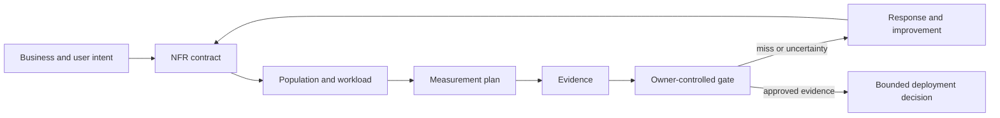

# Course 08 — Non-functional requirements for agentic systems

**Design measurable requirements for performance, reliability, scalability, security, privacy, observability, cost, resilience, capacity, operability, and AI quality.**

Courses 01–07 established what a system must do and how to assemble bounded evidence that it does it. Course 08 adds the production question:

> Can the system continue to provide safe, useful service under realistic load, dependency failure, cost pressure, model variability, and operational change?

A system may satisfy every functional example and still be unsuitable for production. An NFR contract turns vague quality adjectives into measurable, owned, population-bound decisions without allowing a coding agent—or the course author—to invent targets.

## Learning objectives

By the end of this course, you can:

1. distinguish a quality characteristic, indicator, objective, invariant, capacity claim, and external agreement;
2. write an NFR with an explicit population/workload, measurement boundary, statistic, unit, window, owner, target state, evidence method, and failure response;
3. preserve `target_unresolved` rather than converting “fast” or “cost-effective” into an arbitrary number;
4. calculate latency percentiles, semantic availability, reliability, retry amplification, budget conformance, and cost per successful compliant workflow with honest denominators;
5. define safe dependency degradation, fail-open/fail-closed behavior, retry budgets, circuit breakers, and bounded agent execution;
6. specify least privilege, data minimization, correlation, versioning, and redacted observability for agentic workflows;
7. separate synthetic measurement-pipeline exercises from load, production, or live-model evidence;
8. keep safety and privacy invariants outside a cost/latency optimization frontier; and
9. produce a traceable production-readiness assessment that may correctly remain blocked.

## Prerequisites

- [Course 06 — Writing executable requirements](../06-writing-executable-requirements/README.md)
- [Course 07 — Acceptance criteria, invariants, and evidence](../07-acceptance-criteria-invariants-evidence/README.md)
- Basic familiarity with percentiles, APIs, distributed dependencies, and operational telemetry

## Scenario — the pilot is not the product

Northstar Mutual’s broker-response pilot works:

```text
Broker response
      ↓
AI extraction
      ↓
ProposedUpdate
      ↓
Trusted validation
      ↓
Review or authorized apply
```

Commercial Underwriting now asks for a rollout. The functional behavior does not answer:

- How many messages arrive under sustained and peak load?
- Where does latency begin and end?
- What counts as successful service?
- What happens when the model, retriever, policy service, audit path, or analytics exporter fails?
- How do provider quotas constrain application scaling?
- How many retries, model turns, tool calls, tokens, and side effects may one logical operation consume?
- What does a successful compliant workflow cost?
- Which content may reach a model or telemetry system?
- How is degradation detected and how does it reduce autonomy?
- How do we recognize model/workflow quality drift?

`REQ-BR-005 — conflicting values must not overwrite verified values` is essential, but it does not answer those questions.

## Success criteria and non-goals

The course succeeds when the reference package validates, exposes meaningful synthetic measurements, demonstrates a retry-storm failure and mitigation, and still blocks production readiness for missing real evidence and unresolved targets.

This course does **not**:

- establish a production SLO or SLA for Northstar;
- benchmark a real model, provider, or cloud service;
- prove W1 capacity from twelve JSON events;
- treat simulation as production telemetry;
- recommend one observability or load-testing vendor; or
- let performance, availability, or cost override authorization, privacy, or mutation invariants.

## Mental model — quality is a governed measurement loop



The layers must not collapse:

```text
Characteristic  What quality matters?
Indicator       What exactly is measured?
Objective       What target did an accountable owner approve?
Evidence        What population and system revision were observed?
Gate            What decision follows from the evidence?
Response        What happens on miss, uncertainty, or measurement loss?
```

A metric is not an objective. An objective is not an SLA. A passing objective is not universal production fitness.

## Functional versus non-functional is not the main argument

A functional requirement can say:

```text
WHEN a conflicting broker value is detected,
THE SYSTEM SHALL classify the proposal as CONFLICTING.
```

An NFR can say:

```text
For eligible W1 requests, the p95 interval from accepted request
to completed proposal response SHALL remain at or below the
owner-approved target over the declared measurement window.
```

Some requirements cross the boundary:

```text
WHEN the model provider is unavailable,
THE SYSTEM SHALL preserve the work item and route it to manual processing.
```

That is observable behavior motivated by resilience. Taxonomy is useful for discovery and ownership; measurable production expectations matter more than forcing every sentence into one box.

## Quality map for an agentic system

| Characteristic | Core question | Agentic complication |
| --- | --- | --- |
| Performance | How long does useful service take? | Model latency, retrieval, tool calls, and loops create long tails. |
| Reliability | Does the workflow consistently produce an intended outcome? | A service can respond successfully while producing an invalid or unsafe decision. |
| Availability | Can eligible users obtain defined service? | Graceful degradation may be good service; an error wrapped in HTTP 200 is not. |
| Capacity | What load can the current topology support? | External model quotas may cap an otherwise scalable application. |
| Scalability | How does capacity change as resources and load change? | More workers can amplify provider throttling and retries. |
| Resilience | How does service behave under failure? | Safe degradation usually reduces autonomy and preserves work. |
| Security | Are identity, egress, credentials, and tools constrained? | Model output and retrieved content remain untrusted. |
| Privacy | Is data exposure, retention, and telemetry minimized? | Prompts, tool results, traces, and memories can replicate sensitive content. |
| Observability | Can operators correlate decisions and resource use? | Model/workflow versions, evidence, tokens, budgets, and reason codes matter. |
| AI quality | Does probabilistic behavior remain acceptable by slice? | Aggregate scores hide rare high-risk failures and drift. |
| Cost | What does a useful compliant outcome cost? | Tokens, retries, routes, tools, and quality interact. |
| Operability | Can humans diagnose and change the system safely? | Prompts, policies, models, datasets, and tool contracts all version independently. |
| Recoverability | Can interrupted or uncertain work resume safely? | Approval, operation identity, checkpoint state, and side-effect reconciliation matter. |

ISO/IEC 25010 provides a general software product quality model. It is a discovery aid, not a ready-made set of agentic production targets. See [ISO/IEC 25010:2023](https://www.iso.org/standard/78176.html).

## The NFR contract

The reference contract uses this shape:

```yaml
id: PERF-BR-001
characteristic: end_to_end_latency
statement: >
  For eligible W1 requests, p95 accepted-request-to-completed-response
  latency SHALL remain at or below the owner-approved target.
population:
  workload_profile: W1
  eligible_only: true
measurement:
  metric: end_to_end_latency_ms.p95
  start: accepted_request
  end: completed_proposal_response
  statistic: p95
  unit: ms
  window: rolling_28_days
target:
  status: target_approved
  value: 5000
  decision_id: TD-PERF-001
owner:
  decision: Commercial Underwriting Product
  measurement: Underwriting Platform SRE
  response: Broker Automation Service
```

The numeric value is acceptable in the fictional reference package only because it traces to a fictional, explicit owner decision with rationale and evidence IDs. The inadequate ticket contains no such authority.

### Required fields

| Field | Why it exists |
| --- | --- |
| Stable ID | Supports review, change impact, evidence, and ownership. |
| Characteristic | Names the quality being governed. |
| Statement | Expresses the obligation and scope. |
| Population/workload | Prevents a result from silently generalizing. |
| Measurement | Defines boundary, method, unit, statistic, and window. |
| Target state | Separates approved, unresolved, and invariant limits. |
| Owner roles | Separates target authority, measurement operation, and response. |
| Criticality | Distinguishes optimization objectives from release/safety controls. |
| Failure behavior | Says what happens when the target or measurement fails. |
| Evidence methods | Names what could support the claim. |

## Never invent a target

“Quick,” “reliable,” and “affordable” express intent but not authority. Do not silently rewrite “quick” as p95 under two seconds.

Use this sequence:

```text
Current business process
        ↓
Baseline with a declared population
        ↓
User/business/regulatory need
        ↓
Prototype and capacity evidence
        ↓
Trade-off analysis
        ↓
Accountable target decision
        ↓
Versioned objective and response policy
```

Targets may come from user expectations, process deadlines, regulation, upstream/downstream contracts, established internal objectives, capacity/cost analysis, empirical baselines, and risk tolerance. The source and owner belong in the decision record.

`TBD` is weak when it hides neglect. `target_unresolved` is useful when it names the missing decision, owner, blocker, and next evidence.

## Workloads are part of the requirement

The same service can appear fast in a single-user test and collapse under Monday-morning traffic. The course defines:

- W1: owner-approved synthetic pilot planning profile;
- W2: unresolved regional-rollout hypothesis; and
- W3: unresolved national-rollout hypothesis.

Each includes sustained and peak rate, typical and peak concurrency, response complexity mix, eligible language/modality/fields, provenance, status, and limitations.

Do not claim W2/W3 capacity simply because their JSON shapes are valid.

## Performance — boundaries before percentiles

“Latency under three seconds” is ambiguous. It might mean:

- client action to first visible token;
- API acceptance to first byte;
- API acceptance to validated proposal;
- broker message arrival to durable workflow completion; or
- queue admission to authoritative update.

The reference contract defines:

```text
T0 = accepted_request
T1 = completed_proposal_response
latency = T1 - T0
```

A streaming experience could add time-to-first-chunk without replacing end-to-end completion.

### Decompose the path

```text
T_total = T_auth + T_context + T_retrieval + T_model
        + T_validation + T_tool + T_storage
```

Only end-to-end performance reflects the user journey; stage timing makes remediation evidence-driven. Optimizing model time is irrelevant if the queue or policy service dominates the tail.

### Percentiles, not only averages

An average of 1.2 seconds can coexist with p95 of 8 seconds and p99 of 21 seconds. Agentic latency is commonly skewed by route, retries, tool selection, context size, and provider throttling.

This lab uses a documented nearest-rank percentile on a finite synthetic population. It reports the sample size, denominator, source, and boundary. With only 12 observations, its p95 and p99 are pedagogical order statistics—not statistically representative tail estimates. A production system should preserve histogram semantics, route/slice dimensions, aggregation correctness, and a sample-size/uncertainty review.

Google’s SRE guidance defines SLIs as carefully specified quantitative measures and recommends percentiles for skewed behavior. It also warns that target selection is a product/business decision, not merely a technical one. See [Service Level Objectives](https://sre.google/sre-book/service-level-objectives/).

## Throughput, capacity, and scalability are different

Throughput is work completed per unit time. Capacity is the load a particular deployment can sustain while meeting all relevant objectives. Scalability describes how capacity and quality change as resources or load change.

```text
Application workers scale out
          │
          ▼
Approved model gateway
          │
          ▼
Provider quota and regional capacity
```

Ten thousand responses per second is not useful if most are errors, unsafe fallbacks, or unauditable. A capacity result should require good throughput **and** latency, reliability, safety, and privacy conformance.

The included events do not generate concurrent load, exercise quotas, or establish capacity. `CAP-BR-001` therefore returns `NOT_MEASURED` even though W1 has an approved planning target.

## Reliability and availability need semantic outcomes

Reliability asks whether the system repeatedly performs the intended function. Useful indicators include:

- successful compliant workflow ratio;
- tool-call success and dependency failure by class;
- duplicate external effect rate;
- workflow completion and recovery success; and
- invalid success-envelope rate.

Availability asks whether eligible requests obtain the defined service in the measurement window. This response is not necessarily available service:

```json
{"status": 200, "body": {"error": "model unavailable"}}
```

The course defines a **semantic service success** as either:

1. a valid proposal response; or
2. an approved graceful-degradation response that preserves work and reduces autonomy.

An arbitrary fallback, empty success, or lost work item is bad service. Control conformance is reported separately: a response can satisfy the semantic service definition while violating privacy, telemetry, or a governed side-effect budget. Such an event remains in the semantic numerator, is excluded from `compliant_workflow_success_ratio`, and blocks release. Keeping both metrics prevents one label from hiding whether the service failed or a control failed.

### SLI, SLO, and SLA

- **SLI:** the measurement, such as `semantic_service_successes / eligible_events`.
- **SLO:** an internal owner-approved target for the SLI.
- **SLA:** a business agreement with explicit consequences.

Do not call every threshold an SLA. The course contains fictional internal target decisions, not contracts.

### Error budgets

For an approved reliability objective `SLO`, the conceptual bad-event budget is:

```text
error budget = 1 - SLO
```

An error-budget policy must also define window, exclusions, data quality, release response, exceptional work, and escalation. A percentage alone is not an operating model. See Google’s [example error budget policy](https://sre.google/workbook/error-budget-policy/).

## Serial dependencies make degradation design essential

An agentic workflow may require:

```text
Authentication → submission API → policy service → retrieval
               → model provider → validation → audit
```

If all are strict serial dependencies and failures are independent, multiplying component availabilities illustrates why end-to-end availability can fall below every component’s headline number. Real systems also have correlated failures and conditional paths, so the simple product is a model—not proof.

### Named modes

The reference policy uses:

```text
NORMAL
DEGRADED_AI
DEGRADED_RETRIEVAL
MANUAL_ONLY
UNAVAILABLE
NORMAL_WITH_BUFFERED_ANALYTICS
```

The rule is:

> Dependency degradation reduces autonomy; it never removes a safety control.

Examples:

| Dependency | Failure response | Automatic mutation |
| --- | --- | ---: |
| Authorization | unavailable; fail closed | no |
| Policy service | manual only; preserve item | no |
| Model provider | degraded AI/manual route | no |
| Retrieval | degraded retrieval/manual route | no |
| Non-critical analytics export | buffer and continue | permitted only if all independent mutation controls pass |

Fail-open or fail-closed is a dependency-specific risk decision. It must not be chosen by one global slogan.

Every degraded mode also needs an exit contract: a recovery predicate, anti-flap window, and a decision about re-evaluating preserved work. A single successful probe does not automatically restore autonomy.

## Retries, overload, and circuit breakers

One hundred requests with one initial call and five retries produce 600 provider attempts during a complete outage. Horizontal scale makes the storm larger.

The governed experiment combines:

- a stable logical operation ID;
- a maximum of three provider attempts per logical workflow;
- a circuit breaker that stops new calls after the configured failure threshold;
- preservation of every work item; and
- manual routing after exhaustion.

Authorization or policy denial is terminal, not retryable. A transient provider timeout may be retryable within budget. An unknown mutation outcome requires reconciliation before any retry.

Google’s SRE overload guidance discusses client-side throttling and bounded retry budgets; see [Handling Overload](https://sre.google/sre-book/handling-overload/).

## Agent execution budgets

An agent can reason, retrieve, call tools, replan, and loop. Bound at least:

- provider attempts;
- model turns;
- tool calls;
- input and output tokens;
- wall-clock deadline;
- handoffs or delegation depth when applicable;
- parallelism; and
- authoritative side effects.

The model does not own these counters. Trusted application code checks them before the next action and records a typed terminal state.

Side-effect budgets are especially strict. The reference has owner provenance for the maximum of three provider attempts and one exact authoritative mutation. Tool calls, model turns, deadline, token, and external-message limits remain unresolved because the source material contains no accountable decision for them. Trusted code measures those dimensions but does not silently enforce invented numbers; bounded production autonomy remains blocked until their owners approve values.

## Cost and unit economics

LLM workflow cost varies with route, context, retrieval, tool calls, retries, cache use, and failure behavior. Measure:

```text
cost / request
cost / successful workflow
cost / successful compliant workflow
cost / automated case
cost / reviewed case
tokens / outcome and route
```

A cheap call that needs four retries may cost more per useful outcome than a more expensive route that succeeds once. Cost per successful compliant workflow is the primary denominator in this course.

The fixture attributes only declared model-inference and tool-API charges. It excludes retrieval infrastructure, compute, telemetry, storage, and human review. Compare cost results only when these attribution boundaries match. The lab measures cost but blocks its gate because no accountable ceiling has been approved. It does not optimize away security, privacy, quality, or resilience.

## Security and privacy requirements

“Secure” is not an NFR. Measurable examples include:

```text
The model-facing execution identity SHALL possess zero credentials
capable of authoritative submission mutation.
```

```text
Broker-response telemetry SHALL contain zero raw message bodies
and zero secrets.
```

Other useful contracts govern:

- approved egress destinations;
- tenant and subject derivation from authenticated state;
- tool allowlists and argument validation;
- secret isolation;
- prompt, tool-result, and memory content policies;
- encryption, retention, deletion, and residency; and
- capability drift detection.

Security invariants remain constraints. Authorization latency may be optimized, but an outage is not permission to skip authorization.

OWASP’s GenAI guidance identifies excessive agency and unbounded consumption as material risks. Use the current [OWASP GenAI project](https://genai.owasp.org/) as threat-discovery input, then write organization-specific controls and evidence.

## Observability without data leakage

An actionable terminal event should include relevant:

- request, logical operation, run, attempt, and trace IDs;
- workflow, policy, prompt, tool-contract, dataset, and model route versions;
- validated outcome and reason code;
- evidence IDs or digests;
- stage and end-to-end latency;
- attempts, model turns, tool calls, tokens, budget state, and cost;
- degradation mode and dependency; and
- authoritative side-effect state.

It should not default to raw prompts, broker messages, tool results, secrets, or hidden model reasoning.

OpenTelemetry provides shared semantic conventions for traces, metrics, logs, and resources. Its GenAI conventions include model, token, workflow, and tool concepts while warning that message and tool content can contain sensitive data. Treat convention maturity and content capture as explicit versioned choices. See [OpenTelemetry semantic conventions](https://opentelemetry.io/docs/specs/semconv/) and the [GenAI attribute registry](https://opentelemetry.io/docs/specs/semconv/registry/attributes/gen-ai/).

Observability itself has NFRs: required-field completeness, event delivery, freshness, cardinality, cost, retention, access, redaction, and alert actionability.

## AI quality is an operational characteristic

Agentic quality may include:

- extraction or classification correctness;
- evidence grounding and citation support;
- unsafe automatic-action rate;
- valid work blocked;
- routing correctness;
- human escalation precision/recall;
- completion and recovery success; and
- drift by language, modality, field, product, or risk slice.

The evaluation contract must name population, labels, versions, split/leakage controls, slices, metric direction, denominator, threshold owner, and deployment response.

The included eight cases use fixed predictions to exercise metric and slice plumbing. The unsupported-field slice scores 1/2 while the other small slices score 2/2. This is useful for teaching why aggregates hide risk; it is not a live-model or production-quality result.

NIST’s AI RMF treats valid/reliable, safe, secure/resilient, privacy-enhanced, accountable, transparent, explainable, and fair characteristics as lifecycle risk-management concerns. The [AI RMF](https://www.nist.gov/itl/ai-risk-management-framework) and [Generative AI Profile](https://nvlpubs.nist.gov/nistpubs/ai/NIST.AI.600-1.pdf) are governance inputs, not automatic target generators.

## Compound requirements and trade-offs

NFRs interact:

```text
larger context → potentially better recall → more latency and cost
more retries   → potentially more completion → more load, cost, and tail latency
more telemetry → better diagnosis → more privacy, storage, and cardinality risk
smaller model  → lower call cost → possible quality loss and more retries
```

Use constrained optimization:

```text
Minimize cost and latency
subject to:
  authorization invariant
  privacy invariant
  mutation invariant
  approved quality floor
  approved reliability objective
```

Security, privacy, and authority invariants are not just weighted preferences on a single score. A cheaper unsafe architecture is infeasible, not “slightly worse.”

## Technology landscape

| Mechanism | Strength | Limitation | Best use in this course |
| --- | --- | --- | --- |
| Git + structured JSON/CSV | Reviewable, versioned ownership and traceability | Schema-valid does not mean correct or current | NFR contract and decisions |
| OpenTelemetry | Portable correlation and semantic conventions | GenAI conventions and content policy require version-aware adoption | Trace/metric vocabulary |
| Metrics backends | Percentiles, ratios, windows, alerting | Aggregation, missing events, and cardinality can distort truth | Operational SLIs |
| Load tools such as k6, Locust, or Gatling | Repeatable traffic and latency distributions | Provider cost, realism, quotas, and test-environment fidelity | Capacity and performance evidence |
| Fault-injection/chaos tools | Test degradation and recovery | Unsafe without scope, rollback, and ownership | Resilience evidence |
| Cloud/provider quota systems | Authoritative provider limits | Quotas vary by model, region, account, and time | Capacity dependencies |
| FinOps attribution | Connect resource use to business outcomes | Shared-cost allocation is approximate | Unit economics |
| Offline evaluation systems | Reproducible quality slices and regression | Dataset representativeness and oracle quality remain hard | AI-quality evidence |
| Policy-as-code | Preventive identity, egress, and configuration checks | Only enforces encoded policy with available inputs | Security/privacy invariants |

Choose by required guarantee, portability, ownership, evidence integrity, and operational fit—not by feature count.

## State of practice

Established practice includes user-centered SLIs/SLOs, workload models, percentile latency, error budgets, capacity/load testing, failure injection, least privilege, data minimization, and correlated telemetry.

Emerging agentic practice adds model/tool/token/route signals, cost per compliant outcome, agent step and side-effect budgets, evaluation/runtime linkage, explicit autonomy-reduction modes, and model/provider portability tests.

Open problems include reliable semantic service-success classification, comparable agent benchmarks, representative rare-risk evaluation, privacy-safe trace analysis, causal attribution across changing models/tools/prompts, and jointly optimizing cost, quality, latency, and safety without hiding hard constraints.

## Worked scenario

> **FICTIONAL TRAINING TARGETS — NOT RECOMMENDED PRODUCTION SLOs.** Every number below exists to exercise the governance and measurement pipeline; none is a benchmark or deployment recommendation.

The reference package defines eleven atomic NFRs:

| ID | Characteristic | Target state | Synthetic result |
| --- | --- | --- | --- |
| PERF-BR-001 | p95 end-to-end latency | owner-approved | passes 4800 ≤ 5000 ms on 12 events |
| REL-BR-001 | semantic service-success ratio | owner-approved | passes 11/12 ≥ 0.90; compliance reported separately |
| RES-BR-001 | provider attempts | invariant | passes max 3 |
| AGENT-NFR-001 | authoritative mutations | invariant | passes max 1 |
| COST-BR-001 | cost per compliant success | unresolved | measured; gate blocked |
| OBS-BR-001 | redacted trace completeness | owner-approved | passes 12/12 |
| AIQ-BR-001 | governed-decision quality | unresolved | measured 7/8; gate blocked |
| SEC-NFR-001 | model-facing mutation credentials | invariant | synthetic policy result passes zero |
| SEC-NFR-002 | trusted-boundary bypass paths | invariant | synthetic architecture result passes zero |
| PRIV-NFR-001 | sensitive telemetry events | invariant | passes 0/12 |
| CAP-BR-001 | sustained W1 capacity | owner-approved | not measured; no load evidence |

The final decision remains `blocked_for_production` because synthetic green results, unresolved targets, and missing load evidence do not establish deployment fitness.

## Run the lab

From the repository root:

```bash
python3 curriculum/beginner/08-non-functional-requirements-agentic-systems/lab.py
```

Use the [guided notebook](nfr_engineering.ipynb) to inspect each experiment. The reusable [lab module](lab.py) exposes the same functions used by the test suite.

## Experiments

### 1. Vague ticket to governed contract

Compare [AI-2219-rollout.md](northstar-broker-nfrs/ticket/AI-2219-rollout.md) with the [reference contract](northstar-broker-nfrs/reference/nfr-contract.json). Confirm that numeric values appear only with a target decision or remain `null`.

### 2. Mean versus tail latency

Inspect p50, p95, and p99 on W1. Add one high-latency event. Observe how the nearest-rank tail changes while the mean may hide the experience.

### 3. Semantic service success versus compliance

Change an approved graceful-degradation outcome to an error envelope. The semantic numerator must fall even if the HTTP transport would have returned 200. Then keep the outcome valid but set `authoritative_mutations` to two: semantic success stays constant, compliant success falls, and release blocks.

### 4. Retry storm

Compare 600 provider attempts in the deliberately unsafe baseline with eight calls before the governed circuit opens. Observe that all 100 work items are preserved and routed manually.

### 5. Autonomy under degradation

Inspect the authorization, model-provider, policy-service, retrieval, and analytics decisions. Safety-critical failures disable automatic mutation. Non-critical analytics may buffer and continue.

### 6. Cost denominator

Compare `cost / request` with `cost / successful compliant workflow`. Failed and non-compliant work still consumes money; a request denominator can make a route look cheaper than it is.

### 7. Observability/privacy failure injection

Set `raw_broker_content_logged` to true or remove a `run_id`. The validator should report exposure or incompleteness, and OBS/PRIV gates should fail.

### 8. Agent budget governance

Raise provider attempts or authoritative mutations above their owner-approved limits; the trusted boundary must stop the next action. Then raise tool calls or tokens and confirm that the lab reports the measurement but does not invent a threshold. Unresolved limits block production autonomy until approved.

### 9. Aggregate versus risk slice

Inspect the 7/8 quality aggregate and the 1/2 unsupported-field slice. Decide which additional evidence and owner decision would be required before expanding automated eligibility.

### 10. Green fixtures, blocked production

Explain why eight passing gates do not offset two blocked gates, one unmeasured capacity requirement, unresolved agent-budget decisions, and the global absence of production evidence.

## Failure modes and anti-patterns

| Anti-pattern | Why it fails | Better pattern |
| --- | --- | --- |
| “Fast, scalable, secure” | No boundary, population, measure, owner, or response | Versioned NFR contract |
| Architect chooses two seconds | Manufactures business authority | Preserve unresolved target and collect evidence |
| Average latency only | Hides tail behavior | Percentiles and route/slice distributions |
| HTTP success equals availability | Counts invalid service as good | Semantic good-event classifier |
| Throughput without quality | Rewards fast errors | Good throughput under all applicable gates |
| Retry every failure | Creates storms and duplicates | Typed retryability, budgets, circuit, reconciliation |
| Provider down → skip policy | Degradation increases autonomy | Reduce autonomy and preserve work |
| Cost per API call | Ignores retries and failed outcomes | Cost per successful compliant workflow |
| Log prompts for observability | Creates privacy/security exposure | IDs, digests, versions, reason codes, redacted fields |
| Aggregate AI score | Hides rare high-risk failure | Versioned slices with denominators |
| Synthetic fixture called SLO evidence | Confuses mechanics with deployment truth | Explicit evidence status and production blockers |
| One composite quality score | Allows strong latency to mask unsafe behavior | Hard invariants plus separate objectives |

## Production upgrade path

| Course fixture | Production requirement |
| --- | --- |
| Twelve static runtime events | Authenticated, complete, versioned runtime telemetry with data-quality monitoring |
| Nearest-rank calculation | Correct histogram/quantile strategy and aggregation review |
| Synthetic W1 profile | Measured business forecast plus representative steady, peak, burst, and soak tests |
| Fictional owner decisions | Approved decisions in the organization’s system of record |
| Fixed quality predictions | Representative, leakage-controlled evaluation plus human calibration and production drift detection |
| Static dependency policy | Tested runtime state machine with alerting, recovery, and rollback |
| In-memory retry count | Durable operation identity, atomic attempt/mutation accounting, and unknown-outcome reconciliation |
| Static identity count | Deployment-time attestation and continuous capability-drift detection |
| Simple cost sum | Provider, tool, storage, and shared-infrastructure allocation with delayed-cost reconciliation |
| Local JSON evidence | Immutable provenance-bearing attestations tied to exact release and environment revisions |

Before production, test concurrency, queueing, backpressure, provider quotas, regional failure, cold starts, cancellation, recovery, duplicate delivery, schema evolution, model migration, alert actionability, redaction, and rollback.

## When not to use the full NFR package

Use proportionality:

- a documentation typo may need no new NFR work;
- a local deterministic refactor may reuse existing objectives and regression evidence;
- an experiment that cannot affect users may record hypotheses and measurement boundaries without production gates; and
- a new external side effect, model route, provider, data class, workload, or automatic-decision path deserves deeper NFR discovery and evidence.

Do not use process volume as a proxy for risk control.

## Practical exercises

1. **Boundary diagnosis:** Rewrite “latency under three seconds” three ways: time-to-first-chunk, validated-response completion, and durable workflow completion.
2. **Target authority:** Add an accessibility or recoverability NFR with an unresolved target and name the decision owner and evidence needed.
3. **Workload drift:** Add attachments to W1. Identify which performance, privacy, quality, and capacity evidence becomes stale.
4. **False availability:** Add three HTTP 200 error envelopes and show why transport success is not service success.
5. **Retry economics:** Compare two model routes using cost per call and cost per compliant success after retries.
6. **Quota bottleneck:** Model application scale-out against a fixed provider quota. Propose backpressure and admission behavior.
7. **Unsafe degradation:** Change the policy-service rule to preserve automatic mutation. Write the negative test that must reject it.
8. **Observability tension:** Design a trace that supports incident diagnosis without raw broker content or hidden reasoning.
9. **Budget exhaustion:** Specify terminal states for tool, token, deadline, and side-effect exhaustion.
10. **Evidence laundering:** Explain why twelve copied dashboards derived from the same incomplete event stream are not independent evidence.
11. **Aggregate harm:** Add ten easy quality cases while leaving the unsupported-field failure unchanged. Explain why the higher aggregate is misleading.
12. **Capacity honesty:** Define the minimum load, dependency-quota, correctness, safety, and soak evidence needed to move `CAP-BR-001` from `NOT_MEASURED`.
13. **Error-budget policy:** Draft response actions without assuming that a target miss automatically authorizes a risky rollback or policy waiver.
14. **Architecture judgment:** Decide when deterministic parsing, smaller-model routing, manual review, or full model processing is appropriate; preserve evaluation and authority boundaries.
15. **Feasible region:** Plot or tabulate three designs by latency, cost, reliability, privacy, and mutation safety. Remove every design that violates a hard constraint before comparing optimization objectives.
16. **Retry-driven tail:** Add one and then two retry attempts to a small subset of events. Recalculate p50/p95/p99 and explain why completion can improve while tail latency and provider load deteriorate.
17. **Context explosion:** Double retrieved context on each model turn. Project input-token, latency, and cost growth; define the evidence an owner would need before approving token and turn budgets.

## Review questions

1. Why is `target_unresolved` safer than choosing a familiar industry number?
2. What must a latency indicator state besides “p95”?
3. When can graceful degradation count as a good event?
4. Why can horizontal scale worsen model-provider availability?
5. Which failures are retryable and who decides?
6. Why should the model-facing identity lack mutation credentials?
7. What denominator makes unit economics meaningful?
8. Why can a perfect synthetic result still leave production blocked?
9. Which NFRs are optimization objectives and which are hard constraints?
10. What evidence would show that a degradation mode works after deployment?

## Checkpoint

The synthetic fixture passes p95 latency and reliability, but the AI-quality ceiling is unresolved and W1 capacity has never been load-tested. What is the correct production decision?

- **A.** Deploy because most gates pass.
- **B.** Block production readiness, retain the bounded measurements, and obtain owner-approved quality and representative capacity evidence.
- **C.** Ask the coding agent to select common quality and capacity thresholds.

Correct answer: **B**. Passing evidence does not compensate for an unauthorized target or absent evidence in another required characteristic.

## References

- [ISO/IEC 25010:2023 — Product quality model](https://www.iso.org/standard/78176.html)
- [ISO/IEC/IEEE 29148:2018 — Requirements engineering](https://www.iso.org/standard/72089.html)
- [Google SRE — Service Level Objectives](https://sre.google/sre-book/service-level-objectives/)
- [Google SRE Workbook — Error Budget Policy](https://sre.google/workbook/error-budget-policy/)
- [Google SRE — Handling Overload](https://sre.google/sre-book/handling-overload/)
- [OpenTelemetry semantic conventions](https://opentelemetry.io/docs/specs/semconv/)
- [OpenTelemetry GenAI attribute registry](https://opentelemetry.io/docs/specs/semconv/registry/attributes/gen-ai/)
- [NIST AI Risk Management Framework](https://www.nist.gov/itl/ai-risk-management-framework)
- [NIST AI 600-1 — Generative AI Profile](https://nvlpubs.nist.gov/nistpubs/ai/NIST.AI.600-1.pdf)
- [OWASP GenAI Security Project](https://genai.owasp.org/)

## Continue

Course 09 will use these NFR trade-offs as decision forces in Architecture Decision Records. Course 10 will connect requirements and NFRs through design, tasks, code, tests, evaluations, runtime evidence, and operating decisions.
