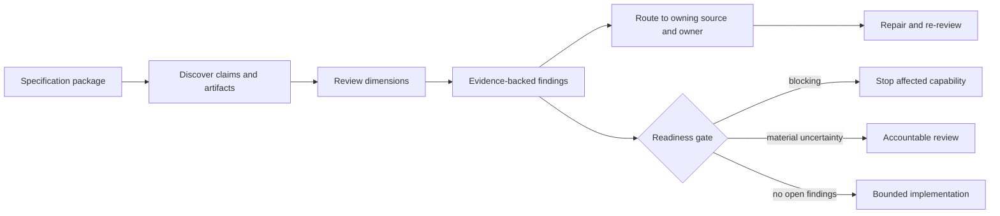
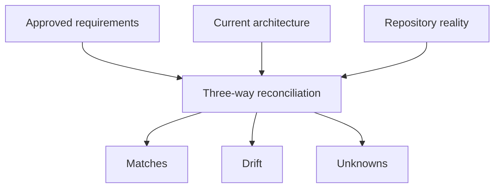

# Course 09 — Specification quality, review, and anti-patterns

**Detect specifications that look complete but are unsafe, ambiguous, stale, over-constrained, unverifiable, or ineffective for coding agents.**

Courses 01–08 built an enterprise specification system. Course 09 reverses the perspective:

> How do specifications fail, and what evidence justifies handing one to a coding agent?

This is a review course. You receive a plausible but dangerous Northstar specification, diagnose it with typed findings, repair each defect at its owning source, and make a readiness decision without hiding risk inside a score.

## Learning objectives

By the end of this course, you can:

1. review a specification across correctness, completeness, clarity, consistency, verifiability, traceability, authority, maintainability, autonomy, and decision ownership;
2. distinguish responsible-sounding vocabulary from an executable contract;
3. classify findings as `blocking`, `review`, or `informational` and connect each to evidence, an owner, and a repair;
4. detect vague requirements, false precision, confidence theater, aggregate-only quality claims, and undefined failure or uncertainty behavior;
5. separate product requirements, inherited constraints, architecture decisions, implementation choices, tasks, tests, evidence, and agent instructions;
6. detect authority, exception, policy, traceability, evidence, and generated-context laundering;
7. preserve bounded agent freedom between under-constrained and over-constrained tasks;
8. distinguish structural links from semantically valid traceability and current evidence;
9. reconcile approved requirements, architecture, and repository reality without treating code as authority;
10. review migration, rollback, rollout controls, fallback capacity, observability, and cross-NFR claims;
11. compare an unsafe lexical baseline with a field-aware review on labelled fixtures; and
12. issue capability-scoped `STOP`, `REVIEW`, or `READY_FOR_BOUNDED_IMPLEMENTATION` decisions without inventing a 0–100 quality score.

## Prerequisites

- [Course 03 — The specification hierarchy](../03-the-specification-hierarchy/README.md)
- [Course 04 — Company vs project vs feature requirements](../04-company-project-feature-requirements/README.md)
- [Course 06 — Writing executable requirements](../06-writing-executable-requirements/README.md)
- [Course 07 — Acceptance criteria, invariants, and evidence](../07-acceptance-criteria-invariants-evidence/README.md)
- [Course 08 — Non-functional requirements for agentic systems](../08-non-functional-requirements-agentic-systems/README.md)

## Scenario — a specification that says all the right words

Northstar proposes **AI-2290 — Automated Broker Response Handling v2**:

```text
The system shall use GPT-5.6 with LangChain
to intelligently process broker messages.

Responses should be processed quickly and accurately.

The agent should update the submission automatically
whenever confidence is above 90%.

Use Redis to cache results.

All broker responses should be handled.

The system should be secure and scalable.

Human review should be used where appropriate.

Follow AI-030 and all relevant enterprise policies.

Tests should ensure everything works correctly.
```

At a glance it contains:

```text
AI ✓  performance ✓  security ✓  scalability ✓
human review ✓  policy ✓  testing ✓
```

The lexical baseline therefore reports `7 / 7` and `looks_complete = true`. That result is the failure demonstration. Presence is not quality.

## Success criteria, boundaries, and non-goals

The course succeeds when you can explain every finding with evidence, identify the owning artifact and decision owner, distinguish blockers from improvements, repair the package, and preserve a bounded implementation decision.

The course does **not**:

- treat a linter, checklist, model, or agent as a semantic approval authority;
- prove that a clean result means a specification is complete;
- claim that deterministic rules generalize to arbitrary prose;
- automatically merge possible duplicate requirements;
- treat tests or existing code as the sole source of intent;
- authorize policy, architecture, exception, product, implementation, or release decisions through reviewer language;
- modify generated effective context directly; or
- reduce specification quality to a weighted score.

All fixtures, people, policies, revisions, evidence, and decisions are fictional and credential-free.

## Mental model — review is a typed decision pipeline



The gate does not average findings:

```text
one unresolved authorization blocker
    + ten clear formatting sections
    ≠ safe implementation
```

Strong review preserves separate facts:

```text
finding        What is wrong?
severity       What may proceed?
evidence       Where is the defect?
subject        Which capability or artifact is affected?
owner          Who can change the meaning or approve the decision?
repair         Which source should change?
limitations    What does this review not establish?
```

## Ten review dimensions

| Dimension | Core question | Typical failure |
| --- | --- | --- |
| Correctness | Does the statement express the intended obligation? | Current code is mistaken for required behavior. |
| Completeness | Are populations, negative paths, failures, boundaries, and uncertainty covered? | Happy path only. |
| Clarity | Could two competent implementers choose incompatible meanings? | “Secure,” “appropriate,” “quickly.” |
| Consistency | Do normative artifacts agree? | Human review required in one source and optional in another. |
| Verifiability | Is there an observable oracle with population and boundary? | “Tests ensure everything works.” |
| Traceability | Do claims retain source, revision, applicability, and semantic evidence links? | A link exists but its test checks something else. |
| Authority | Did an authorized source make the decision? | Hearsay becomes an auto-send rule. |
| Maintainability | Can the package evolve without drift or review overload? | Giant spec, stale copy, manual generated edit. |
| Autonomy | Are agent permissions and freedom proportionate? | Wildcard write/deploy or exact line transcription. |
| Decision ownership | Who owns product, policy, architecture, evidence, and response decisions? | A threshold has no owner. |

These dimensions guide discovery. They are not ten equally weighted score components.

## Finding severity and capability scope

### Blocking

Affected implementation must not proceed.

```text
Automatic mutation is permitted
but authorization and failure behavior are undefined.
```

The blocker is scoped. Documentation work or an unrelated parser refactor may still proceed if its authority and dependencies are independent.

### Review

A meaningful defect or ambiguity requires correction or an accountable disposition before the relevant claim is relied on.

```text
A latency number lacks a workload profile and start/end boundary.
```

### Informational

A bounded improvement does not currently invalidate safe implementation.

```text
One additional example could improve readability.
```

Informational must not become a bucket for unowned risk.

Severity is contextual, not a permanent property of a finding code:

```text
Severity = defect × affected capability × consequence × current autonomy
```

Undefined retry behavior for a read-only metadata lookup may require review; the same defect for an automatic external payment is blocking. The deterministic lab demonstrates this calibration while deliberately keeping the rule small enough to inspect.

### Findings for machines, remediation themes for people

The unsafe candidate intentionally produces 40 individual findings. Stable finding IDs remain useful for automation, evidence, and disposition, but a human review should not present 40 unrelated checklist items. `cluster_findings` groups them into seven themes such as **automatic action is not safely governed** and **enterprise context and applicable policy are unresolved**. Clustering is a navigation aid: it must not delete, merge, downgrade, or silently dispose of the underlying findings.

## Specification theater

Specification theater uses the vocabulary of disciplined engineering without establishing durable constraints:

```text
secure
scalable
accurate
human review where appropriate
follow all policies
comprehensive tests
```

The Course 09 baseline merely checks whether seven concepts appear. It finds all seven. It cannot answer:

- what the words mean;
- which population is covered;
- who decided;
- which source applies;
- what happens on failure;
- what evidence would be valid; or
- what the coding agent may change.

GitHub Spec Kit describes requirements-quality checklists as “unit tests for English”: they ask whether requirements are complete, clear, consistent, and cover relevant scenarios—not whether an implementation already works. Its current flow also separates clarification, checklists, cross-artifact analysis, implementation, and convergence. See the official [Spec Kit checklist template](https://github.com/github/spec-kit/blob/main/templates/commands/checklist.md) and [quickstart](https://github.com/github/spec-kit/blob/main/docs/quickstart.md).

## Anti-pattern family 1 — language that delegates meaning

### Vague requirements

Words such as `fast`, `secure`, `professional`, `appropriate`, `intelligent`, `robust`, `scalable`, and `accurate` can express intent. They become dangerous when undefined:

```text
undefined semantics
      ↓
implementation agent chooses meaning
      ↓
local choice becomes product or governance decision
```

Repair the obligation, not merely the adjective:

```text
For eligible W1 requests, end-to-end latency SHALL satisfy PERF-BR-001,
including its workload, boundary, statistic, window, owner, and response.
```

### False precision

`p95 < 1.7 seconds` looks precise. Without workload, environment, start/end boundary, aggregation, owner, rationale, and evidence, it is precision theater. An explicit unresolved decision with an owner is more honest than an invented number.

### Confidence theater

```text
confidence > 90% → auto-apply
```

Before confidence controls an authoritative action, define:

- what quantity produces the number;
- calibration method and population;
- revision of model/workflow/data;
- risk-specific error costs and slices;
- abstain/review behavior;
- threshold owner and decision record; and
- an independent trusted authorization and mutation boundary.

A floating-point value is evidence at best. It is not authority.

### One accuracy number

`accuracy ≥ 95%` may collapse field mapping, extraction, source support, conflict detection, abstention, routing, and authorized-action correctness. Split component metrics and examine critical slices. Course 07’s denominator and slice discipline still applies.

## Anti-pattern family 2 — misplaced design and brittle structure

### Implementation leakage

Bad product requirement:

```text
Use LangChain StructuredOutputParser with GPT-5.6.
```

Useful decomposition:

```text
Requirement    ProposedUpdate conforms to CONTRACT-BR-001.
Constraint     Production inference uses the gateway required by AI-007.
Architecture   Select model/provider and validation boundaries.
Implementation Select a parser/library inside the approved design.
```

Technology language is not automatically wrong. Ask **why it is named**. An external interface, regulatory constraint, platform standard, compatibility promise, or approved ADR can legitimately bind technology.

### Accidental architecture

`Use Redis because another team uses it` converts social proximity into architecture. Before making caching normative, examine latency evidence, sensitivity, invalidation, stale-decision risk, ownership, failure behavior, operational cost, and alternatives. Record the result as an ADR when consequential.

### Giant specification

One document containing product requirements, policy copies, architecture, database schema, tasks, tests, deployment, runbooks, and agent instructions creates ownership ambiguity, review overload, merge conflicts, and coupled lifecycles.

### Over-fragmentation

Seventy one-line requirement files create navigation cost and hide the end-to-end behavior. Split artifacts where ownership, authority, lifecycle, or representation differs—not one sentence per file.

```text
feature specification       product behavior and failure semantics
design / ADR                consequential architecture
contracts                   interface and data obligations
evidence plan               acceptance and evaluation
AGENTS.md                   bounded execution guidance
policy manifest             version-pinned inherited sources
```

## Anti-pattern family 3 — policy and authority laundering

### Copied enterprise policy

A local copy of “data stays in Canada” loses its relationship to `PRIV-018`. When the source changes, the copy drifts. Prefer version-pinned inheritance plus applicability evidence.

### “Follow all relevant policies”

The sentence is not worthless, but it delegates discovery, applicability, precedence, freshness, and conflict resolution to the implementation agent. Resolve an effective manifest before coding:

```text
enterprise corpus
    ↓ candidate discovery
    ↓ applicability evidence
    ↓ authority and conflict resolution
versioned effective context
```

### Missing decision ownership

Product targets, architecture choices, policy meanings, exception decisions, evidence oracles, and release decisions have different owners. A review must not let file authorship or repository access stand in for authority.

### Authority laundering

```text
“Sarah said auto-send is probably okay”
        ↓ copied into specification
AUTO_SEND = enabled
```

Trace the decision to source, owner, authority, scope, and revision. Hearsay remains a clarification input.

### Exception laundering

A project cannot write “human review is optional” when `AI-030` requires review. That is an unauthorized exception, even if it appears in a polished specification.

### Permanent temporary exception

A valid exception needs the exact governing revision, scope, independent authorized approver, conditions, evidence, issue and expiry time, renewal/revocation behavior, and unaffected obligations. “Temporary” with no expiry is permanent debt disguised as process.

## Anti-pattern family 4 — tests, code, links, and dashboards as theater

### Tests as the specification

Tests are conformance evidence. They rarely preserve all intent, ownership, scope, negative obligations, policy rationale, or unimplemented scenarios. If an implementation is wrong and a developer changes the test to match it, the requirement should not disappear.

### Code as the specification

Existing code shows observed behavior. Brownfield discovery must separate:

```text
observed behavior     what the system does
intended behavior     what stakeholders believe it should do
required behavior     what authorized sources obligate
```

GitHub Spec Kit’s existing-project guide similarly warns against inventing a retroactive specification of every behavior; use repository artifacts as evidence and define the intended change. See [Adopting Spec Kit in an Existing Project](https://github.com/github/spec-kit/blob/main/docs/guides/existing-projects.md).

### Traceability theater

The candidate maps all ten requirements to `TEST-ALL`:

```text
structural link coverage = 10 / 10
semantic link validity   =  1 / 10
```

A relationship is valid only if the target exists, is current, and its oracle actually supports the source obligation. Course 10 will deepen bidirectional traceability; Course 09 teaches reviewers not to trust a link count.

The repaired artifact uses the explicit relationship `reviewed_by` with target type `specification_review`. Its result is 10/10 semantic **review traceability** and 0/10 implementation/conformance evidence coverage. This is review traceability, not implementation or conformance traceability: it proves that each requirement was included in the specification review, not that the requirement has an acceptance oracle, implementation, executed test, or production evidence.

### Evidence theater

```text
Tests PASS
Security PASS
AI PASS
Governance PASS
```

Without producer relationship, exact subject revision, environment, population, numerator, denominator, timestamp/freshness, and limitations, the dashboard offers confidence without a defensible claim.

### Stale evidence

Evidence for `impl-v16` cannot authorize a claim about `impl-v17` merely because both are green. Evidence invalidation and re-execution are part of the contract.

### Expected policy sets come from resolution

The lab’s `FIXTURE_EXPECTED_POLICY_IDS` belongs only to Northstar. The checked-in `resolved-policy-expectation.json` models output from the Course 03 change-context and applicability resolver. A generic reviewer does not globally know that `AI-007`, `AI-030`, and `PRIV-018` apply:

```text
change context → policy resolver → expected effective policy set → Course 09 review
```

The reviewer compares the package manifest with that resolved set; it must not invent applicability.

### Heuristics are discovery aids, not authority

`VAGUE_TERMS` is a transparent fixture heuristic. A term such as “secure” is not defective when it is bound to a versioned, authoritative, measurable quality contract such as `SSP-04`; the lab accepts `referenced_quality_contract` for that reason. Likewise, the six-concern/1,500-line giant-spec rule is a **synthetic fixture trigger, not an enterprise guideline**. The real decomposition signals are different owners, lifecycles, authority, representation, and difficulty of review or navigation—not whether a file contains 1,499 or 1,501 lines.

## Anti-pattern family 5 — missing paths and uncertainty

### Happy path only

```text
broker response → extraction → update
```

A consequential workflow also needs negative, boundary, failure, uncertainty, stale-state, duplicate, authorization, and unknown-outcome behavior.

### Undefined failure semantics

“Retrieve applicable underwriting rules” is incomplete if retrieval failure could cause unbounded retry, model-memory substitution, or fail-open processing. Specify retryability, budgets, preservation, degradation, escalation, and recovery.

### Undefined uncertainty semantics

AI behavior must say when to proceed, abstain, clarify, preserve, or escalate. Otherwise the system is rewarded for always choosing.

## Anti-pattern family 6 — agent autonomy extremes

### Under-constrained

```text
Implement AI-2290.
Change whatever is needed.
Deploy when tests pass.
```

The task lacks writable/protected paths, dependencies, change budget, evidence, stop conditions, and independent release authority.

### Over-constrained

```text
Edit line 42.
Use exactly this function.
Do not add helpers.
```

Unless compatibility, safety, or architecture requires those mechanics, the instruction prevents legitimate local design.

### Bounded autonomy

```text
consequential decisions fixed by approved contracts
        +
local implementation freedom inside scoped paths and budgets
        +
explicit evidence and stop conditions
```

The reference permits edits only in feature source, tests, and the AI-2290 spec; protects policy, exceptions, and production; excludes deployment; and stops on conflicts, scope expansion, missing authority, protected-path need, or unknown mutation outcome.

## Anti-pattern family 7 — stale and damaged context

### Stale specification

Specs lose trust when policy, contracts, implementation, or evidence changes without triggering review. Each durable specification needs an owner, freshness signals, and a reconciliation workflow.

### Generated context edited manually

Patching `effective-context.md` creates a competing source of truth. Change the owning policy/specification/decision, regenerate, and verify the digest.

### Provenance-free compression

`Use the enterprise gateway` is not durable without source ID, revision, locator, and applicability reason. Compression may remove prose; it must preserve obligations and provenance.

### Context overload

Thousands of policies, ADRs, tickets, and repository files increase cost, conflict exposure, and attention dilution. More context is not automatically safer.

### Context starvation

`Implement AI-2290` without policies, architecture, existing contracts, or failure behavior forces reconstruction and guessing. Review context selection for candidate-discovery recall and false inclusion separately.

### Discoverability is quality

A correct requirement that the implementation workflow cannot discover is operationally ineffective. Enterprise specification quality includes discoverability, applicability, retrievability, freshness, and preservation in bounded context.

## Anti-pattern family 8 — duplicate semantics

```text
Human approval required.
Underwriter review required.
Manual validation must occur.
```

These may be duplicates, specializations, or distinct obligations. Flag `POSSIBLE_REQUIREMENT_DUPLICATION`; do not auto-merge until owners, scopes, authority, semantics, and evidence are compared.

## Anti-pattern family 9 — contradictions, authority heuristics, and shadow governance

Duplicate-looking statements can carry different authority and meaning:

```text
AI-030          enterprise mandatory   human review required
REQ-PROJ-017    project                review normally expected
REQ-FEAT-009    feature                skip review above a confidence threshold
```

This is not a wording cleanup. `REQ-FEAT-009` attempts to weaken a governing obligation. The review must preserve all three sources and issue `NORMATIVE_CONFLICT`; it must not synthesize “review is generally required except at high confidence.”

Three attractive heuristics fail:

| Heuristic | Why it fails | Required review |
| --- | --- | --- |
| Most specific wins | Specificity does not grant policy authority | Compare authority domain, scope, applicability, and exceptions. |
| Latest file wins | A recent ticket may still be informal | Check status, effective period, source authority, and freshness separately. |
| Nearest file wins | Repository proximity improves discoverability, not governance authority | Treat local instructions as execution guidance within their delegated scope. |

An `AGENTS.md` file becomes **shadow governance** when it starts setting policy, skipping controls, authorizing automatic action, or granting exceptions. Review should distinguish:

```text
how the agent works           legitimate instruction scope
what the system may do        product/policy/architecture authority
```

The lab emits `AGENT_INSTRUCTION_EXCEEDS_AUTHORITY` when that boundary is crossed.

### Derived requirements remain proposals

Combining two authoritative sources does not make the transformation authoritative:

```text
authoritative sources
        ↓
agent-derived interpretation
        ↓
PROPOSED requirement
        ↓
accountable semantic review
```

An active derivation without approval produces `DERIVED_REQUIREMENT_UNAPPROVED`.

### Self-confirming specification loops

The most dangerous internally consistent workflow is:

```text
ambiguous ticket
    ↓ agent assumption
generated requirement
    ↓
generated implementation
    ↓
generated test and evaluation
    ↓
PASS
```

The test proves conformity to the agent’s assumption—not stakeholder intent. Break the loop by preserving uncertainty, obtaining an accountable decision, and adding independently owned or deterministic external evidence. Course 09 reports `SELF_CONFIRMING_SPECIFICATION_LOOP` separately from `EVIDENCE_INDEPENDENCE_WEAK`: agent-authored tests can still be useful, but their evidence relationship must be visible.

## Anti-pattern family 10 — uncertainty and requirement shape

### Uncertainty laundered into certainty

“I think commercial policies probably need senior review” is an input to clarification, not a `SHALL`. A safe transformation retains source text, question, owner, affected capability, and decision state. `UNCERTAINTY_LAUNDERED` blocks reliance on the invented obligation.

Open questions also need consequences:

```yaml
id: OQ-017
question: Can broker communication be sent automatically?
blocks: [automatic_delivery]
does_not_block: [analysis, draft_generation]
owner: Underwriting Risk
```

No `blocks` mapping produces `OPEN_QUESTION_CONSEQUENCE_UNDEFINED`. Blocking the entire change when only one capability depends on the answer produces `OPEN_QUESTION_OVER_BLOCKS`.

### Requirement explosion and compound requirements

Both extremes hide behavior:

```text
437 sentence fragments               one requirement containing the whole workflow
         ↓                                           ↓
semantic fragmentation                 ownership and evidence ambiguity
```

There is no ideal count. Each requirement should express a meaningful, independently reasoned obligation with coherent ownership, failure semantics, priority, and evidence. The lab flags `REQUIREMENT_EXPLOSION` and `COMPOUND_REQUIREMENT` without imposing a universal number.

### Organize behavior before implementation

`Frontend`, `backend`, `database`, and `LLM` may be useful implementation views, but they are weak primary behavioral boundaries. Prefer ingestion, extraction, validation, conflict resolution, review, mutation, and audit—then map those behaviors to architecture.

Similarly, do not substitute representations for intent:

| Weak requirement | Durable obligation |
| --- | --- |
| `POST /responses SHALL return 200` | An accepted response receives a stable processing identity. |
| `proposal.source_response_id column exists` | Every proposal retains provenance to its source response. |
| Prompt says “do not hallucinate” | Every proposed field is supported by declared source evidence. |

An externally contractual API or schema can be normative. The defect is presenting one realization as the obligation without provenance.

## Anti-pattern family 11 — controls, human review, approval, and retries

### Prompt-only and enforcement-only safety

Prompt guidance can reinforce behavior; it cannot replace a trusted boundary:

```text
safety obligation
    ├── prompt guidance
    ├── least-privilege tool
    ├── authorization
    ├── runtime validation
    └── evidence
```

If a model can call unrestricted `update_submission()`, “do not change verified fields” is `CONTROL_UNDERENFORCED`.

The opposite is also defective. An OPA rule or runtime check with no linked requirement loses intent and change rationale (`ENFORCEMENT_INTENT_MISSING`). A consequential requirement with no known CI, runtime, authorization, human, or operational enforcement point produces `ENFORCEMENT_MAPPING_MISSING`.

### Human review is a contract, not a slogan

“A human reviews output” must define:

- reviewer identity and authority;
- what artifact, source evidence, policy context, and limitations they see;
- the exact decision and action it authorizes;
- whether editing is allowed and whether edits invalidate approval; and
- expiry, reuse, consumption, and audit behavior where consequential.

An approval boolean bound only to `SUB-17` does not identify the approved proposal. A trusted receipt binds exact content digest, subject revision, requirement/policy context, reviewer, decision, issuance, expiry, and consumption. Proposal mutation invalidates it. Reuse is prohibited.

### External effects need unknown-outcome semantics

For email, payment, claim creation, or authoritative mutation:

```text
timeout ≠ failed
timeout = outcome unknown
```

Safe retry requires a stable logical operation ID, idempotency strategy, reconciliation, retryable error classes, attempt/deadline budgets, backoff, and exhaustion behavior. “Retry seven times” also needs an owner and rationale; a precise budget without provenance is another form of false precision.

## Anti-pattern family 12 — NFR, evaluation, and gate laundering

Cost and performance are optimization objectives inside an approved feasible region:

```text
minimize cost / latency
subject to quality, safety, reliability, privacy, and authority invariants
```

Never skip authorization to meet latency. Degrade service or reduce autonomy instead.

An NFR target needs workload and measurement boundaries. `p95 < 2 seconds` is incomplete until request mix, rate, concurrency, data shape, environment, duration, start/end events, statistic, window, and exclusions are defined.

### Semantic success and degradation

HTTP `200` with a null result is not necessarily a good service event. Manual fallback counts as a good event only where the owned service contract says so. Dependency uncertainty must preserve or reduce autonomy:

```text
policy unavailable → manual/proposal-only and preserve work
policy unavailable → skip check and auto-apply        INVALID
```

The latter produces `DEGRADATION_WEAKENS_CONTROL`.

### Evaluation limits deployment eligibility

If evaluation covers English plain text but deployment enables French attachments, the claim does not transfer. Unsupported populations need manual routing, feature disablement, or current evidence. Likewise, `10 / 10` on a synthetic slice remains exactly that—not “100% accurate.”

### Absence is not green

Keep these states distinct:

```text
PASS  FAIL  BLOCKED  NOT_MEASURED  STALE  NOT_APPLICABLE  UNCERTAIN
```

`MEASURED` is not an authorized gate decision; `NOT RUN` is not “no failures”; and unknown applicability is not `N/A`. The extended lab detects `UNRESOLVED_GATE_REPORTED_READY`, `MISSING_EVIDENCE_INTERPRETED_AS_PASS`, and `UNKNOWN_MISCLASSIFIED_NOT_APPLICABLE`.

### Lifecycle-aware context

Draft, active, and superseded artifacts are not interchangeable. Retain superseded history for provenance and release reproduction, but do not present it as current instruction. Current context needs status and `supersedes` / `superseded_by` metadata where history appears.

An ADR can conflict with a requirement and can itself become stale. `Use Redis Cloud` does not override “no external caching of PII,” and a two-year-old provider decision is not eternal policy. ADRs need status, assumptions, consequences, supersession, and observable review triggers.

## Anti-pattern family 13 — specification, architecture, and repository reality

Brownfield review reconciles three independent relationships:



- **Requirement ↔ architecture:** does the design satisfy the obligation?
- **Architecture ↔ repository:** does implementation reflect the design?
- **Requirement ↔ repository:** does observed behavior satisfy the requirement?

A difference does not prove which side is wrong. Possible dispositions include implementation drift, stale specification, missing architecture decision, or incomplete discovery. The coding agent must not silently edit either source of truth.

### Discover before detailed design

Before proposing `BrokerResponseService`, inspect existing capabilities, contracts, dependencies, patterns, and responsibility owners. Otherwise the agent may duplicate `BrokerMessageProcessor`. Repository discovery is evidence, not authority: a legacy auto-apply implementation cannot override an approved review requirement.

Prevalence is also not approval. Three similar implementations may all be debt. Check lifecycle, current paved roads, applicability, and conformance before copying a pattern.

### Trust-boundary reconciliation

```text
Requirement: model-facing execution has no authoritative mutation capability
Architecture: LLM → Proposal Service → Trusted Mutation Service
Repository:   agent/tools.py exposes update_submission()
```

This is not generic “spec/code mismatch.” It is `IMPLEMENTATION_VIOLATES_TRUST_BOUNDARY`, and it blocks the affected capability.

## Anti-pattern family 14 — migration and rollout theater

A desired-state specification describes where the system should end. A transition specification explains how current data, producers, consumers, contracts, events, and deployments reach it safely.

Schema v2 that adds `source_span` must account for stored v1 records, old producers and consumers, rolling deployment, migration completion, and rollback. Enterprise deployments often run mixed versions; assuming an instantaneous replacement creates `BIG_BANG_ROLLOUT_ASSUMPTION`.

Rollback is not merely `git revert`. Ask what happens to:

```text
code  data  events  contracts  externally visible side effects
```

Broker email, payment, claim creation, and external notification may be irreversible. They need stronger authorization, idempotency, verification, and recovery/compensation semantics than reversible internal state.

### Flags and kill switches

A feature flag controls rollout. It does not repair authorization, migration, data corruption, side effects, or policy violations. A governed flag defines enable authority, population, evidence gate, expiry, disabled behavior, and an invariant that it cannot bypass policy.

A kill switch needs evidence: activation latency, queued effects, in-flight behavior, preserved state, and recovery. “We can disable it” without a tested path produces `KILL_SWITCH_UNVERIFIED`.

## Anti-pattern family 15 — fallback, observability, and bounded readiness

### Manual fallback must work

If degraded demand is 50,000 messages/day and human capacity is 1,000/day, fallback is not sustainable for a prolonged outage. Measure load, manual capacity, queue growth, and maximum outage duration without inventing targets. Preserve the work item, source evidence, subject identity, failure reason, and current state so people can continue.

### Observability is part of the specification

Consequential workflows need enough metadata to reconstruct model/workflow versions, applicable policy, tools, decision, reason, outcome, cost, and latency. They do not need raw broker emails, prompts, submissions, or tool outputs copied indiscriminately into logs.

Define identity semantics:

```text
request_id              inbound interaction
run_id                  one workflow execution
attempt_id              one retry attempt
logical_operation_id    stable side-effect identity across uncertain retry
proposal_id             exact candidate content
```

Missing correlation fragments evidence; reusing one ID across unrelated operations merges audit trails.

Cost requires an outcome denominator such as eligible, successful, or successful compliant workflow. Latency must be interpreted with semantic success, reliability, and quality—a system that fails instantly is fast, not good. Model choice, context size, and retry budgets create an NFR dependency graph; optimizing each independently can worsen the whole system.

### “Production-ready” is not a boolean vibe

A defensible claim is bounded:

```text
capability:   broker-response proposal generation
population:   English W1 responses without attachments
autonomy:     proposal only
environment:  production
evidence:     current for exact revisions
excluded:     automatic mutation, French, attachments
```

Course 09’s implementation decision remains distinct from production release.

## Ten-stage specification review pipeline

Proofreading is useful but insufficient. A professional review progresses through distinct questions:

| Stage | Review question | Representative evidence | Candidate finding |
| ---: | --- | --- | --- |
| 1. Source | Where did each consequential decision come from; is it identifiable and current? | Source ID, version, locator, status, freshness. | `SOURCE_UNKNOWN`, `SOURCE_STALE`, `INFORMAL_SOURCE_USED_NORMATIVELY` |
| 2. Authority | Who owns the domain; was authority delegated; is an exception required? | Owner/delegation/exception records. | `OWNER_MISSING`, `DECISION_AUTHORITY_UNKNOWN`, `SPECIALIZATION_UNAUTHORIZED` |
| 3. Requirement quality | Are terms, scope, quantifiers, obligations, and numbers clear and appropriately placed? | Typed requirement fields and candidate lint findings. | `VAGUE_REQUIREMENT`, `COMPOUND_REQUIREMENT`, `FALSE_PRECISION` |
| 4. Conflict | Do enterprise, platform, domain, project, feature, and instruction artifacts overlap on the same resource/control/scope? | Applicability and authority analysis. | `NORMATIVE_CONFLICT`; distinguish false from genuine conflict. |
| 5. Behavioral completeness | Are trigger, preconditions, authorization, positive/negative/failure outcomes, postconditions, frames, staleness, and idempotency defined proportionately? | Scenarios, tables, state/invariant contracts. | `SCENARIO_COVERAGE_INCOMPLETE`, `SIDE_EFFECT_IDEMPOTENCY_UNDEFINED` |
| 6. NFR | Are population, workload, boundary, unit, window, target state/owner, response, and evidence explicit? | NFR and measurement contracts. | `NFR_WORKLOAD_UNDEFINED`, `NFR_MEASUREMENT_BOUNDARY_UNDEFINED` |
| 7. Traceability | Do requirement links reach design, tasks, acceptance, and evidence—and are sampled links semantically valid? | Relationship graph plus oracle inspection. | `TRACE_LINK_SEMANTIC_MISMATCH` |
| 8. Evidence | Is evidence executed, current, population-bound, revision-bound, and limitation-aware? | Provenance-bearing records. | `EVIDENCE_STALE`, `MISSING_EVIDENCE_INTERPRETED_AS_PASS` |
| 9. Repository reconciliation | What matches, drifts, or remains unknown across requirement, architecture, and repository? | Discovery and three-way reconciliation report. | `REPOSITORY_DISCOVERY_INCOMPLETE`, `IMPLEMENTATION_VIOLATES_TRUST_BOUNDARY` |
| 10. Agent readiness | Can an agent safely begin within bounded scope, context, permissions, stop conditions, and verification? | Capability-scoped readiness decision. | `AGENT_TASK_UNDER_CONSTRAINED`, capability `blocked` |

Review rigor remains proportional. A low-risk CRUD edit does not need a ten-page state analysis; a consequential automatic mutation does.

### Readiness by capability

The included fixture deliberately yields:

| Capability | Decision |
| --- | --- |
| Extraction | Ready for bounded implementation |
| Proposal creation | Ready for bounded implementation |
| Conflict detection | Ready for bounded implementation |
| Human-review workflow | Ready for bounded implementation |
| Automatic mutation | Blocked: authorization, autonomy, evaluation, and verification unresolved |

This avoids both failure modes: one question blocking all useful work, and a broad “ready” claim clearing an unsafe capability.

## Review architecture patterns

### Pattern A — human checklist only

Strengths: semantic judgment, proportionality, domain context. Limitations: inconsistent execution, weak scaling, and difficult regression. Best for small changes when supported by clear ownership.

### Pattern B — deterministic lint and schema checks

Strengths: fast, repeatable detection of missing fields, forbidden phrases, stale revisions, invalid links, and policy structure. Limitations: lexical/structural checks cannot establish meaning.

### Pattern C — cross-artifact analysis

Strengths: detects conflicts and gaps across spec, design, tasks, evidence, and instructions. Limitations: depends on artifact identity, provenance, and encoded relationships.

### Pattern D — model-assisted review

Strengths: proposes ambiguity, duplication, edge cases, and clarity findings across prose. Limitations: nondeterminism, false positives/negatives, context selection, and no inherent authority. Output remains a proposal.

### Pattern E — independent CI gate plus accountable disposition

Strengths: repeatable stop conditions, current revision binding, evidence capture, and separation of implementation from approval. Limitations: enforces only represented rules; human/domain review still matters.

Most enterprise systems combine B–E. No single mechanism establishes completeness.

## Technology landscape

| Mechanism | Best contribution | Limitation | Selection question |
| --- | --- | --- | --- |
| Markdown + Git review | Durable diff, ownership, comments, history | Formatting does not create semantics | Can reviewers see exact source and change? |
| JSON Schema/custom linters | Required fields, controlled states, deterministic rules | Cannot infer intent or authority | Which defects are safely mechanizable? |
| GitHub Spec Kit checklist/analyze | Requirements-quality questions and cross-artifact checks | Needs organizational policy and ownership integration | Which gates belong before implementation? |
| Requirements platforms | Identity, baselines, relationships, change workflow | Cost, integration, and traceability theater remain possible | Does the tool preserve semantic ownership? |
| Contract/schema tools | Interface conformance | Partial view of business behavior | Which observable boundary is formalizable? |
| Property/model-based tools | Broad invariants and state exploration | Model quality and state-space cost | Which high-risk behaviors justify formalization? |
| Model-assisted review | Broad candidate-finding generation | Stochastic and non-authoritative | How are findings verified and routed? |
| Policy-as-code/CI | Independent repeatable enforcement | Only checks encoded inputs/rules | Which blockers can safely fail closed? |

Choose mechanisms by guarantee, provenance, portability, reviewability, false-positive cost, and failure behavior—not feature count.

## State of practice

**Established practice** includes requirements-quality attributes, peer review, inspections, baselines, change control, bidirectional traceability, verification planning, and configuration management. ISO/IEC/IEEE 29148 remains a useful requirements-engineering reference; see the official [ISO standard page](https://www.iso.org/standard/72089.html).

**Current agentic practice** adds repository-local instructions, context manifests, requirements checklists, cross-artifact analysis, convergence, bounded autonomy, and evidence-aware CI. GitHub Spec Kit documents an explicit `specify → clarify → plan → checklist → tasks → analyze → implement → converge` path for meaningful ambiguity; see its [official reference](https://github.com/github/spec-kit/blob/main/docs/reference/overview.md).

**Emerging practice** uses model-assisted review to propose ambiguities, missing scenarios, and conflicts, then relies on deterministic validation and accountable disposition. Models improve discovery breadth but do not become policy or approval authorities.

**Open problems** include semantic duplicate detection, reliable conflict localization, measuring specification retrieval recall, maintaining specs through brownfield evolution, evaluating reviewer agents without circular judges, and connecting runtime drift to owning specifications without turning observations into self-authorizing policy.

NIST’s AI RMF frames governance, mapping, measurement, and management as lifecycle activities and emphasizes documentation and role clarity; see [AI RMF 1.0](https://www.nist.gov/publications/artificial-intelligence-risk-management-framework-ai-rmf-10) and the [AI Resource Center](https://airc.nist.gov/). These sources inform review questions; they do not supply Northstar’s decisions.

## Worked scenario — AI-2290

The lab reviews five input surfaces:

```text
candidate requirements
agent autonomy contract
traceability + evidence
generated context manifest
policy and exception metadata
```

The deterministic candidate result is:

| Result | Numerator / denominator or count | Interpretation |
| --- | ---: | --- |
| Lexical concept presence | 7 / 7 | Unsafe baseline looks complete. |
| Blocking findings | 16 | Affected implementation stops. |
| Review findings | 24 | Material repairs/dispositions required. |
| Informational findings | 0 | No filler findings are needed. |
| Structural trace coverage | 10 / 10 | Every requirement has a link. |
| Semantically valid trace links | 1 / 10 | Nine links do not support their claimed obligation. |
| Composite score | none | Findings do not average away blockers. |

The repaired package has zero encoded findings and returns `READY_FOR_BOUNDED_IMPLEMENTATION`. That means only:

- the specification passed this bounded review;
- the agent may operate under the reference autonomy contract; and
- independent implementation, evidence, approval, and release gates still apply.

It does not mean “production ready.”

## Run the lab

From the repository root:

```bash
python3 curriculum/beginner/09-specification-quality-review-antipatterns/lab.py
python3 -m unittest tests.test_course_09
```

Use the [guided notebook](specification_review.ipynb) for the learning sequence and the [AI-2290 workshop](northstar-spec-review/README.md) for the realistic review package.

## Experiments

### 1. Presence versus quality

Run the lexical baseline. Remove the word `security` and observe the concept count change without changing the core mutation risk. Add ten responsible-sounding words and show why quality still does not follow.

### 2. Vague language and false precision

Replace “quickly” with `p95 < 1.7 seconds` but omit workload and authority. Compare `VAGUE_REQUIREMENT` with `FALSE_PRECISION` and `DECISION_AUTHORITY_MISSING`.

### 3. Technology provenance

Compare ticket-level GPT/Redis choices with the Enterprise AI Gateway constraint inherited from `AI-007`. The same syntactic form can be leakage or a legitimate constraint depending on provenance.

### 4. Confidence-controlled mutation

Add calibration metadata but leave trusted authorization absent. A better metric contract does not grant mutation authority.

### 5. Happy-path failure injection

Remove failure and uncertainty scenarios from the repaired package. Because the feature has authoritative side effects, readiness must stop.

### 6. Agent autonomy extremes

Compare wildcard write/deploy authority, exact-line transcription, and the bounded reference contract. Explain which decisions belong to the agent.

### 7. Traceability theater

Observe 10/10 structural links and 1/10 semantic validity. Repair the oracle support list and verify both measures independently.

### 8. Evidence freshness

Change `current_subject_revision` without re-running evidence. A green status becomes stale; the evidence record should not be rewritten to pretend otherwise.

### 9. Generated context integrity

Change the context digest or remove `AI-030`. The first detects manual derived-output mutation; the second detects starvation. Neither is fixed by adding unrelated context.

### 10. Repair and re-review

Compare the dangerous and repaired bundles. Every repair belongs in an owning requirement, policy manifest, exception record, context source, evidence record, or agent contract—not in the review result itself.

### 11. Authority-resolution heuristics

Run the enterprise/project/feature conflict fixture. Observe that specificity, recency, and repository proximity each produce a separate finding while the underlying `NORMATIVE_CONFLICT` remains blocking.

### 12. Self-confirming agent loop

Let one producer assume ambiguous intent, create the requirement, implementation, tests, and evaluation. Then change the pipeline to require clarification and independent evidence. Compare semantic authority—not merely internal consistency.

### 13. Brownfield transition review

Inject an undiscovered repository bypass, schema migration without coexistence, a feature flag without governance, and an untested kill switch. Repair the desired-state and transition contracts separately.

### 14. Capability-scoped readiness

Run `agent_readiness_by_capability`. Resolve the automatic-mutation authorization question without changing extraction or proposal-generation status. Verify that only the affected capability transitions.

The booleans in `capability-readiness.json` are **fixture assertions**, not authenticated readiness evidence. Each positive assertion links to a synthetic evidence ID and digest so learners can test relationship integrity and freshness. In production, replace these records with independently produced, authenticated approvals, context-resolution outputs, attestations, and verification evidence; a literal `true` must never authorize consequential work by itself.

## Evaluation

The included evaluation has 35 labelled cases covering the original requirement-quality rules plus authority resolution, self-confirming loops, uncertainty scope, requirement shape, control mapping, approval/retry safety, NFR and gate laundering, lifecycle state, repository reconciliation, migration, rollout controls, fallback, observability, unit economics, and bounded readiness.

The lab reports:

```text
true positives
false positives
false negatives
precision numerator / denominator
recall numerator / denominator
exact case matches / total cases
```

The fixture currently matches 35/35 labelled cases and 78 expected finding labels with zero false positives or false negatives. The claim is explicitly:

```text
labelled fixture rule coverage
not general specification-review accuracy
```

The cases are intentionally transparent and deterministic. A production evaluation would need independently labelled, representative, versioned review packages; multiple domains and reviewers; disagreement adjudication; severity calibration; false-stop and missed-blocker analysis; and drift monitoring.

## Failure modes of the review process

| Review anti-pattern | Failure | Mitigation |
| --- | --- | --- |
| Keyword lint as approval | Presence is mistaken for semantics | Label lexical checks as candidate discovery only. |
| One quality score | Blockers are averaged away | Preserve typed severity and affected capability. |
| Reviewer edits the requirement | Review silently becomes product authority | Repair at the owner/source and re-review. |
| Every issue is blocking | Review becomes unusable and ignored | Calibrate severity to consequence and scope. |
| Every issue is informational | Unsafe work proceeds | Define non-negotiable stop conditions. |
| Generated checklist pre-checked | Agent self-approves quality | Keep reviewer-owned checklist state. |
| Model review treated as truth | False positives/negatives gain authority | Require evidence and accountable disposition. |
| Fix the derived context | Competing source of truth appears | Regenerate from corrected sources. |
| Link-count KPI | Teams optimize trace presence | Sample semantic validity and oracle support. |
| Review once, trust forever | Spec/evidence becomes stale | Trigger review on relevant revisions and drift. |

## Production operating model

### Review states

Use explicit states such as:

```text
DRAFT → IN_REVIEW → CHANGES_REQUIRED → REVIEW_READY
      ↘ SUPERSEDED
```

Implementation readiness and production release remain separate state machines.

### Ownership

| Decision | Typical accountable owner |
| --- | --- |
| Product behavior/population | Product/domain owner |
| Policy meaning/applicability | Policy owner/resolver |
| Architecture choice | Architecture owner/ADR approver |
| AI quality threshold | Domain risk + AI quality |
| Exception | Governing policy’s authorized approver |
| Implementation detail | Engineering within constraints |
| Evidence oracle | Independent evidence owner |
| Release | Release/change authority |

### CI and evidence

A production gate should bind review results to exact artifact digests and revisions, retain rule/checklist versions, distinguish machine from human findings, prevent the implementation agent from marking reviewer-owned checks complete, require disposition evidence, expire waivers, and re-run after semantic changes.

### Security

Specification inputs—tickets, retrieved policies, comments, generated plans, agent messages, test output—remain untrusted until source, authority, scope, and integrity are established. Review tooling should not execute embedded instructions or accept prompt text as identity, permission, or approval. OWASP’s [GenAI Security Project](https://genai.owasp.org/) is useful threat-discovery input for injection and excessive-agency risks.

### Observability

Track review ID, subject digest, rule/checklist version, finding transitions, owner, disposition, exception/approval receipt, re-review revision, lead time, reopen rate, escaped ambiguity, false-stop rate, and stale-spec age. Do not log unnecessary sensitive specification content or hidden model reasoning.

## Production upgrade path

| Course fixture | Production requirement |
| --- | --- |
| Transparent Python rules | Versioned linter/policy packages with change review and rollback |
| Fictional policy manifest | Authenticated sources, owners, immutable revisions, and freshness checks |
| Static review package | Repository/requirements-system integration bound to exact commits plus three-way brownfield reconciliation |
| One labelled domain | Representative cross-domain corpus with independent reviewers |
| Exact fixture labels | Adjudication, inter-reviewer agreement, severity calibration, and drift |
| JSON evidence | Signed/provenance-bearing attestations and immutable retention |
| Local readiness function | Independent CI gate with scoped waivers and protected-branch enforcement |
| Simple context digest | Reproducible generation, supply-chain provenance, and tamper detection |
| Manual owner strings | Authenticated identity and authorization at decision boundaries |
| Desired-state migration example | Mixed-version compatibility tests, reversible data strategy, and rehearsed rollback/forward-fix |
| Declared flag/kill switch | Authorized flag service, tested emergency path, in-flight semantics, and retained evidence |
| Manual fallback statement | Measured capacity, queue policy, preserved work, and sustainable outage window |

## When not to use the full review package

Use proportionality:

- a typo with no semantic change may need normal code review;
- a local refactor may reuse current specifications and regression evidence;
- a small reversible bug fix may need a lightweight behavior delta and one regression test;
- a change to automatic decisions, external side effects, permissions, data classes, architecture, policy, model routing, or production objectives deserves deeper review.

The choice itself should be explainable. “Small” is not a synonym for “low risk.”

## Practical exercises

1. **Vagueness:** Repair “human review where appropriate” without inventing product policy.
2. **False precision:** Review `p95 < 1.7 seconds` and list the missing authority and measurement fields.
3. **Technology classification:** Classify GPT, LangChain, Redis, and Enterprise AI Gateway as requirement, inherited constraint, design candidate, or implementation choice—with provenance.
4. **Artifact design:** Split a giant spec along ownership/lifecycle boundaries, then defend why it is not over-fragmented.
5. **Brownfield truth:** Given code, tests, telemetry, tickets, and user reports, classify observed, intended, and required behavior.
6. **Failure coverage:** Add authorization denial, stale state, duplicate response, provider outage, policy outage, and unknown mutation outcome.
7. **Uncertainty:** Define proceed, abstain, clarify, preserve, and escalate behavior for unsupported fields.
8. **Confidence:** Design the evidence and ownership needed before any threshold may influence routing; keep mutation authorization separate.
9. **Autonomy:** Repair both wildcard permission and exact-line instructions into a bounded task.
10. **Authority:** Trace the “Sarah said” claim and record the correct clarification path.
11. **Exception:** Draft a scoped, conditional, independently approved, expiring exception without weakening the base policy.
12. **Traceability:** Keep structural coverage at 100% while deliberately breaking oracle semantics; explain why the dashboard is misleading.
13. **Freshness:** Define invalidation triggers for spec, implementation, evidence, policy, and context revisions.
14. **Context:** Compare starvation, overload, and minimal-sufficient context using discovery recall and false inclusion.
15. **Review calibration:** Write one blocking, one review, and one informational finding with subject, evidence, owner, and repair; explain why none should be converted into points.
16. **Conflict resolution:** Explain why a more specific, newer, closer feature file cannot weaken `AI-030`.
17. **Self-confirming loop:** Redesign an agent-authored requirement/code/test/evaluation pipeline with independent authority and evidence.
18. **Migration:** Write desired-state and transition requirements for proposal schema v1 → v2, including coexistence and rollback.
19. **Operability:** Specify a governed feature flag, tested kill switch, and capacity-backed work-preserving manual fallback.
20. **Brownfield reconciliation:** Classify a spec/repository disagreement as implementation drift, stale specification, missing decision, or incomplete discovery without letting the agent choose unilaterally.
21. **Reviewer disagreement:** Reviewer A labels a technology reference `IMPLEMENTATION_LEAKAGE`; Reviewer B labels it `INHERITED_TECHNOLOGY_CONSTRAINT`. Inspect source, authority, technology basis, and applicability. Record `REVIEW_FINDING_DISPUTED` until an accountable adjudicator resolves the classification.
22. **Correct finding, wrong repair:** A reviewer correctly finds an unauthorized 90% auto-apply threshold, then recommends 95%. Explain why the defect is missing authority, calibration, and population—not the numeric value—and write an owner-routed repair.
23. **Normative review laundering:** A reviewer recommends replacing Redis with DynamoDB. Rewrite the finding so it identifies the missing approved architecture basis and routes evaluation to the architecture owner without making the reviewer’s preference normative.

## Review questions

1. Why can a specification contain security, testing, and governance language yet remain unsafe?
2. When is a named technology a legitimate constraint rather than implementation leakage?
3. Why is an unresolved target sometimes more honest than a precise number?
4. What additional contract is required before model confidence can influence a consequential action?
5. Why are tests and current code evidence rather than automatic owners of intent?
6. How can structural traceability reach 100% while semantic validity is 10%?
7. What makes a temporary exception governed rather than laundered?
8. Why should generated context be regenerated instead of manually repaired?
9. How does a reviewer distinguish bounded autonomy from under- and over-constraint?
10. What exactly does `READY_FOR_BOUNDED_IMPLEMENTATION` authorize—and what does it not?
11. Why can requirement specificity, file recency, and repository proximity never substitute for authority?
12. How does independent evidence break a self-confirming specification loop?
13. What are the three independently failing edges in requirement/architecture/repository reconciliation?
14. Why do feature flags and kill switches require semantics and evidence beyond their existence?
15. How can capability-scoped readiness preserve safe parallelism without clearing automatic mutation?

## Checkpoint

AI-2290’s enterprise policy requires human review. A newer feature file and nearby `AGENTS.md` permit high-confidence bypass, while repository discovery finds a model-facing direct-mutation tool. Extraction and proposal generation have approved bounded contracts. What should the reviewer do?

- **A.** Let the newer, more specific, closer files override enterprise policy and preserve repository convention.
- **B.** Block every capability until the entire repository and specification are perfect.
- **C.** Preserve the normative conflict and trust-boundary violation, block automatic mutation, route decisions to accountable owners, and allow independently ready extraction/proposal work to proceed within bounded implementation scope.

Correct answer: **C**. Specificity, recency, proximity, and code prevalence do not grant authority. Capability-scoped readiness preserves safe parallelism without clearing an unsafe side effect.

## References

- [ISO/IEC/IEEE 29148:2018 — Requirements engineering](https://www.iso.org/standard/72089.html)
- [GitHub Spec Kit — checklist command template](https://github.com/github/spec-kit/blob/main/templates/commands/checklist.md)
- [GitHub Spec Kit — quickstart and full workflow](https://github.com/github/spec-kit/blob/main/docs/quickstart.md)
- [GitHub Spec Kit — Spec-Driven Development concepts](https://github.com/github/spec-kit/blob/main/docs/concepts/sdd.md)
- [GitHub Spec Kit — adopting existing projects](https://github.com/github/spec-kit/blob/main/docs/guides/existing-projects.md)
- [NIST AI Risk Management Framework 1.0](https://www.nist.gov/publications/artificial-intelligence-risk-management-framework-ai-rmf-10)
- [NIST AI Resource Center](https://airc.nist.gov/)
- [OWASP GenAI Security Project](https://genai.owasp.org/)
- [Cucumber Gherkin reference](https://cucumber.io/docs/gherkin/reference/)

## Continue

Course 10 will turn valid relationships into bidirectional requirement traceability across intent, design, tasks, code, evidence, approvals, and runtime observations. Later courses will apply this review discipline to SDD frameworks, brownfield work, PR design, policy gates, drift, and continuous specification.
