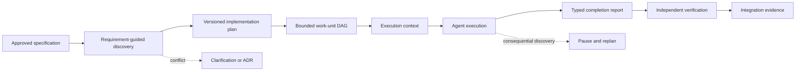
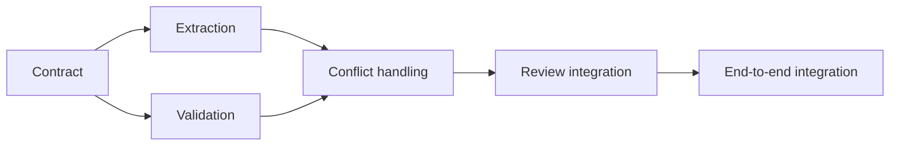
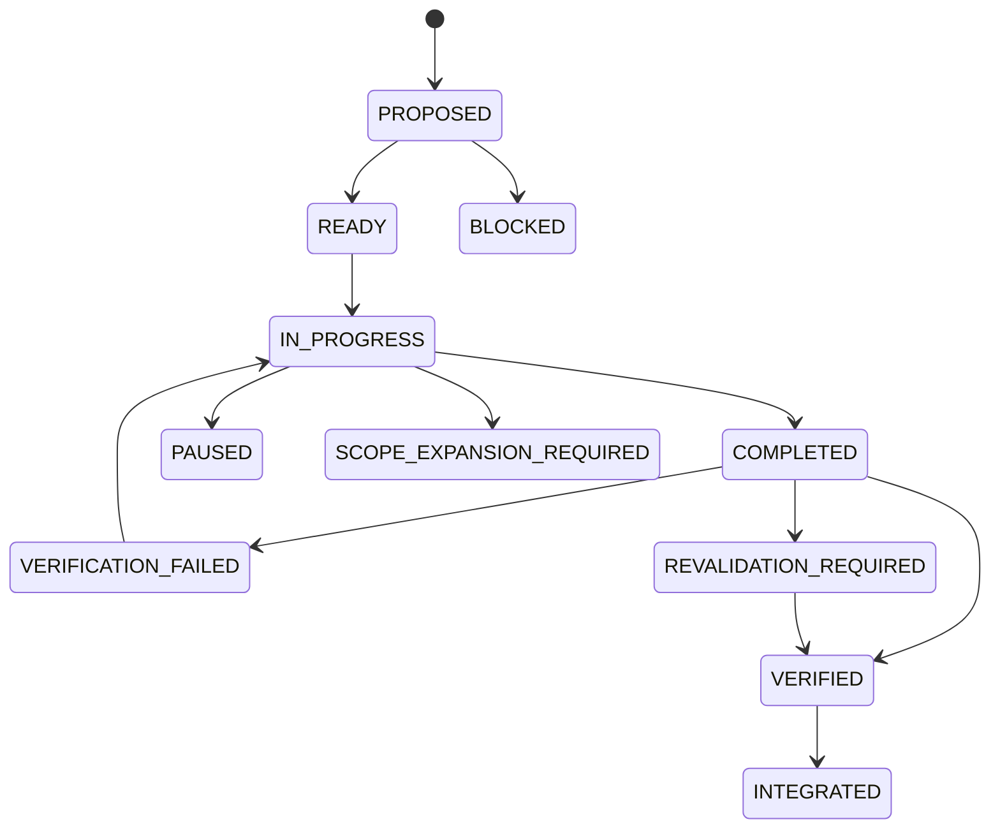

# Course 10 — From Specification to Implementation Plan & Agent Work Units

> Turn approved intent into bounded, reviewable, dependency-aware work without silently giving coding agents product, architecture, policy, or release authority.

Course 09 established whether a specification is ready for bounded implementation. This course begins at that boundary. An approved specification is necessary, but it is not an implementation plan, a task list, an agent prompt, or permission to edit a repository.

The enterprise planning problem is to connect intent to repository reality while keeping uncertainty and decision authority visible.

## Learning objectives

By the end, you can:

- distinguish requirements, plans, tasks, work units, execution context, and completion evidence;
- perform requirement-guided repository discovery against an exact revision;
- bind a plan to specification, repository, architecture, and instruction provenance;
- give every applicable requirement an explicit planning disposition;
- build bidirectional traces from requirement to evidence without brittle line-level links;
- decompose work around cohesive responsibilities and stable contracts;
- model dependencies as a directed acyclic graph and schedule honest execution waves;
- separate accountable ownership, execution assignment, review, and decision authority;
- detect write collisions, semantic coupling, hidden scope expansion, and plan drift;
- route mid-flight contract changes through impact analysis and replanning;
- use typed lifecycle states and independent verification rather than agent self-attestation;
- explain when the full planning model costs more than it protects.

## Prerequisites

Complete Courses 01–09, especially the specification hierarchy, executable requirements, evidence design, NFRs, and specification review. You need Python 3.10 or newer. The lab is credential-free, deterministic, standard-library only, and safe to run offline.

## 1. The key distinction: approved does not mean planned

A specification defines required behavior, invariants, constraints, acceptance conditions, and governed exclusions. A plan proposes a repository-specific path to achieve that intent. A work unit bounds one execution responsibility. Evidence reports what was observed.

| Artifact | Question | Must not claim |
|---|---|---|
| Approved specification | What must be true? | Which files an agent should edit |
| Discovery record | What exists at this repository revision? | That an observation overrides approved intent |
| Implementation plan | How might the approved change be delivered here? | That execution or release is authorized |
| Agent work unit | What bounded increment may be attempted? | Unlimited local decision authority |
| Execution context | Which exact inputs constrain this run? | That context is a credential or approval |
| Completion report | What did the executor change and observe? | That self-reported completion is verification |
| Verification evidence | Did independent checks support a claim? | General correctness outside its population |

The dangerous shortcut is:

```text
ticket -> agent -> code
```

The governed path is:



Planning is a translation discipline, not a ceremonial document phase.

## 2. Discovery is evidence, not browsing

Repository discovery should be guided by the requirements, invariants, NFRs, architecture decisions, and protected boundaries in scope. “Read the repository” is neither bounded nor reproducible.

A useful discovery record contains:

- the exact repository revision;
- requirement and decision IDs that seeded the search;
- exact symbols, concepts, dependency paths, and tests inspected;
- evidence paths for each observation;
- confidence classification;
- an owned resolution for conflicts;
- consequential unknowns that remain unknown.

Use four confidence classes:

| Class | Meaning | Planning consequence |
|---|---|---|
| `CONFIRMED` | Direct repository evidence supports the claim | May shape the plan |
| `LIKELY` | Evidence is strong but incomplete | Plan conservatively and verify |
| `UNKNOWN` | Evidence does not settle the question | Preserve as an unknown or stop condition |
| `CONFLICT` | Repository reality conflicts with approved intent or architecture | Stop until an owner resolves it |

An agent must not convert `UNKNOWN` into a design decision merely to keep moving. Nor should the plan canonize accidental repository structure when an approved ADR says otherwise.

## 3. Bind the plan to its evidence

A durable plan needs provenance:

```yaml
plan_id: PLAN-AI-2219
specification:
  id: AI-2219
  revision: 1.1-training-approved
  digest: sha256:...
repository_revision: repo-abc123
architecture_decisions: [ADR-031, ADR-042, ADR-047]
instruction_snapshot: INSTRUCTIONS-UW-V4
```

A human-friendly revision label is not enough. The content digest detects a changed specification that kept the same label. Repository binding makes discovery falsifiable. Decision IDs prevent an implementation plan from inventing architecture.

### Staleness is impact analysis, not a boolean

Any repository change after planning makes the revision different, but not every change invalidates every work unit. Compare changed paths and semantics with each unit’s writable paths, read-only paths, contracts, dependencies, and evidence plan.

- `current`: bound revision still matches;
- `stale_unrelated`: record the revision difference and continue;
- `stale_relevant`: pause affected units and perform targeted rediscovery.

Do not “refresh” provenance by only changing the revision string.

## 4. Start with an impact hypothesis

Before enumerating tasks, state a falsifiable hypothesis:

> The approved change can be implemented by extending the versioned proposal contract, updating extraction and validation producers, applying existing review ownership, and preserving the authoritative mutation boundary. No new persistence service or automatic mutation authority is required.

Discovery then tries to confirm or disprove that hypothesis. This prevents a ticket noun from becoming a guessed file list.

Record:

- components expected to change;
- contracts expected to remain stable or evolve;
- protected components expected not to change;
- likely evidence and integration points;
- assumptions that would require clarification, an ADR, or scope expansion.

## 5. Give every requirement a disposition

Every in-scope requirement must have one governed disposition:

- `implement`: mapped to one or more work units;
- `already_satisfied`: supported by current evidence for the exact revision;
- `blocked`: cannot proceed, with owner and unblock condition;
- `deferred`: deliberately postponed, with owner and review trigger;
- `not_applicable`: justified against scope and evidence.

Disposition coverage is structural, not proof of plan quality:

```text
disposition coverage = in-scope requirements with a disposition
                       -----------------------------------------
                              all in-scope requirements
```

One hundred percent coverage can still describe a wrong plan. Unsupported “already satisfied” claims are especially dangerous because they turn absence of work into false assurance.

## 6. Maintain meaningful traceability

A useful chain is:

```text
requirement -> disposition -> work unit -> task
            -> component / module / contract / control -> evidence
```

Trace both directions:

- forward: show how every applicable requirement is addressed;
- backward: explain why every task, dependency, code area, and evidence item exists.

Avoid line-number traceability. Lines move during refactoring. Prefer stable semantic units: module, contract, component, policy control, test suite, migration, or observable behavior.

Traceability is not task generation. A requirement may affect several work units, while one cohesive work unit may satisfy several requirements. Creating one task or one agent per requirement duplicates cross-cutting changes and increases integration risk.

## 7. Tasks are not agent work units

A task is a verifiable action. An agent work unit is an execution boundary containing related tasks plus scope, authority, dependencies, evidence, and stop rules.

A production-minded work unit should include:

```yaml
id: AWU-BR-EXTRACTION
accountability_team: broker_integrations
execution_owner: unassigned_until_scheduler
required_reviewers: [broker_integrations, underwriting_platform]
goal: Materialize governed proposals with source provenance
requirement_ids: [REQ-BR-003, REQ-BR-030]
contracts:
  input: [BrokerResponse@1]
  output: [ProposedUpdate@2]
depends_on: [AWU-BR-CONTRACT]
writable_paths: [src/broker/extraction.py, tests/broker/test_extraction.py]
read_only_paths: [src/underwriting/proposals.py]
protected_decisions: [proposal_contract, mutation_eligibility]
verification:
  acceptance_ids: [AC-BR-003-A, AC-BR-030-A]
  required_checks: [unit, provenance]
  evidence_outputs: [EVID-EXTRACTION-2219]
```

The unit is ready only when its prerequisites are backed by inspectable evidence. A field named `ready: true` is boolean theater.

### Cohesion and size

A good unit has one meaningful responsibility, a stable contract, a bounded write set, an independently reviewable result, and evidence that can fail clearly. It is too large when it spans unrelated subsystems, mixes policy decisions with code, cannot be reviewed independently, or needs many owners. It is too small when most effort becomes coordination, contract negotiation, duplicate context loading, or integration repair.

Estimate size to reason about review and scheduling—not to create a fake precision score. Preserve separate dimensions such as expected effort, uncertainty, ownership count, contract volatility, and verification cost.

## 8. Separate accountability from execution

An agent can execute work; it cannot become the accountable organization.

| Role | Responsibility |
|---|---|
| Accountable team | Owns the outcome and consequential decisions |
| Execution owner | Performs the bounded attempt; may be assigned at dispatch |
| Required reviewers | Independently review owned concerns |
| Contract owner | Approves shared contract evolution |
| Planning owner | Maintains plan provenance, dispositions, and dependency integrity |
| Integration owner | Verifies that independently valid increments work together |

Express authority explicitly:

- `may_decide`: local implementation details within scope;
- `may_propose`: contract, dependency, architecture, or scope changes;
- `may_not_decide`: product semantics, policy exceptions, authorization, protected boundaries, and release decisions.

Mixed authority is a stop signal. A unit that contains both local code choices and unapproved product or architecture choices should be split or routed for decision.

## 9. Plan the dependency graph before parallel agents

Model work units as a directed graph. An edge means one unit depends on another unit’s reviewed output—not merely that the planner wrote them in sequence.



This yields five execution waves:

1. contract;
2. extraction and validation in parallel;
3. conflict handling;
4. review integration;
5. end-to-end integration.

Parallel execution is safe only when units have stable input/output contracts, exclusive write ownership, compatible decision authority, and independent evidence. Downstream units consume shared contracts read-only. If two parallel agents can edit the same path, the plan needs ownership or sequencing—not optimistic merge conflict resolution.

### Maximum useful parallelism

The theoretical number of simultaneously ready nodes is not the useful concurrency limit. Useful parallelism is reduced by:

- writable-path overlap;
- semantic coupling through shared invariants;
- contract volatility;
- scarce reviewers or environments;
- integration and verification capacity;
- uncertainty likely to cause replanning.

Track total effort separately from dependency-aware elapsed waves. Parallel work does not make review, integration, or coordination free.

## 10. Build a bounded execution context

At dispatch, assemble only the context required by the work unit:

- specification ID, revision, digest, and scoped requirement text;
- plan ID and digest;
- exact repository revision;
- approved contracts and ADRs;
- writable, read-only, and prohibited paths;
- applicable `AGENTS.md` or equivalent instruction digest;
- planned permission profile—not credentials;
- acceptance checks and evidence outputs;
- decision authority, protected decisions, and stop conditions;
- accountable team and required reviewers.

An execution-context digest makes later reports comparable. It is not a security token and must not contain secrets. Runtime credentials and sandbox policy belong to the execution platform.

## 11. Make stop conditions concrete

Every work unit in the lab must stop when it discovers:

- a required contract change;
- a required protected-path change;
- a requirement conflict;
- a required architecture change;
- a new external dependency;
- a change to authorization behavior.

The agent should return a typed outcome such as `BLOCKED`, `PAUSED`, `SCOPE_EXPANSION_REQUIRED`, `REVALIDATION_REQUIRED`, or `VERIFICATION_FAILED`. “Best effort complete” hides precisely the information the planner needs.

## 12. Replan through a change-impact path

A downstream agent must not edit an upstream contract because it is convenient. It should submit a contract change request containing:

- discovering work-unit ID;
- contract and proposed semantic change;
- requirement basis;
- affected downstream work units;
- impact on tasks, evidence, compatibility, security, and schedule;
- accountable owner and decision state.

When a plan input changes mid-flight:

1. classify the changed artifact and revision;
2. find affected nodes through path and semantic dependencies;
3. pause affected in-progress units;
4. allow demonstrably unaffected units to continue;
5. cancel invalidated work rather than rewriting its history;
6. revise the plan, work units, evidence plan, and context digests;
7. re-establish readiness before dispatch.

The goal is controlled propagation, not universal restart.

## 13. Use a real lifecycle



`COMPLETED` is an executor claim. `VERIFIED` requires independent evidence. `INTEGRATED` requires evidence across the assembled graph. A separate integration work unit is often appropriate because no component agent owns cross-component behavior.

A completion report should include the input context digest, actual changed paths, semantic actions, tests run, evidence IDs, deviations, unresolved items, and typed status. Compare plan versus actual at work-unit and aggregate levels; investigate divergence instead of rewarding conformance to a stale plan.

## 14. Feasibility feedback is not scope authority

Planning can reveal that a requirement is infeasible, disproportionately expensive, inconsistent with the repository, or dependent on an unresolved architecture decision. That is valuable feedback.

The planner or coding agent may propose:

- a requirement clarification;
- an ADR;
- a contract revision;
- a scope change;
- deferral with accountable owner.

It may not silently weaken a SHALL, discard an invariant, reinterpret a security boundary, or declare an exception.

## 15. Common planning anti-patterns

### Ticket-shaped planning

“Implement the ticket” skips repository evidence, requirement disposition, and authority boundaries.

### File-list planning

A guessed list of files has no behavior, contract, or evidence basis.

### One requirement, one task, one agent

This duplicates cross-cutting changes and maximizes semantic conflict.

### Unlimited parallelism

Concurrency without stable contracts and exclusive write ownership creates integration debt faster.

### Readiness booleans

`ready: true` without linked, current evidence obscures missing prerequisites.

### Agent as owner

Naming an execution agent as accountable owner removes the organizational decision path.

### Hidden architecture in tasks

“Add Redis” or “create a service” is an architecture proposal unless already decided.

### Happy-path completion

Treating generated code or a green unit test as completion ignores evidence population, independent verification, integration, security, and release gates.

### Fake risk arithmetic

A composite score can cancel a severe authority violation with several low-risk dimensions. Keep typed findings and explicit owners.

### Path-only scope checks

An agent can violate semantics inside an allowed file. Validate both changed paths and protected decisions.

## 16. How current SDD tools relate

The portable concepts in this course are more durable than any one command surface.

- GitHub Spec Kit uses a current workflow of specification, planning, task generation, implementation, and convergence, with optional clarification, checklist, and analysis steps. Its plan and tasks commands provide a strong process harness, but organizations still need explicit ownership, permissions, evidence, and policy gates.
- OpenSpec supports customizable artifact schemas and dependency graphs. An enterprise can add discovery, architecture, work-unit, and evidence artifacts; declaring a dependency is still not the same as enforcing semantic correctness.
- Kiro specifications organize requirements, design, and tasks. The same authority, provenance, and verification boundaries still apply.
- `AGENTS.md` and Codex/Claude-style instructions constrain execution behavior. They are inputs to a work unit, not replacements for product requirements, ADRs, or approval records.

The operational test is not “which framework generated the most artifacts?” It is whether the organization can explain what governs each decision, which evidence establishes readiness, what an agent may change, when it must stop, and who remains accountable.

## 17. Lab: Northstar Underwriter

The [scenario](northstar-implementation-plan/README.md) contains an unsafe candidate and a governed reference for approved specification `AI-2219`.

Run the deterministic demonstration:

```bash
python3 curriculum/beginner/10-specification-to-implementation-plan/lab.py
```

The reference should produce:

- `PLAN_READY` with zero findings;
- six of six requirements with a disposition;
- six of six complete requirement-to-evidence chains;
- an acyclic five-wave plan with extraction and validation in parallel;
- 23/23 exact labelled-fixture evaluation cases.

The unsafe candidate should stop. It schedules a blocked capability, invents architecture, uses stale provenance, has missing dispositions, grants wildcard/protected writes, lacks evidence-backed readiness, creates collisions and a cycle, and contains an orphan external-dependency task.

These numbers are regression checks for a transparent fixture. They are not estimates of real-world planner accuracy.

## 18. Notebook experiments

Open `implementation_planning.ipynb` and run all cells. You will:

1. review the unsafe candidate;
2. inspect the reference dispositions and dependency waves;
3. generate a bounded execution-context snapshot;
4. simulate relevant and unrelated repository drift;
5. test a contract-change impact request;
6. distinguish path scope from semantic scope;
7. exercise verified and integrated lifecycle gates;
8. evaluate 23 disclosed labelled cases.

## 19. Workshop exercises

Use `northstar-implementation-plan/workshop/starter/`.

### Exercise A — Discovery before decomposition

Create evidence-backed observations for each in-scope requirement. Keep at least one consequential unknown explicit. Explain why it is not safe to infer.

### Exercise B — Disposition audit

Give every applicable requirement a disposition. For `already_satisfied`, name current evidence and a revalidation trigger.

### Exercise C — Contract-first work units

Create a DAG with exclusive writable paths, read-only downstream contracts, accountable teams, verification outputs, and all six stop conditions.

### Exercise D — Mid-flight change

Assume extraction needs a new `confidence_reason` field in `ProposedUpdate`. Produce a change request, calculate affected downstream units, and state which active work can continue.

### Exercise E — Completion and verification

Write an executor completion report with one deviation. Then write the independent verification decision. Do not use the word “done” as a state.

### Exercise F — Lightweight alternative

For a one-line documentation correction, write the smallest safe process. Explain which full-course artifacts you intentionally omit and why.

## 20. When not to use the full model

Use a lighter process for low-risk, local, reversible changes when scope is obvious, ownership is singular, no protected behavior or shared contract changes, tests are strong, and rollback is cheap. Examples include a typo, a non-semantic comment, or a narrowly scoped test-data correction.

Do not skip the stronger model merely because the diff looks small. A one-line authorization, schema, retention, dependency, or prompt change can have enterprise-wide semantics.

A lightweight path still needs:

- the governing intent;
- bounded scope;
- an accountable reviewer;
- proportionate verification;
- a clear escalation trigger.

## Review questions

1. Why is an approved specification not an implementation plan?
2. What evidence makes repository discovery reproducible?
3. Why should `UNKNOWN` remain distinct from `LIKELY`?
4. What does a specification content digest protect against?
5. When can a stale plan continue without full regeneration?
6. Why is 100% disposition coverage not evidence of plan correctness?
7. What makes a task an orphan?
8. Why should traceability target semantic components instead of source lines?
9. What is the difference between accountable ownership and execution assignment?
10. What must be true before two work units run in parallel?
11. Why is `ready: true` insufficient?
12. How can an implementation violate semantic scope without leaving its allowed paths?
13. Which discoveries require an agent to stop?
14. Why does a contract change require downstream impact analysis?
15. What separates `COMPLETED`, `VERIFIED`, and `INTEGRATED`?
16. When is a dedicated integration work unit useful?
17. Why should feasibility feedback not silently rewrite a requirement?
18. When is the full process disproportionate?

## Authoritative references

- [GitHub Spec Kit documentation](https://github.github.com/spec-kit/)
- [Spec-driven development concepts](https://github.com/github/spec-kit/blob/main/docs/concepts/sdd.md)
- [Spec Kit plan command](https://github.github.com/spec-kit/reference/commands/plan.html)
- [Spec Kit tasks command](https://github.github.com/spec-kit/reference/commands/tasks.html)
- [Spec of specs](https://github.com/github/spec-kit/blob/main/docs/concepts/spec-of-specs.md)
- [Specification persistence](https://github.com/github/spec-kit/blob/main/docs/concepts/spec-persistence.md)
- [OpenSpec customization](https://github.com/Fission-AI/OpenSpec/blob/main/docs/customization.md)
- [Kiro specifications documentation](https://kiro.dev/docs/specs/)
- [GitHub CODEOWNERS documentation](https://docs.github.com/en/repositories/managing-your-repositorys-settings-and-features/customizing-your-repository/about-code-owners)

## Course boundary

This course demonstrates deterministic planning rules over fictional fixtures. It does not authenticate approvals, inspect a live repository, provision permissions, execute coding agents, prove implementation correctness, approve a merge, or authorize a release.

Next: Course 11 will apply the hierarchy through GitHub Spec Kit as an extensible process harness.
