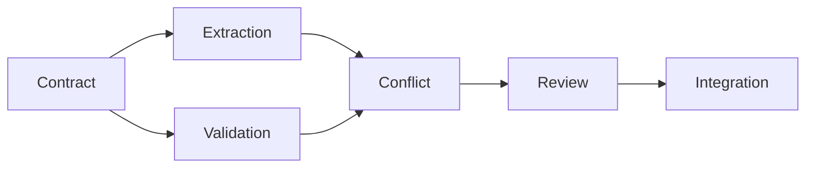
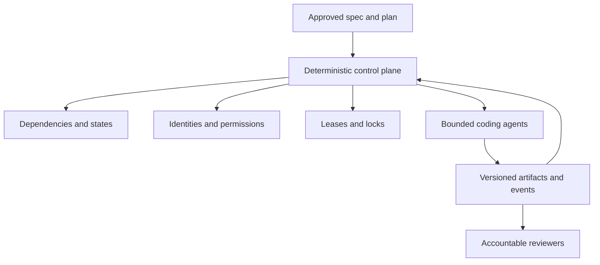

# Course 11 — Multi-Agent Coding Workflows & Coordination

Design safe, efficient software delivery across coding agents without confusing more activity with more progress.

Course 10 produced bounded work units. Course 11 turns that execution graph into a durable coordination system: scheduling, identities, leases, locks, branches, artifact-based handoffs, context pinning, integration, independent verification, review queues, recovery, and flow metrics.

## Learning objectives

After this course, you can:

- decide when multiple agents provide useful separation or concurrency and when one agent is better;
- distinguish investigation, implementation, and verification parallelism;
- schedule a work-unit DAG with dependency, WIP, integration, and reviewer-capacity constraints;
- bind each run to a work unit, authenticated identity, temporary permissions, branch/worktree, lease, lock, and context manifest;
- communicate consequential discoveries and changes through durable artifacts rather than informal agent agreement;
- preserve independent verification without hiding relevant implementation facts;
- integrate exact component revisions, route failures to owners, and invalidate stale evidence;
- recover interrupted work without trusting partial branches or persisting hidden reasoning;
- bound delegation, retries, replans, handoffs, parallelism, and contract churn;
- measure useful flow, review load, coordination tax, and integration health; and
- define the production control plane without granting an orchestrator universal decision authority.

## Prerequisites

Complete [Course 07](../../beginner/07-acceptance-criteria-invariants-evidence/README.md), [Course 09](../../beginner/09-specification-quality-review-antipatterns/README.md), and [Course 10](../../beginner/10-specification-to-implementation-plan/README.md). You should understand requirements, invariants, evidence provenance, work units, dependency graphs, contract ownership, and the difference between completion, verification, integration, merge, release, and enablement.

## Scenario, success criteria, and non-goals

Northstar Mutual has six AI-2219 work units: contract, extraction, validation, conflict classification, review integration, and end-to-end integration. Extraction and validation can run concurrently only after `ProposedUpdate@2` is verified.

Success means the fixture can:

- keep unsafe work from dispatch;
- expose extraction and validation together only when their predecessor is verified;
- prevent concurrent overlapping writes and authority amplification;
- detect stale shared context and untrusted coordination events;
- generate precise handoff, integration, recovery, and review artifacts;
- compare multi-agent flow with a single-agent baseline honestly; and
- remain credential-free and deterministic.

This course does not launch real agents, provision credentials, claim exactly-once distributed execution, approve architecture or policy, merge changes, or recommend universal WIP values.

## 1. The central mistake: multi-agent is not all-agent parallelism

Starting six agents for six work units is unsafe when five units depend on earlier verified outputs.



A multi-agent workflow may execute only two agents concurrently. The objective is not utilization. It is useful flow: maximize concurrency that does not create disproportionate context synchronization, review, rework, or integration cost.

Use this reasoning frame, not a fake score:

```text
net benefit = useful parallel work
              - coordination cost
              - integration and rework
              - review load
              - context synchronization
```

One strong agent is often better for a tiny change, an unresolved architecture, one highly coupled algorithm, or work concentrated in one shared file.

## 2. Separate three kinds of parallelism

| Form | Example | Typical risk |
|---|---|---|
| Investigation | Read-only agents inspect auth, persistence, and tests | Low if findings retain provenance |
| Implementation | Extraction and validation change separate components | Contract, branch, context, and integration risk |
| Verification | An implementer works while an independent agent designs adversarial tests | Correlated assumptions if contexts are contaminated |

Multiple writers are not the only way to gain value. Read-only discovery and independent verification often create safer parallelism.

## 3. Roles exist to separate responsibility and authority

A practical workflow may use planner, implementer, verifier, reviewer, integrator, and orchestrator responsibilities. Do not create roles because a swarm diagram looks advanced.

- The planner decomposes approved intent but cannot approve architecture or release.
- The implementer changes only its bounded write surface and produces a completion report.
- The verifier receives requirements, invariants, implementation revision, interfaces, and evidence obligations—not a persuasive implementation narrative.
- The reviewer inspects scope, architecture, security, maintainability, evidence, and the diff.
- The integrator assembles exact revisions, tests cross-component invariants, diagnoses incompatibilities, and routes repair.
- The orchestrator schedules approved work and enforces workflow rules, but does not become policy, product, architecture, merge, or release authority.

Three agents agreeing remains three proposals. Consensus does not manufacture authority.

## 4. Prefer a deterministic control plane with bounded AI judgment

Dependency completion, permission scope, lock ownership, approved contract revisions, event identity, and state transitions are deterministic facts. Do not ask an LLM whether a DAG predecessor is verified.

AI can help classify an unexpected discovery, summarize an integration failure, suggest likely impact, or propose decomposition. Those outputs remain untrusted proposals until deterministic and authorized controls accept them.



Agent chat is an interaction surface. It is not the control plane or source of operational truth.

## 5. Choose a coordination topology deliberately

| Pattern | Strength | Limitation | Best fit |
|---|---|---|---|
| Central orchestrator | Clear state, scheduling, and audit boundary | Bottleneck and single control-plane dependency | Governed enterprise delivery |
| Pipeline | Simple handoffs and role separation | Limited component concurrency | Sequential change flow |
| DAG orchestration | Expresses contract and verification dependencies | Requires durable state and impact logic | Multi-component software change |
| Peer swarm | Flexible local collaboration | Unclear ownership, authority drift, weak auditability | Bounded research, rarely unrestricted code changes |

The Course 11 reference uses a DAG with a deterministic central control plane. A production platform might implement that model with a workflow engine, database, queue, GitHub state, or structured repository artifacts. Event sourcing is an option, not a requirement.

## 6. Agents communicate through artifacts

Informal messages are fine for non-normative updates such as “contract tests are available at revision X.” Any communication that changes scope, contract, requirement, architecture, authority, or evidence must become a governed artifact.

Useful artifacts include:

- completion and verification reports;
- handoff packages;
- discovery updates;
- contract-change and scope-expansion requests;
- context manifests;
- integration findings and manifests;
- recovery records; and
- review packages.

Artifacts make communication versioned, reviewable, auditable, and replayable. Prefer authoritative references such as `AI-030@rev4` over repeatedly summarized prose. Derived rules must retain their sources.

## 7. Share precise project state, not entire agent contexts

Shared state contains approved requirements, ADRs, contract revisions, work-unit states, repository bases, completion reports, evidence, discoveries, and blockers. Local scratch work, temporary hypotheses, and hidden reasoning stay local.

Handoff is semantic compression. It should carry the exact output contract, revision, evidence, relevant facts, limitations, unresolved items, and downstream authority boundary. Machine-readable contracts reduce loss compared with summaries.

Full context digests may legitimately differ by work unit. Compare shared sources that should align—governing requirements, ADRs, and contract revisions—rather than demanding identical entire contexts.

## 8. Pin execution waves like snapshots

Parallel units should normally see one pinned repository base and shared-source set for the wave. Continuous mid-wave context updates create moving-target execution.

Before each new wave:

```text
merge or assemble verified predecessor state
→ refresh repository discovery
→ issue new context manifests
→ check downstream and reviewer capacity
→ dispatch bounded assignments
```

A shared-contract change breaks snapshot isolation. Affected active units pause; completed units and their evidence may require revalidation.

## 9. Bind identity, assignment, permission, lease, and lock

A role is not an identity. `implementation_agent` cannot authenticate an event or explain which execution changed a file.

Conceptually:

```text
organization → control plane → work unit → assignment → workload identity → temporary capability
```

Permissions should bind a short-lived identity to one repository, branch/worktree, work unit, and exact write paths. Agents cannot self-provision or share a permanent token.

Logical locks protect semantic ownership. Their minimal scope may be a contract, component, directory, or file set. Locks require owner, assignment, lease, state, heartbeat/expiry, and recovery behavior. Agents cannot steal them because another execution seems slow.

At most one active lease may own an exclusive assignment. Duplicate delivery of the same stable assignment ID must be idempotent.

## 10. Make branch topology reflect the DAG

A good default is one branch/worktree per work unit. Git worktrees allow multiple branches to be checked out simultaneously while retaining distinct `HEAD` and index state.

- If B depends on A, the branch strategy must not pretend B is independent.
- Starting dependent branches after A merges is simplest.
- Stacking B on A may reduce waiting but adds rebase and stack-management cost.
- Multiple autonomous agents committing to one shared branch weaken attribution and create moving context.

A PR is an execution artifact. Generate its summary from durable work-unit and completion artifacts: work-unit ID, requirements, spec digest, base revision, contracts, changed paths, evidence, deviations, and unresolved risks. Reviewers must still inspect the diff.

## 11. Use artifact-based handoffs

“Done, you can start” is not a safe handoff. The reference handoff names:

- producing and consuming work units;
- exact repository and contract revisions;
- schema location and digest;
- evidence;
- published discoveries;
- unresolved ownership; and
- the rule that consumers cannot silently modify the contract.

If an agent discovers an undocumented mutation path or unsupported assumption, it publishes a discovery with evidence and affected work units. Systemic discoveries can pause other agents.

## 12. Integration is a revision-bound graph operation

Git can merge different files while semantics conflict. Enums, state transitions, error codes, authorization assumptions, retries, transactions, event ordering, and telemetry names can disagree without a textual conflict.

Integration evidence must bind the exact component set. If `A1 + B1 + C1` passed and A becomes A2, the previous result is stale.

Integration tests should emphasize boundaries and cross-component invariants:

- extraction provenance survives validation and conflict review;
- a validation result has one contract meaning across producers and consumers;
- review receipts preserve scope and current context; and
- no model-facing component gains authoritative mutation capability.

An integration agent may assemble revisions, configure fixtures, run suites, diagnose, and report. It may propose corrections. It generally may not rewrite verified component behavior, change shared contracts, weaken criteria, change authorization, or approve architecture.

## 13. Route integration failure instead of “fixing everything”

Classify each failure:

```text
contract mismatch → contract owner
component defect → owning work unit
specification ambiguity → requirement owner
architecture gap → architecture owner
```

A repaired component gets a new revision. Its old evidence becomes stale, its state returns to `REVALIDATION_REQUIRED`, and integration evidence is regenerated. This preserves the meaning of “verified.”

## 14. Preserve verification independence

Independence has several dimensions: model, context, evidence source, implementation access, role objective, and human/domain review. A different provider is not automatically more independent; the same model with a fresh requirement-centered context can still add value.

Give the verifier changed paths, declared evidence, interfaces, and exact revision, but avoid feeding it the implementer's long persuasive reasoning. A verifier spawned and controlled by the implementer can be useful local checking, but should not be labeled independent verification.

Normal review asks whether the change conforms and remains maintainable. Adversarial verification asks how to violate the contract. Use deeper orchestration only when risk justifies its coordination cost.

## 15. Categorize review findings and reviewer authority

Useful categories include requirement violation, scope violation, architecture drift, security-boundary change, contract mismatch, missing evidence, unnecessary complexity, and maintainability concern.

Severity depends on context. An unused helper is not equivalent to a new model-facing call to authoritative state mutation. Reviewers also cannot invent requirements: “Redis would be cleaner” is a suggestion unless an approved requirement or ADR makes it necessary.

When reviewers disagree, consult requirement authority, ADRs, delegation, and owned evidence. Model voting is not a decision process.

## 16. Recover interrupted work safely

Leases make crashed assignments recoverable, but partial work remains untrusted input. A replacement execution must:

```text
inspect branch
→ compare with work-unit scope
→ validate specification, contract, and repository revisions
→ run current checks
→ continue, repair, discard, or replan
```

Recovery artifacts preserve last commit, completed/remaining work, discoveries, blockers, evidence state, and context revisions. They do not need hidden chain-of-thought. If a contract changed during interruption, recovery becomes replanning.

The orchestrator itself also needs durable state. Losing running assignments, locks, pinned contracts, blockers, or evidence when a process restarts is not acceptable production behavior.

## 17. Bound delegation

Child authority must be a subset of parent delegated authority. An implementation agent may spawn a read-only researcher to inspect parser conventions, but cannot create another unrestricted writer or delegate paths it does not possess.

Define allowed child roles, child count, depth, inherited/attenuated permissions, budgets, and parent accountability. A self-spawned verifier is not independent merely because its role string says `verifier`.

## 18. Design coordination events as untrusted inputs

Useful event types include work-unit ready/started/completed/verified, contract-change requested/approved, discovery published, context invalidated, integration failed, paused, and cancelled.

Every event needs stable ID, subject, authenticated producer identity, repository/spec revision, timestamp, and related artifact. Duplicate delivery should be idempotent.

An event named `CONTRACT_CHANGE_APPROVED` is not authority. The control plane must validate the associated owner approval. A message label never grants permission.

## 19. Use a precise lifecycle, not `DONE`

```text
PROPOSED → READY → ASSIGNED → IN_PROGRESS → COMPLETED
                                         ↓
                                      VERIFYING
                                      /       \
                              VERIFIED       VERIFICATION_FAILED
                                  ↓
                              INTEGRATING
                              /          \
                      INTEGRATED        INTEGRATION_FAILED
```

Side states include paused, blocked, context invalidated, revalidation required, scope expansion required, and cancelled.

- `COMPLETED`: executor finished its bounded attempt.
- `VERIFIED`: independent current evidence passed.
- `INTEGRATED`: the exact component set satisfies cross-component checks.
- `MERGED`, `DEPLOYED`, and `ENABLED`: later delivery states with different authority.

Generic `FAILED` is equally weak. Classify execution, verification, integration, context, permission, dependency, and review failures because their recovery differs.

## 20. Retry by failure class, not optimism

A transient infrastructure failure may receive a bounded retry. A requirement conflict needs owner resolution. Missing architecture needs a decision. Stale context requires refresh/replanning. Policy or authorization denial is terminal for the attempt.

Preserve attempt ID, failure class, evidence, and the change made before retry. Repeated failure against the same requirement suggests a systemic problem. Alternating A→B→A repairs indicate oscillation and should stop. Repeated contract churn or scope expansion may mean the parent plan must be redesigned.

## 21. Optimize flow, not agent utilization

Ten busy agents with 27 PRs waiting, eight integration failures, and four stale units describe high work in progress—not high performance.

Code generation can grow faster than human review and integration capacity. WIP limits reduce branch age, drift, review latency, contract divergence, and rework. Values must come from organizational data.

Use pull scheduling:

```text
ready work
→ dependencies verified?
→ implementation capacity?
→ required review capacity?
→ integration capacity?
→ dispatch
```

Critical-path work matters, but so do risk, specialist availability, permissions, and downstream capacity. Avoid a made-up priority score. Record explicit rationale.

Humans belong in the topology. Model engineering, domain, security, architecture, and governance review as typed queues. Use review by exception: stable local work gets normal engineering review; authorization, contracts, external side effects, or policy changes route to specialists.

## 22. Encode orchestration invariants

The fixture implements ten invariants covering dependency preconditions, concurrent write exclusion, work-unit-scoped permissions, contract-context invalidation, evidence invalidation, authority attenuation, exclusive leases, verified-state evidence, revision-bound integration, and pinned handoffs.

Coordination policy-as-code can also route review:

```text
auth/** changed → SECURITY_REVIEW
shared contract changed → pause consumers + ARCHITECTURE_REVIEW
policy exception requested → prohibit dispatch + GOVERNANCE_REVIEW
```

Prompts can explain these rules. They should not be their only enforcement.

## 23. Diagnose local versus systemic findings

A parser typo is local. A wrong shared contract is systemic. Systemic changes propagate through the dependency graph and can invalidate active agents, completed units, evidence, branches, and integration runs.

Before approving a contract, architecture, or shared-dependency change, generate a blast-radius report. Impact analysis informs the accountable owner; it is not approval.

Contract freeze windows such as “v2 stable for wave two” reduce churn but do not justify preserving a bad contract. Correctness outranks parallelism.

## 24. Evaluate the delivery system honestly

Measure flow and outcomes, not active-agent count:

- work-unit cycle and blocked time;
- branch age and context invalidation;
- replan, handoff, scope-expansion, and contract-change frequency;
- first-pass integration success, semantic conflicts, and post-integration regression;
- review waiting time, minutes, re-review cycles, and specialist demand;
- duplicate-work findings and repair oscillation;
- total work, lead time, rework, and cost per successful compliant change; and
- attempted versus actual forbidden outcomes.

Metrics require interpretation. More scope-expansion requests may show bad planning—or agents correctly stopping. Compare before/after multi-agent delivery with a simpler baseline.

The lab's synthetic comparison deliberately shows unsafe parallelism with the lowest lead-time number but the highest total work, review load, rework, integration failures, and forbidden attempts. It is a mechanics exercise, not a productivity benchmark.

## 25. Technology landscape

| Mechanism | Strength | Limitation | Selection question |
|---|---|---|---|
| Git branches/worktrees | Familiar isolation, attribution, diff/review integration | Does not enforce semantic contracts or agent authority | Does work partition align with branches? |
| GitHub PRs, CODEOWNERS, rulesets | Review routing and merge gates near code | Repository controls do not model full workflow state | Which risks require owner/specialist review? |
| CI systems | Deterministic checks and independent evidence | Stateless jobs need external durable coordination | Which invariants can fail closed in CI? |
| Durable workflow engines | Persistent state, retries, timers, recovery | Operational complexity and careful determinism/idempotency requirements | Does workflow duration/recovery justify it? |
| Queue/database control plane | Explicit assignments, leases, events, and WIP | Requires custom transition and audit semantics | Can the team operate the control plane safely? |
| LLM supervisor | Flexible classification and summarization | Probabilistic, prompt-sensitive, not authority | Which ambiguous judgment genuinely needs AI? |
| Workload identity systems | Short-lived attributable identities | Platform/IAM integration cost | Can capability bind to exact run and work unit? |
| OpenTelemetry | Cross-process trace correlation | Telemetry context is not authorization | Which IDs and transitions need observable causality? |

Framework choice does not remove the need for contracts, authority, identity, evidence, or governance.

## 26. State of practice and open problems

Established practice includes version control isolation, CI gates, code ownership, least privilege, durable workflow state, idempotent message handling, and trace correlation. Applying them to coding-agent fleets is a direct extension of software delivery and distributed-systems engineering.

Emerging practice includes work-unit-scoped agent identities, machine-readable handoff/review packages, semantic conflict detection, contract-first parallel agent execution, and delivery telemetry tied to requirement provenance.

Research and open engineering problems include correlated agent failures, trustworthy semantic merge analysis, scheduling under model/reviewer uncertainty, measuring coordination tax, cross-agent context compression without losing rare constraints, and evaluating whether added agents improve accepted outcomes rather than output volume.

## 27. Guided lab

Run:

```bash
python3 curriculum/intermediate/01-multi-agent-coding-workflows-coordination/lab.py
```

Then use [the notebook](multi_agent_coordination.ipynb) and [Northstar workshop](northstar-multi-agent-delivery/README.md).

The governed fixture produces no findings and `COORDINATION_READY`. The unsafe candidate stops with typed findings. The 31 labelled mutations must match exactly, with explicit false-positive and false-negative counts. None of those results prove production safety or general orchestrator quality.

## 28. Experiments

1. Compare one agent, unsafe parallel agents, and governed multi-agent delivery across lead time, total work, review load, rework, integration failures, and forbidden attempts.
2. Saturate `SECURITY_REVIEW` and observe pull scheduling hold conflict work even when agent slots exist.
3. Deliver one assignment twice and confirm only one execution registers.
4. Expire a lease and require inspection before reassignment.
5. Change extraction from revision `92bc31` and invalidate integration evidence.
6. Propose `ProposedUpdate v3` and calculate active consumers, completed consumers, and stale evidence.
7. Feed A→B→A repair history and stop for systemic analysis.

## 29. Failure modes and anti-patterns

- start every agent immediately;
- use one shared branch and credential;
- let peers make hidden semantic agreements;
- copy summaries until authoritative intent is distorted;
- continuously stream partial commits into same-wave contexts;
- treat an event label or role name as authority;
- let children amplify permissions;
- ask an integration agent to rewrite everything until green;
- call implementer-spawned checking independent verification;
- count green local tests as integrated, merged, deployed, or enabled;
- retry non-retryable conflicts;
- maximize agent utilization while review queues grow; and
- trust dashboards that show only active agents.

## 30. Production upgrade path

| Training fixture | Production requirement |
|---|---|
| JSON identity registry | Authenticated short-lived workload identity and attestation |
| Planned permissions | Externally provisioned least privilege with expiry/revocation |
| In-memory checks | Transactional state transitions and optimistic concurrency |
| Synthetic leases/locks | Atomic acquisition, heartbeat, expiry, fencing, and recovery |
| Static event log | Durable idempotent event ingestion with producer authentication |
| Fixture context digests | Trusted source resolution, signing, freshness, and invalidation |
| Synthetic evidence IDs | Verifiable evidence provenance bound to exact revisions |
| Fixed capacities | Measured team/CI/reviewer capacity and adaptive WIP policy |
| Simplified Git model | Real branch protection, CODEOWNERS, merge queues, and stack handling |
| Local telemetry | Privacy-safe distributed tracing, cost, latency, queues, failures, and terminal states |
| Rule evaluation | Representative adversarial validation and incident/recovery exercises |

Threat-model prompt injection, malicious repository content, compromised agents, secret exfiltration, dependency poisoning, identity theft, lock fencing, stale approvals, cross-tenant state, and control-plane outage before production use.

## 31. When not to use multiple coding agents

Prefer one agent or a human-led change when work is tiny, tightly coupled, ambiguous, concentrated in one file, dominated by one consequential decision, or cheaper to execute sequentially than coordinate. Multiple agents are a design choice, not a maturity badge.

## Exercises

1. Design the smallest safe role set for a two-file bug fix.
2. Convert an unstructured agent message about a contract change into a governed artifact.
3. Compare branch-after-merge and stacked-branch strategies for the AI-2219 wave.
4. Create a handoff that preserves optional-field semantics without copying the entire upstream context.
5. Diagnose a textual clean merge with incompatible enum meanings.
6. Route an integration failure without letting the integrator alter owned components.
7. Design an independent verifier context for `INV-BR-002`.
8. Recover a partial branch after the shared contract changed.
9. Define an attenuated read-only delegation contract.
10. Choose WIP signals for a team whose review queue is the bottleneck.
11. Write state preconditions for `ASSIGNED → IN_PROGRESS` and `VERIFYING → VERIFIED`.
12. Detect repeated contract churn and decide when to replan the parent change.
13. Compare two valid decompositions by review surface and integration risk.
14. Explain why a faster unsafe fixture is not the better delivery system.

## Review questions

1. Why can a multi-agent workflow be mostly sequential?
2. Which facts belong in shared context versus local scratch state?
3. Why is a role name insufficient for authorization and attribution?
4. How do leases and logical locks differ?
5. What invalidates component and integration evidence?
6. Why should downstream units normally keep a pinned within-wave base?
7. When does a coordination event require an external authority artifact?
8. What makes verification meaningfully independent?
9. Why can more scope-expansion requests be a positive signal?
10. How does pull scheduling incorporate human review capacity?
11. What distinguishes local from systemic execution findings?
12. Why is “agents active” a poor success metric?

## References

- [Git worktree documentation](https://git-scm.com/docs/git-worktree)
- [GitHub pull requests](https://docs.github.com/en/pull-requests/reference/pull-requests)
- [GitHub CODEOWNERS](https://docs.github.com/en/repositories/managing-your-repositorys-settings-and-features/customizing-your-repository/about-code-owners)
- [GitHub rulesets](https://docs.github.com/en/repositories/configuring-branches-and-merges-in-your-repository/managing-rulesets/about-rulesets)
- [OpenTelemetry Context specification](https://opentelemetry.io/docs/specs/otel/context/)
- [OpenTelemetry CI/CD semantic conventions](https://opentelemetry.io/docs/specs/semconv/cicd/)
- [SPIFFE workload identity concepts](https://spiffe.io/docs/latest/spiffe/concepts/)
- [Temporal durable execution documentation](https://docs.temporal.io/)
- [NIST SP 800-207: Zero Trust Architecture](https://csrc.nist.gov/pubs/sp/800/207/final)

Learning with One+i · responsible AI, real-world impact. [oneplusi.io](https://oneplusi.io)
