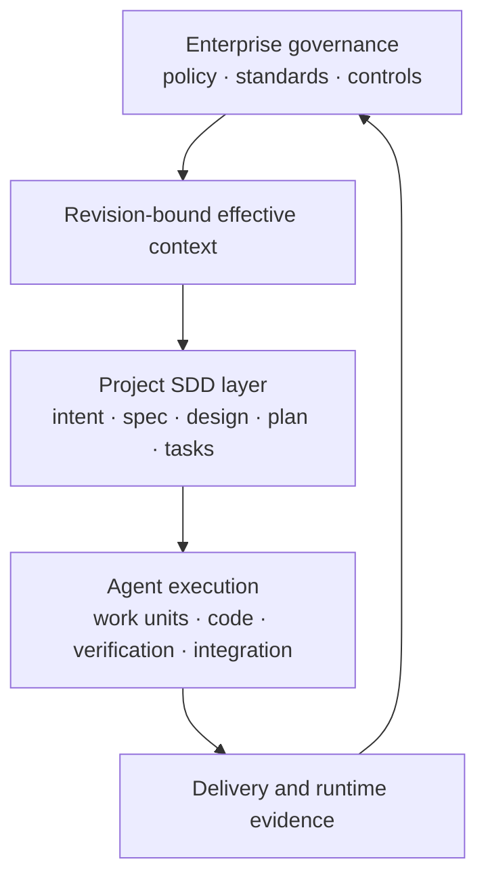

# Course 12 — SDD Framework Landscape & Choosing an Enterprise Operating Model

Understand Spec Kit, OpenSpec, Kiro Specs, BMad, `AGENTS.md`, repo-native workflows, and hybrid enterprise SDD without confusing a framework with the operating model.

Courses 01–11 established requirements, authority, evidence, implementation planning, work units, and multi-agent execution before introducing framework choice. That order matters. You can now ask a better question than “Which tool is best?”

> Which parts of our required operating model does each framework provide, what remains organization-owned, and how can we compose the missing controls without locking normative meaning into one tool?

## Learning objectives

After this course, you can:

- distinguish methodology, framework, agent instructions, and enterprise operating model;
- compare framework semantics by artifact lifecycle, transformations, authority, change model, evidence, portability, and extension cost;
- distinguish current system truth from a proposed change and feature artifacts from delta-oriented specifications;
- map framework artifacts onto a small canonical enterprise model without assuming identical names mean identical semantics;
- keep policy, architecture approval, exceptions, execution permission, and release authority outside framework generation;
- transform framework tasks into bounded agent work units when autonomous execution requires it;
- choose proportional SDD modes by consequence and coordination rather than organizational fashion;
- write an evidence-backed framework selection ADR with assumptions and reconsideration triggers;
- test framework and prompt upgrades with golden scenarios; and
- design a hybrid operating model whose critical knowledge survives framework replacement.

## Prerequisites

Complete [Course 09](../../beginner/09-specification-quality-review-antipatterns/README.md), [Course 10](../../beginner/10-specification-to-implementation-plan/README.md), and [Course 11](../01-multi-agent-coding-workflows-coordination/README.md). You should understand authority domains, provenance, acceptance evidence, plan transformations, work-unit boundaries, multi-agent control planes, and why role labels do not grant authority.

## Scenario, success criteria, and non-goals

Northstar Mutual has more than 100 engineers, many brownfield repositories, regulated data, several clouds, and multiple coding-agent tools. Teams have adopted different SDD styles. Leadership wants one mandate.

The course uses fictional change **AI-2310 — Broker Document Classification**. Every workflow style receives the same revision-bound ticket, policy, domain rules, architecture, and repository discovery. The comparison succeeds when it:

- preserves stable requirement and source identity;
- keeps unresolved authorization explicit;
- separates requirements from proposed architecture;
- exposes capabilities as built into the synthetic style, enterprise extensions, external controls, or not modeled—without collapsing them into one score;
- binds evidence to exact subjects and revisions;
- preserves critical semantics when a framework is removed;
- ends with a reviewable decision—not synthetic approval; and
- passes transparent mutation and upgrade-conformance fixtures.

This course does **not** execute or certify vendor tools, reproduce their generated output, provide procurement advice, rank them globally, or claim that deterministic fixtures predict production quality. The named-framework snapshot below was checked against official sources on **2026-09-28**. Recheck it before adoption because these products evolve quickly.

## 1. Framework is a subset of the operating model

```text
Methodology
  spec before code; evidence before completion

Framework
  commands; templates; workflow; integrations

Enterprise operating model
  authority; ownership; inheritance; exceptions; evidence;
  execution permissions; review; release; improvement
```

The relationship is:

```text
framework capabilities ⊂ enterprise SDD operating model
```

Installing a framework can give a team an excellent structured process. It does not identify Northstar's privacy owner, approve an architecture exception, authenticate an evidence producer, or authorize production release.

## 2. The framework-as-governance failure

The unsafe adoption loop is:

```text
discover tool → copy templates → adopt vocabulary → call that governance
```

Reverse it:

```text
enterprise needs
    ↓
operating-model capabilities
    ↓
mandatory authority and evidence boundaries
    ↓
framework evaluation
    ↓
framework + adapters + external controls
```

The framework implements part of the model. It must not accidentally become the owner of the model.

## 3. Capability architecture



Most SDD frameworks focus primarily on the project layer. An enterprise composes that layer with authoritative sources above it and trusted execution, evidence, and release controls below it.

## 4. Evaluate capabilities, not feature counts

Use questions such as:

| Dimension | Question |
|---|---|
| Intent | How is change intent captured and revised? |
| Requirements | Are normative requirements distinct and stably identified? |
| Design | Are technical proposals separated from behavioral intent? |
| Planning | How are coverage, dependencies, and protected decisions handled? |
| Tasks | Is a task a checklist item, backlog object, or autonomous boundary? |
| Context | How is authoritative, current context assembled? |
| Authority | Can owner, source, status, scope, and decision rights be preserved? |
| Policy | Can inherited obligations be resolved without manual copying? |
| Change | Is current truth distinguishable from a proposed delta? |
| Evidence | Can claims bind to provenance and exact subject revisions? |
| Multi-agent | Can work ownership and contracts be bounded? |
| Portability | Which semantics survive tool removal? |
| Extensibility | Can controls be added through stable interfaces? |
| Upgrade | Can prompt, template, and workflow semantic changes be detected? |

Do not assign one `94/100` score. A high total can hide one mandatory unsupported control. Produce a capability profile:

```text
BUILT_IN_TO_STYLE    present in this fictional workflow style
ENTERPRISE_EXTENSION supplied through an adapter or supported extension point
EXTERNAL_CONTROL     enforced by an organization-owned control plane
NOT_MODELED          absent from the evaluated composition
```

These labels describe the four synthetic training styles only. They are not claims about a named vendor's current feature set.

## 5. Current framework landscape

This is a dated architectural snapshot, not a winner table.

### GitHub Spec Kit: extensible spec-first process harness

Current official documentation describes a full path of `constitution → specify → clarify → plan → checklist → tasks → analyze → implement → converge`. It presents Spec Kit as an extensible, agent-neutral process harness with integrations, presets, workflows, catalogs, and extensions.

Documented strengths include artifact progression, WHAT/HOW separation, quality checks, cross-artifact analysis, convergence, repository-local artifacts, and broad coding-agent support. Enterprise work still needs to decide how organization policy becomes effective project context, which generated decisions need owner review, how evidence is authenticated, and how runtime permission and release gates operate.

The constitution is a project principle artifact. It is not automatically a full company → platform → domain → project authority resolver. A stronger enterprise composition is:

```text
authoritative policy sources
    ↓ effective-context resolver
managed project constitution/context
    ↓ Spec Kit workflow
enterprise evidence and execution adapters
```

Official sources: [Spec Kit overview](https://github.github.com/spec-kit/), [agentic SDD workflow](https://github.github.com/spec-kit/reference/agentic-sdd.html), [evolving specifications](https://github.github.com/spec-kit/guides/evolving-specs.html), and [extensions](https://github.github.com/spec-kit/reference/extensions.html).

### OpenSpec: current truth plus explicit change delta

OpenSpec's official model separates `openspec/specs/`—current system behavior—from `openspec/changes/`—proposed updates. A change can contain proposal, delta specs, design, and tasks. Archiving applies added, modified, and removed requirements to current truth and retains change history.

That makes change semantics highly visible for brownfield systems. It does not by itself decide whose policy is authoritative, authenticate approval, provide enterprise evidence provenance, or provision agent permissions. Those concerns remain external or require extensions.

Official sources: [OpenSpec overview](https://github.com/Fission-AI/OpenSpec/blob/main/docs/overview.md) and [getting started](https://github.com/Fission-AI/OpenSpec/blob/main/docs/getting-started.md).

### Kiro Specs: integrated requirements, design, tasks, and execution

Kiro's current Specs documentation describes Feature Specs, Bugfix Specs, and Quick Spec. Core artifacts are requirements or bug analysis, design, and tasks. Current task execution can derive dependency waves and run independent tasks concurrently; Quick Spec generates the three artifacts without approval gates between phases.

The integrated experience can reduce workflow friction. Enterprises must still distinguish interface approval from organizational authorization and must decide when quick generation is inappropriate. Parallel task execution is not automatically a Course 11 multi-agent control plane: contracts, write ownership, identities, evidence, and recovery remain material.

Official sources: [Kiro Specs](https://kiro.dev/docs/specs/), [Quick Spec](https://kiro.dev/docs/specs/quick-plan/), and [Bugfix Specs](https://kiro.dev/docs/specs/bugfix-specs/).

### BMad: broader role- and workflow-oriented methodology

BMad's current documentation spans thinking and building skills and supports paths proportional to the work. Its workflow map includes analysis, planning, solutioning, and implementation artifacts. Existing-codebase guidance can establish verified project context before building.

This broader PDLC framing is useful when teams want AI support before specification and during delivery. Named analyst, architect, developer, or reviewer agents remain process roles—not authenticated organizational authority. Every handoff and generated decision still needs a canonical meaning and owner.

Official sources: [BMad documentation](https://docs.bmad-method.org/), [workflow map](https://docs.bmad-method.org/workflow-map-diagram.html), and [existing codebases](https://docs.bmad-method.org/existing-codebases/start-in-an-existing-codebase/).

### `AGENTS.md` and repository-native SDD

The open `AGENTS.md` convention describes a predictable Markdown file for coding-agent guidance. It is valuable for local setup, repository navigation, tests, and contribution rules. It is not by itself a requirements lifecycle, evidence system, change registry, or release authority model.

A repository-native stack might use:

```text
AGENTS.md
specs/current/
changes/
adr/
plans/
work-units/
evidence/
policy checks in CI
```

This maximizes fit and can be highly portable, but the organization owns templates, validators, workflow, integration, documentation, upgrades, and support. “Just Markdown” can become an internal platform.

Official source: [`agentsmd/agents.md`](https://github.com/agentsmd/agents.md).

## 6. Framework families reveal the real choices

Names change quickly; architectural families are more durable.

| Family | Native center | Typical enterprise addition |
|---|---|---|
| Repository-native | Local files and custom automation | Maintained schemas, validators, lifecycle, support |
| Guided spec-first | Spec → plan → tasks → implementation | Policy resolution, authority, evidence, work-unit enrichment |
| Change-oriented | Current truth + proposal/delta + archive | Execution, approval, evidence, orchestration controls |
| IDE-integrated | Low-friction authoring and execution | Portable artifacts and external authorization |
| Role/workflow methodology | Broader analysis-to-build process | Canonical semantics and real owner mapping |
| Enterprise hybrid | One framework plus organization-owned services | Clear ownership, adapter versioning, conformance suite |

The lab compares four simplified families. It deliberately does not pretend to reproduce vendor output.

## 7. Feature artifacts and change deltas solve different problems

Feature progression:

```text
intent → feature spec → design → plan → tasks → implementation
```

Change progression:

```text
current truth → proposed delta → implementation → verified new truth
```

Long-lived brownfield systems usually need both. A sequence of historical feature folders may explain how the system evolved but make “What is true now?” difficult. A current-truth registry without decision history can explain today but not why a consequential choice exists.

Preserve three distinct artifacts:

- current intended system behavior;
- a reviewable proposed change; and
- decision history such as ADRs and approved exceptions.

## 8. The same word can carry different semantics

One framework's `spec` may mean product behavior. Another may combine requirements, design, and tasks. One `task` may be a checkbox; another may be directly executable.

Map semantics rather than names:

| Framework artifact | Possible canonical concept |
|---|---|
| constitution / steering | Project principles and agent guidance |
| specification | Feature requirements or current system behavior |
| acceptance criterion | Measurable behavioral verification contract |
| open question | Explicit unresolved decision with an owner and blocking effect |
| proposal / delta | Intended change to current truth |
| design | Technical proposal or approved architecture reference |
| plan | Execution-normative implementation plan after review |
| task | Derived implementation step, normally non-authoritative |
| evidence | Claim support bound to exact subject and revision |

## 9. Use a minimum canonical artifact model

Northstar's training model includes:

```text
Requirement
Acceptance Criterion
Open Question
Architecture Decision
Implementation Plan
Task
Agent Work Unit
Evidence
Exception
```

Every durable artifact carries the minimum useful metadata: ID, kind, owner, source, scope, relationships, status, and revision. Do not start with a universal 400-field ontology. Extend the model only when a real control or interoperability need appears.

Authority remains typed:

```text
BUSINESS · POLICY · ARCHITECTURE · EXECUTION · EVIDENCE · RELEASE
```

An approved implementation plan can be normative for execution without becoming a business requirement. A task is non-normative with respect to business, policy, and architecture semantics, but it can become binding for execution when it is derived from an approved plan. A framework-generated task cannot select a database against an approved ADR.

## 10. Task is not agent work unit

```text
Task
  Add document classifier.

Agent work unit
  goal · requirement IDs · contracts · repository revision
  dependencies · writable paths · protected decisions
  temporary permissions · stop conditions · evidence
```

An enterprise adapter may group and enrich framework tasks before autonomous dispatch. If the framework runs plain checklist tasks autonomously, treat that as an execution-control gap—not as evidence that the task magically acquired safe authority.

## 11. Every command is an untrusted transformation

```text
Intent
  ↓ specify
Proposed specification
  ↓ plan
Proposed implementation plan
  ↓ tasks
Derived work list
  ↓ implement
Code and completion claims
```

Each transition can omit obligations, collapse uncertainty, or introduce a decision. Validate after the transformation that owns the risk:

| Stage | Required assurance |
|---|---|
| Specify | authority, ambiguity, conflict, open questions, provenance |
| Plan | requirement coverage, orphan work, architecture invention, protected decisions |
| Tasks | scope, justification, dependencies, work-unit enrichment, stop conditions |
| Implement | revision binding, scope conformance, independent evidence, unresolved risk |

Better prompts improve proposals. They do not grant approval.

## 12. Command authority matrix

| Transformation | May generate | Cannot approve |
|---|---|---|
| specify | proposed requirements | business or policy decisions |
| design/plan | implementation and architecture proposals | protected architecture or exceptions |
| tasks | derived work | expanded scope or autonomous permission |
| implement | code, tests, completion report, formal change request | approved requirement, architecture, exception, or acceptance-threshold changes; merge; release |

If a tool defines specialized “architect” or “reviewer” agents, map each to the same `may generate / may propose / may not decide` boundary. Role names are not organizational credentials.

The implementation transformation must treat approved requirements, architecture decisions, exceptions, and acceptance thresholds as protected outputs. When code cannot satisfy one of them, the agent proposes a formal change request; it does not weaken the source artifact or rewrite the test until implementation passes.

## 13. One capability, one authoritative owner

A hybrid model might assign:

```text
Accountable team        Authoritative capability         Implementation
Governance Platform  →  enterprise policy             → policy catalog
Architecture Council →  architecture decisions        → ADR registry
Developer Platform   →  project change workflow       → selected SDD framework
Developer Platform   →  execution identity/permission → workload control plane
Quality Engineering  →  conformance evidence          → CI/evidence services
Release Engineering  →  release decisions             → release control plane
```

The framework implements a workflow capability; it is not the accountable owner of that capability.

Framework copies are derived context. Never manually copy a policy into dozens of project constitutions or steering files and hope they remain current. Resolve applicable controls from source, emit revision-bound context, and retain provenance.

## 14. Good and bad extension boundaries

Good:

```text
authoritative governance
    ↓ effective-context.json
supported framework workflow
    ↓ evidence-manifest.json
enterprise assurance and release controls
```

Bad:

```text
fork framework → rewrite parser → patch every template → maintain forever
```

Extension cost belongs in selection: implementation effort, upgrade burden, ownership, support, training, and failure recovery. A smaller built-in capability set with stable extension points may fit better than a larger but rigid product.

## 15. Portability has four levels

1. **Content:** humans can read the Markdown, YAML, or JSON.
2. **Agent:** several coding agents can consume it.
3. **Workflow:** the process can move between tools.
4. **Governance:** authority, provenance, decisions, evidence, and history survive the move.

Markdown syntax does not guarantee semantic portability. Hidden directives, proprietary state, generated IDs, or tool-only approval history can create deep coupling.

Use the migration question:

> If the framework disappeared tomorrow, which meaning would we lose?

Losing CLI convenience may be acceptable. Losing requirement meaning, decision provenance, exception state, or evidence history is not.

## 16. Selection is scenario-specific

Three teams should not receive the same maximum process:

- a greenfield product team may value guided spec-to-plan flow;
- a regulated brownfield platform may prioritize policy inheritance, current truth, evidence, change history, and multi-team controls;
- a two-person internal automation may need only `AGENTS.md`, a small spec, plan, tests, and normal review.

Maturity means minimal sufficient control, automation, clear authority, and good evidence. It does not mean more documents.

## 17. Risk-tiered operating modes

| Tier | Typical change | Minimum mode |
|---|---|---|
| 1 | Documentation or local reversible refactor | Direct or lightweight repo-native flow |
| 2 | Product behavior or shared contract | Structured spec, plan, acceptance, bounded work unit |
| 3 | Consequential or regulated AI | Effective context, evidence, independent verification, specialist review |
| 4 | Multi-agent, cross-repository, irreversible | Full orchestration, identities, contracts, recovery, runtime controls |

A small diff can be high consequence. A large mechanical migration can be well understood. Route by semantics, uncertainty, reversibility, and coordination—not line count.

## 18. Framework selection decision record

Treat adoption as an architectural/process decision. Record:

- organization and portfolio context;
- mandatory enterprise capabilities;
- each requirement's built-in-style, enterprise-extension, external-control, or not-modeled disposition;
- alternatives and trade-offs;
- the framework's bounded role;
- enterprise-owned extensions;
- assumptions;
- evidence;
- owner and review state; and
- observable reconsideration triggers.

The correct conclusion is not “X is best.” It is:

> Under these constraints, this composition satisfies these requirements, leaves these controls external, and must be reconsidered if these assumptions change.

The fixture selection ADR ends at `ready_for_owner_review`. A JSON field cannot authenticate a platform council's decision.

Northstar chooses a hybrid pattern because no evaluated workflow style should own enterprise policy or release authority, canonical artifacts preserve semantics across tools, adapters retain framework-specific developer experience, external controls retain accountable authority, and explicit change semantics fit brownfield delivery. A real ADR states this rationale directly instead of making reviewers infer it from dispositions.

## 19. Framework upgrades are operating-model changes

Prompts, templates, commands, and artifact mappings are executable process assets. An upgrade may change requirements, plans, task semantics, or agent context across hundreds of repositories.

Pin baseline and candidate versions, version prompt/template digests, then run golden scenarios:

- unresolved authorization must remain unresolved;
- enterprise policy conflict must surface;
- generated architecture remains a proposal;
- plain tasks cannot bypass work-unit controls;
- changed brownfield truth invalidates affected artifacts; and
- semantic prompt drift stops rollout for review;
- a generated plan cannot weaken an approved NFR target; and
- self-reported completion cannot become conformance evidence.

Roll out to representative projects and a bounded cohort before broad adoption.

## 20. Practical lab: one source, four workflow styles

The [Northstar workshop](northstar-framework-selection/README.md) evaluates AI-2310 through:

1. repository-native;
2. guided spec-first;
3. current-truth plus change delta; and
4. role/workflow-oriented.

The source package is identical. The reference adds the same enterprise authority and evidence boundary around each style. Run:

```bash
python3 curriculum/intermediate/02-sdd-framework-landscape-enterprise-operating-model/lab.py
```

Expected reference output:

```text
READY_FOR_OWNER_REVIEW
zero findings
eight of eight golden scenarios
34 of 34 exact labelled mutation cases
```

The unsafe candidate chooses a feature winner, drops policy provenance and uncertainty, mixes architecture into requirements, treats tasks as autonomous work units, lets a command self-approve, copies policy manually, and claims adoption approval.

## 21. Experiments

Use the [guided notebook](framework_landscape.ipynb) to:

- compare a feature-count baseline with capability profiles;
- inspect how enterprise extensions change the meaning of built-in-style gaps;
- route four changes through proportional risk tiers;
- inject policy, authority, evidence, portability, and upgrade failures;
- test transformation-specific assurance; and
- measure the deterministic rule set against 34 labelled mutations.

The fixture measures rule coverage only. It does not measure developer experience, vendor quality, real generated-artifact accuracy, productivity, or total cost of ownership.

## 22. Evaluation design

A real pilot should use representative changes—not demos selected to flatter the tool:

```text
simple local feature
brownfield feature
regulated AI change
architecture decision
policy conflict or exception
multi-agent/cross-repository change
```

Measure at least:

- material requirement loss and invented decisions;
- open-question preservation;
- trace and evidence completeness;
- owner review/rework load;
- lead time and wait time;
- framework/adapter failures;
- upgrade semantic diffs;
- valid work blocked and unsafe work admitted;
- portability and migration effort; and
- cost per successful compliant change.

Do not sum parallel work duration and call it latency. Do not call template presence conformance. Do not treat a clean generated artifact as authenticated approval.

## 23. Common failure modes

| Failure | Consequence | Repair |
|---|---|---|
| Feature-count winner | Mandatory gap hidden by a total | Use capability gates and trade-offs |
| Framework as governance | Generated files appear authoritative | Keep organization-owned systems of record |
| Manual policy copying | Stale, unauditable constraints | Resolve and generate revision-bound context |
| Task = work unit | Autonomous scope and authority are implicit | Enrich or block dispatch |
| Same-name mapping | Semantic mismatch crosses tools | Map meaning and authority, not labels |
| Markdown = portable | Proprietary semantics remain hidden | Run migration survivability tests |
| Deep framework fork | Upgrade and maintenance trap | Prefer adapters and supported extension points |
| Prompt edit without evaluation | Future artifacts drift silently | Version prompts and run golden scenarios |
| Role name = authority | Agent self-approves decisions | Bind real identity, owner, and receipts externally |
| Maximum process everywhere | Process theatre and abandonment | Use risk-tiered modes |

## 24. Production operating model

Productionize beyond the training fixture with:

- an owned canonical artifact registry and versioned adapter contracts;
- authenticated policy/ADR sources and applicability resolution;
- schema and semantic validation at every transformation;
- provenance-bearing evidence and single-use approval receipts where consequential;
- short-lived execution identities and bounded work units;
- framework/template supply-chain review;
- migration, backup, rollback, and disaster-recovery procedures;
- telemetry for throughput, waits, rework, overrides, blocked work, and semantic drift;
- support ownership and service expectations; and
- regular owner review of the selection ADR and risk-tier policy.

## 25. When not to use the full framework stack

Use a direct or lightweight path for low-risk, local, reversible work with clear ownership, strong existing checks, and no policy, contract, architecture, or release impact. Normal code review and CI still apply.

Escalate process depth when uncertainty, consequence, shared contracts, regulatory obligations, irreversible effects, cross-repository coordination, or autonomous execution increase.

## Exercises

1. Define the minimum canonical artifact vocabulary for your organization.
2. Map two tools that both use `spec` and show where their semantics differ.
3. Convert five framework tasks into one bounded agent work unit.
4. Design an effective-context adapter without copying enterprise policy into the repository by hand.
5. Write a command authority matrix for `specify`, `plan`, `tasks`, and `implement`.
6. Test what would be lost if your current framework disappeared tomorrow.
7. Compare a built-in-style feature with a clean extension and a permanent framework fork.
8. Route a README fix, API-contract change, regulated classifier, and cross-repository multi-agent migration through the four risk tiers.
9. Add a golden scenario in which a feature request conflicts with an enterprise rule.
10. Design a pilot that measures review load and semantic omissions, not only time-to-code.
11. Repair the unsafe candidate without changing the source package.
12. Defend why `ready_for_owner_review` is the strongest fixture claim.
13. Compare Framework A, which has excellent workflow features but poor authority and provenance fit, with Framework B, which has basic workflow UX but strong portability and extension hooks. Explain why feature count alone cannot select either one; evaluate mandatory requirements and extension cost.
14. Migrate an unresolved question—`automatic delivery allowed?`—into a system that emits `auto_delivery = false`. Explain why converting `UNKNOWN` into `NO` is `MIGRATION_SEMANTIC_LOSS` even though every output field is populated.

## Review questions

1. Why can no framework install enterprise authority?
2. When is change-delta modeling more useful than a feature folder?
3. Why is a framework task not necessarily an agent work unit?
4. What is the difference between content and governance portability?
5. Why should framework outputs remain proposed after schema validation?
6. What belongs inside an adapter versus an organization-owned control plane?
7. Why are prompts and templates governed process assets?
8. What makes a selection ADR reconsiderable rather than permanent?
9. Why is one overall framework score misleading?
10. When is repository-native SDD the proportional choice?

## Summary

A framework is an implementation choice inside the Agentic PDLC. Choose it only after defining enterprise capabilities, authority, evidence, and risk tiers. Preserve one source of truth per authoritative capability, wrap every generated transformation with assurance, isolate framework-specific instructions, and keep critical semantics portable. The winning outcome is not universal standardization; it is a maintainable composition that fits the change and preserves accountable control.

## References

- [GitHub Spec Kit](https://github.github.com/spec-kit/)
- [Spec Kit agentic SDD workflow](https://github.github.com/spec-kit/reference/agentic-sdd.html)
- [Spec Kit extensions](https://github.github.com/spec-kit/reference/extensions.html)
- [OpenSpec overview](https://github.com/Fission-AI/OpenSpec/blob/main/docs/overview.md)
- [OpenSpec getting started and delta specs](https://github.com/Fission-AI/OpenSpec/blob/main/docs/getting-started.md)
- [Kiro Specs](https://kiro.dev/docs/specs/)
- [Kiro Quick Spec](https://kiro.dev/docs/specs/quick-plan/)
- [BMad Method documentation](https://docs.bmad-method.org/)
- [`AGENTS.md` open format](https://github.com/agentsmd/agents.md)
- [NIST Secure Software Development Framework](https://csrc.nist.gov/pubs/sp/800/218/final)

Next: a deep, hands-on framework implementation course can apply this operating-model boundary to one concrete process harness without mistaking its built-in workflow for complete governance.
