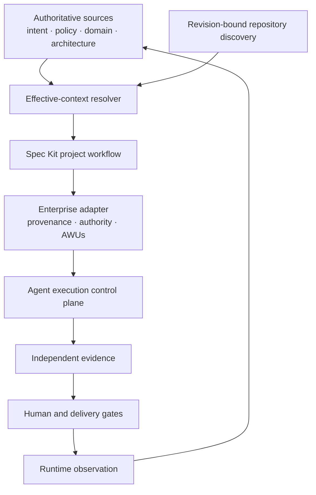

# Course 13 — GitHub Spec Kit for Enterprise Spec-Driven Development

Use GitHub Spec Kit as an extensible process harness inside an enterprise operating model—without mistaking generated artifacts for policy, approval, execution authority, or release evidence.

Course 12 selected an SDD framework by capability and operating-model fit. This course performs the next step: design a production-shaped Spec Kit composition around a consequential brownfield AI change.

> Spec Kit structures the work. The enterprise still owns authoritative context, decision rights, execution boundaries, independent evidence, and release.

## Learning objectives

After this course, you can:

- explain the current Spec Kit workflow from constitution through convergence;
- install and pin an observed Spec Kit release reproducibly;
- distinguish a project constitution from inherited enterprise authority;
- resolve product intent, policy, domain rules, architecture, and repository truth before specification;
- preserve unknowns during specification and clarification instead of allowing agents to invent decisions;
- separate current repository truth from proposed design;
- trace requirements through plans, tasks, agent work units, and evidence;
- enrich Spec Kit tasks into safe autonomous execution boundaries;
- preserve parent/child semantics across repositories;
- manage extensions, templates, agent adapters, and upgrades as governed supply-chain inputs;
- detect semantic drift with golden scenarios and mutation tests; and
- decide when a lighter workflow is more appropriate.

## Prerequisites

Complete [Course 10](../../beginner/10-specification-to-implementation-plan/README.md), [Course 11](../01-multi-agent-coding-workflows-coordination/README.md), and [Course 12](../02-sdd-framework-landscape-enterprise-operating-model/README.md). You should already understand requirements provenance, protected decisions, plan coverage, bounded agent work units, independent evidence, and framework selection.

## Scenario and claims boundary

Northstar Mutual wants to add AI-assisted broker-document classification to an existing underwriting system. The change touches regulated data, a shared review contract, and two repositories. A ticket alone is insufficient. The workflow must reconcile:

- product intent from `TICKET-AI-2310`;
- enterprise AI policy `AI-030@7-training`;
- domain rules `DOMAIN-DOC-11@2-training`;
- architecture decision `ADR-058@3-training`;
- repository discovery at `repo-docs@a17-training`; and
- an unresolved owner decision about confidence thresholds.

All Northstar artifacts are synthetic. The evidence proves only that the deterministic training fixture behaves as designed. It does not certify GitHub Spec Kit, approve a production architecture, establish legal compliance, or authorize release.

## 1. What Spec Kit currently provides

The official Spec Kit documentation presents the workflow as:

```text
constitution → specify → clarify → plan → checklist
             → tasks → analyze → implement → converge
```

The constitution records durable project principles. Specification states what users need and why. Clarification reduces material ambiguity. Planning converts intent into a technical approach. Checklists test requirement quality. Tasks make work executable. Analysis checks cross-artifact consistency. Implementation performs the work. Convergence compares the implementation with the planned artifacts and creates repair work.

Spec Kit also exposes presets, workflows, bundles, catalogs, and extensions. That makes it a useful process harness rather than a fixed prompt sequence. See the official [Spec Kit overview](https://github.github.com/spec-kit/), [reference overview](https://github.github.com/spec-kit/reference/overview.html), [extensions reference](https://github.github.com/spec-kit/reference/extensions.html), and [bundles reference](https://github.github.com/spec-kit/reference/bundles.html).

## 2. Dated and reproducible framework snapshot

This course observed official release **v1.1.0**, published **2026-10-02**, on **2026-10-04**. The lab ran the official CLI from the release tag and recorded the resolved commit, CLI version, scaffold paths, workflow surface, and SHA-256 template digests. The release record is available from the official [v1.1.0 release](https://github.com/github/spec-kit/releases/tag/v1.1.0).

The command shape was:

```bash
uvx --from 'git+https://github.com/github/spec-kit.git@v1.1.0' specify init \
  --here --non-interactive --integration codex \
  --integration-options='--skills' --ignore-agent-tools
```

Do not silently replace `v1.1.0` with `latest`. A framework upgrade changes executable process inputs. Re-observe the CLI, diff templates and manifests, run golden scenarios, and approve rollout through the organization-owned change path.

## 3. Enterprise Spec Kit architecture



The safe composition has three planes:

| Plane | Responsibility | May not impersonate |
|---|---|---|
| Spec Kit workflow | Generate and refine project artifacts | Policy owner, architect, release authority |
| Enterprise adapter | Bind sources, validate structure, create execution envelopes | Approval or exception authority |
| Trusted control plane | Authorize, execute, produce evidence, merge, release | Unauthenticated generated claims |

## 4. Constitution is not enterprise policy

A project constitution is useful for stable local principles. It is dangerous when copied policy text loses its owner, revision, scope, and authority class.

Represent every principle as one of:

```text
PROJECT_OWNED
INHERITED_CONSTRAINT
GENERATED_CONTEXT
REFERENCE
```

For example, “preserve established service boundaries” can be project-owned. “Human review precedes consequential authoritative mutation” is inherited from `AI-030@7-training`. Calling both project-owned launders authority: a repository maintainer could appear able to weaken an enterprise obligation.

The course validator rejects that transformation with `CONSTITUTION_AUTHORITY_LAUNDERING`.

## 5. Resolve context before `/speckit.specify`

An agent should not discover policy opportunistically while writing the spec. First resolve an immutable effective context:

```json
{
  "context_id": "CTX-AI-2310@2-training",
  "policy_references": ["AI-030@7-training"],
  "repository_revision": "repo-docs@a17-training"
}
```

The context manifest lists every source, revision, authority, and repository observation. The generated spec then points back to that manifest. Missing or stale inputs block progress; they do not become agent discretion.

## 6. Specify outcomes, boundaries, and populations

The reference feature spec uses stable typed identifiers:

```text
REQ-DOC-001  Produce a classification proposal with provenance
REQ-DOC-002  Restrict proposals to supported document types
REQ-DOC-003  Route ambiguous cases for human review
REQ-DOC-004  Preserve source and model provenance
SEC-DOC-001  Treat document text as untrusted input
PERF-DOC-001 Meet the approved latency target for the supported population
```

It does not select a vector database, cache, model provider, or authorization design. Those are implementation proposals unless an authoritative source already fixed them.

A serious AI specification also defines populations:

- supported inputs;
- known exclusions;
- manual-review population;
- abuse and prompt-injection cases;
- evaluation slices; and
- behavior when the system cannot make a supported claim.

## 7. Clarification preserves unresolved authority

The Northstar source package does not define a confidence threshold for automatic requirement satisfaction. The safe output is:

```text
Q-DOC-001 = OPEN
automatic_requirement_satisfaction = BLOCKED
owner = Underwriting Risk
```

Clarification may identify the question, assemble options, and record the owner. It may not infer a consequential threshold from similar systems. An unresolved decision is executable information because it prevents unsafe work.

## 8. Brownfield planning separates current and proposed truth

The plan records existing capabilities before designing new ones:

```text
Current truth
  existing OCR
  document-type enum
  submission service owns authoritative mutation
  document agent has no mutation tool

Proposed truth
  classification proposal
  deterministic supported-type validation
  ambiguity state
  human-review contract
  independent evidence
```

This prevents architecture invention, duplicate OCR, and accidental changes to authorization semantics. Each requirement has an explicit disposition: implement, reuse, external control, deferred with owner approval, or out of scope with rationale.

If repository revision changes after planning, the correct response is targeted rediscovery and revalidation—not optimistic implementation against stale assumptions. The official [existing-project guidance](https://github.github.com/spec-kit/guides/existing-projects.html) is a useful starting point; the enterprise layer adds revision binding and authority checks.

## 9. A Spec Kit task is not automatically an agent work unit

A task can be an excellent human-readable implementation step and still be unsafe for autonomous execution. The adapter enriches consequential tasks with:

- requirement ancestry;
- writable and protected paths;
- allowed decisions;
- decisions the agent may only propose;
- decisions the agent may never make;
- stop conditions;
- required independent evidence; and
- a stable work-unit identity.

```text
Spec Kit task
    ↓ deterministic enterprise adapter
Agent Work Unit (AWU)
    ↓ authorized execution identity
bounded implementation
```

Release, policy exceptions, authorization semantics, architecture approval, and automatic requirement satisfaction remain outside every AWU.

## 10. Analyze before implementation

Cross-artifact analysis should answer more than “are all headings present?”

| Check | Unsafe condition |
|---|---|
| Source coverage | Effective context omits an authoritative source |
| Requirement coverage | Requirement has no plan disposition |
| Work ancestry | Plan item or task has no requirement basis |
| Decision protection | Generated plan claims approval |
| Scope | Writable path overlaps a protected path |
| Dependency | New dependency lacks a proposal |
| Evidence | Acceptance claim lacks an independent oracle |
| Freshness | Plan or evidence targets a stale revision |

The lab's intentionally unsafe candidate violates these boundaries and is deterministically blocked.

## 11. Implementation completion is not conformance

The implementation agent can report what it changed and which checks it ran. That report is useful provenance, but it is not independent evidence.

The reference evidence manifest distinguishes:

```text
completion report      producer: coding agent       independent: false
contract test          producer: trusted CI         independent: true
classification eval    producer: evaluation service independent: true
injection test         producer: trusted CI         independent: true
provenance test        producer: trusted CI         independent: true
```

Every evidence record binds to the exact implementation revision. Synthetic fixture results remain synthetic; the manifest explicitly says `production_ready: false`.

## 12. Convergence repairs gaps without rewriting intent

Spec Kit's current convergence command is designed to reconcile implementation against the specification and plan. The enterprise boundary is essential: convergence may append repair tasks, but it must not silently weaken approved intent to match code. See the official [convergence command](https://github.com/github/spec-kit/blob/main/templates/commands/converge.md).

Allowed:

```text
observe gap → link source requirement → append repair task → rerun evidence
```

Blocked:

```text
implementation differs → rewrite requirement → declare convergence
```

Semantic changes return to the accountable owner through a formal change request.

## 13. Multi-repository change model

One business change can create several repository-local Spec Kit changes:

```text
Parent change AI-2310
  canonical requirement IDs
  CONTRACT-DOC-REVIEW@1-training
  integration evidence plan
      ├─ document-processing / 001-broker-document-classification
      └─ underwriting-review / 014-ambiguous-document-review
```

Child specs select the requirements they implement. They may specialize local design but may not weaken or redefine parent semantics. Contract revisions and integration evidence are parent-level coordination concerns.

## 14. Agent instruction adapters

`AGENTS.md`, `CLAUDE.md`, and tool-specific skills answer how an agent should operate in a repository. Feature specs answer what behavior the change requires. Duplicating feature semantics in agent instruction files creates two competing sources of truth.

Generate tool-specific instructions from a canonical versioned rule and test that every adapter names the same source revision. Agent instruction drift is operational drift.

## 15. Extensions and catalogs are supply-chain inputs

Spec Kit's extension architecture is powerful. Enterprise use should control:

- approved catalogs;
- publisher and source identity;
- artifact digests;
- extension permissions;
- compatible framework versions;
- update review; and
- rollback.

An unvetted community catalog can be visible for discovery while installation remains disabled. “Officially supported extension mechanism” does not mean “every extension is trusted.”

## 16. Progressive operating modes

Do not run the maximum workflow for every typo.

| Mode | Appropriate signals | Typical controls |
|---|---|---|
| Lightweight change | Docs, cosmetic UI, isolated low-risk fix | Local intent, focused test, review |
| Standard spec-driven | Shared contract, persistent data, public API | Spec, plan, tasks, analysis, evidence |
| Governed orchestrated | Regulated data, security boundary, AI behavior, cross-repo | Resolved context, AWUs, independent evidence, approval gates, convergence |

The coding agent must not choose its own risk tier. A trusted policy engine makes the route from observable signals and a revisioned policy basis.

## 17. CI control boundary

CI can reliably enforce syntax, schema, referential integrity, digests, protected paths, traceability, evidence freshness, and deterministic conformance cases. AI-assisted review may help identify ambiguity or likely conflicts, but its findings are proposals until verified. Human owners retain genuinely normative decisions.

```text
deterministic checks → candidate package
AI-assisted review   → review findings
accountable owner    → decision or exception
trusted delivery     → merge and release
```

No green check should imply more than the check actually proves.

## 18. Configuration is executable behavior

Templates, prompts, presets, workflows, catalogs, extension manifests, agent adapters, and CI rules shape agent behavior. Treat them like code:

- version them;
- record provenance and digests;
- review semantic diffs;
- test upgrades against golden scenarios;
- deploy progressively;
- observe runtime effects; and
- keep a rollback path.

The lab's eight golden scenarios cover unresolved decisions, policy conflict, architecture invention, task boundaries, repository drift, protected NFR changes, evidence laundering, and template drift. Thirty-six mutations verify that each guard fails closed.

## 19. When not to use the full process

Use a lighter route when the change is low consequence, local, reversible, and easy to verify. The full governed flow is usually unnecessary for punctuation, a non-semantic documentation repair, or a narrowly scoped test cleanup.

Do not skip the governed route merely because the code diff is small. A one-line change to authorization, policy enforcement, model routing, evidence production, a public contract, or regulated-data handling can be consequential.

## 20. Runnable lab

Open [the lab guide](northstar-spec-kit-adapter/README.md) and [the notebook](northstar-spec-kit-adapter/spec_kit_enterprise_adapter.ipynb).

Run the deterministic lab from the repository root:

```bash
python3 curriculum/intermediate/03-github-spec-kit-enterprise-sdd/northstar-spec-kit-adapter/lab.py
python3 -m unittest tests.test_course_13 -v
```

Expected outcome:

- reference package: `READY_FOR_OWNER_REVIEW`, zero findings;
- unsafe candidate: `BLOCKED` with many independent findings;
- conformance suite: `8/8`;
- mutation evaluation: `36/36`.

## 21. Workshop exercises

1. Resolve the supplied source package into a revision-bound effective context.
2. Classify constitution principles by authority kind.
3. Repair the unsafe feature spec without selecting implementation technology.
4. Preserve `Q-DOC-001` and its blocking effect.
5. Build complete requirement dispositions from repository truth.
6. Convert consequential tasks into AWUs.
7. Separate completion reports from independent evidence.
8. Add one multi-repository child without weakening parent semantics.
9. Evaluate one hypothetical template upgrade with the golden suite.
10. Write a short decision explaining whether a low-risk change should use lightweight, standard, or governed mode.

## 22. Definition of done

You have completed the course when you can explain why the reference package is only ready for owner review, identify why the candidate is blocked, reproduce the adapter output, and defend which controls belong in Spec Kit, in the enterprise adapter, and in the trusted delivery plane.

## Further reading

- [GitHub Spec Kit documentation](https://github.github.com/spec-kit/)
- [Installation](https://github.github.com/spec-kit/installation.html)
- [Existing projects](https://github.github.com/spec-kit/guides/existing-projects.html)
- [Reference overview](https://github.github.com/spec-kit/reference/overview.html)
- [Extensions](https://github.github.com/spec-kit/reference/extensions.html)
- [Bundles](https://github.github.com/spec-kit/reference/bundles.html)
- [Specification of specifications](https://github.com/github/spec-kit/blob/main/docs/concepts/spec-of-specs.md)
- [Spec Kit repository and releases](https://github.com/github/spec-kit)
